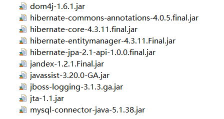

# JPA

​	是sun公司提供的一套规范，内部主要有接口、抽象类，比较好的实现框架有hibernate、toplink

​	SpringData是JPA的最佳实现.


**所需jar**



**jpa核心配置文件**

必须在类路径[src||resources]中META-INF下，名称必须为 persistence.xml 

```xml
<?xml version="1.0" encoding="utf-8" ?>
<!--导入schema约束，此约束来源：复制hibernate-core:5.2.16.Final包下的/org/hibernate/jpa/persistence_2_0.xsd文件中的这一段出来即可。-->
<persistence xmlns="http://java.sun.com/xml/ns/persistence" 										 
			 xmlns:xsi="http://www.w3.org/2001/XMLSchema-instance"
             xsi:schemaLocation="http://java.sun.com/xml/ns/persistence 							 
             http://java.sun.com/xml/ns/persistence/persistence_2_0.xsd"
             version="2.0">
    <!--配置持久化单元（可以配置多个，名称不能重复）
        name:用于指定持久化单元的名称
        transcation-type:指定事务的类型。
             JTA:分布式事务管理
             RESOURCE_LOCAL:指的是本地代码事务
    -->
    <persistence-unit name="jpa" transaction-type="RESOURCE_LOCAL">
        <!--JPA规范提供商，可以不写-->
        <provider>org.hibernate.jpa.HibernatePersistenceProvider</provider>
        <!--指定Jpa注解的实体类型位置，可以不写-->
        <class>com.znsd.bean.User</class>
        <!--连接相关的一些配置，都是用hibernate的。-->
        <properties>
            <!--第一部分，连接数据库信息-->
            <property name="hibernate.connection.driver_class" value="com.mysql.jdbc.Driver" />
            <property name="hibernate.connection.url" value="jdbc:mysql:///test2" />
            <property name="hibernate.connection.username" value="root" />
            <property name="hibernate.connection.password" value="123" />
            <!--第二部分，hibernate的可选配置-->
            <!--是否显示hiberante的生成的SQL语句-->
            <property name="hibernate.show_sql" value="true" />
            <!--是否使用格式化输出SQL语句到控制台-->
            <property name="hibernate.format_sql" value="false" />
            <!-- create:表若存在则删除重创 update:表若存在则使用，不存在则创建 -->
            <property name="hibernate.hbm2ddl.auto" value="create" />
            
        </properties>
    </persistence-unit>
</persistence>
```


### 入门案例

**步骤：**导包、编写核心配置文件、编写属性类、开始测试

​																					> 创建实体管理工厂读取核心配置文件信息

​																					> 通过工厂创建实体管理对象(类似于conn)

​																					> 通过实体管理对象获取事务对象开启事务

​																					> 通过实体管理对象保存属性类

​																					> 提交事务关闭资源

导包与编写核心配置文件省略

**JavaBean**

```java
@Entity
@Table(name="user")
public class User {
	@Id
	@GeneratedValue(strategy=GenerationType.IDENTITY)
	@Column(name="id")
	private Integer id;
	@Column(name="name")
	private String name;
    //省略get、set、toString 方法
}
```

**测试方法**

```java
public static void main(String[] args) {
    	//实体管理工厂 jpa 为核心配置文件 persistence-unit 的 name
		EntityManagerFactory entryManagerFactory = 
        Persistence.createEntityManagerFactory("jpa");
    	//实体管理对象
        EntityManager manager = entryManagerFactory.createEntityManager();
        //事务对象
    	EntityTransaction trans = manager.getTransaction();
        //开启事务
    	trans.begin();
        User user = new User();
        user.setName("dang！");
    	//存入数据库
        manager.persist(user);
    	//提交事务
        trans.commit();
    	//释放资源
        manager.close();
        entryManagerFactory.close();
	}
```


### 抽取工具类

通过Persistence创建实体管理工厂[EntityManagerFactory]很消耗资源，因为在创建过程中会产生一系列操作比如解析配置文件、创建表等，但很庆幸实体管理工厂是线程安全的，当我们需要重复使用实体管理工厂时调用Persistence.createEntityManagerFactory("jpa");的方法这样会重复解析配置文件，创建表等一些操作，所以为了节省资源则需要将必要的代码抽取成工具类重复使用.该工厂即使我们所需抽取的对象，重复向同一个工厂获取新数据库连接.

**案例演示**

```java
public class MyUtils{
    private static EntityManagerFactory emFactory;
    static{
        emFactory = Persistence.createEntityManagerFactory("jpa");
    }
    public static EntityManager getEntityManager(){
        return emFactory.createEntityManager();
    }
}
```


### CRUD

> 增加方法 

```java
public void persist(Object paramObject);
```

**案例演示**

```java
public void testSave(){
   EntityManager em = MyUtils.getEntityManager();
   //事务对象
   EntityTransaction trans = em.getTransaction();
   //开启事务
   trans.begin();
   User user = new User();
   user.setName("dang！");
   //存入数据库
   em.persist(user);
   //提交事务
   trans.commit();
   //关闭数据库连接
   em.close();
}
```

创建User对象，set赋值、调用方法进行持久化


> 查询方法 根据id查询

```java
/**
*	Class<T> paramClass 查询结果的封装对象，比如：User.class
*   Object paramObject 要查询纪录的id值，比如：1
*/
public <T> T find(Class<T> paramClass, Object paramObject);
public <T> T getReference(Class<T> paramClass, Object paramObject);
//find是立即加载、返回对象为传入的class实例
//getReference懒加载[用时才加载]、返回对象为代理对象.
```

**案例演示**

```java
public void testQuery(){
   EntityManager em = MyUtils.getEntityManager();
   User user1 = em.find(User.class,1);
   User user2 = em.getReference(User.class,1);
   System.out.println(user1);
   SYstem.out.println(user2);
   em.close();
}
```


> 删除方法

```java
//paramObject 必须是查询出来的实体类对象
public abstract void remove(Object paramObject);
```

**案例演示**

```java
public void testRemove(){
   EntityManager em = MyUtils.getEntityManager();
   //事务对象
   EntityTransaction trans = em.getTransaction();
   //开启事务
   trans.begin();
   User user = new User();
   user.setName("dang！");
   //先查询，再删除
   User user = em.find(User.class,1);
   em.remove(user);
   //提交事务
   trans.commit();
   //关闭数据库连接
   em.close();
}
```

先查询再删除.


> 修改方法

```java
//paramT 必须是查询出来的实体类对象
public <T> T merge(T paramT);
```

**案例演示**

```java
public void testUpdate(){
   EntityManager em = MyUtils.getEntityManager();
   //事务对象
   EntityTransaction trans = em.getTransaction();
   //开启事务
   trans.begin();
   User user = em.find(User.class,1);
   user.setName("ww");
   em.merge(user);
   //提交事务
   trans.commit();
   //关闭数据库连接
   em.close();
}
```

先查询后修改


### JPQL

与sql语句类似，但语句中不会出现表名以及字段名称而是对象类名与对象属性名称.

 可以被编译成所有主流 数据库服务器上的SQL。 


> jpql语句可以在query对象中使用

```java
public Query createQuery(String paramString);
```

通过EntityManager对象创建.

> 查询全部语句

```java
/**
* sql: select * from t_user 表名
* jpql: from user 类名 也可以是类全名
* jpql 不支持select *  但支持select 其他对象属性 所以若查询全部则select * 省略
*/
public void testQuery(){
   EntityManager em = MyUtils.getEntityManager();
   String jpql = "from User"
   Query query = em.createQuery(jpql);
   List resultList = createQuery.getResultList();
   System.out.println(resultList);
   //关闭数据库连接
   em.close();
}
```

> 分页查询

```java
public void testQuery(){
   EntityManager em = MyUtils.getEntityManager();
   String jpql = "from User"
   Query query = em.createQuery(jpql);
   query.setFirstResult(0); //起始位置
   query.setMaxResults(2); //查询条数
   List resultList = createQuery.getResultList();
   System.out.println(resultList);
   //关闭数据库连接
   em.close();
}
```

> 条件查询

```java
public void testQuery(){
   EntityManager em = MyUtils.getEntityManager();
   String jpql = "from User where name = ?"
   Query query = em.createQuery(jpql);
   //占位符下标从1开始.
   query.setParameter(1,"dang!");
   List resultList = createQuery.getResultList();
   System.out.println(resultList);
   //关闭数据库连接
   em.close();
}
```