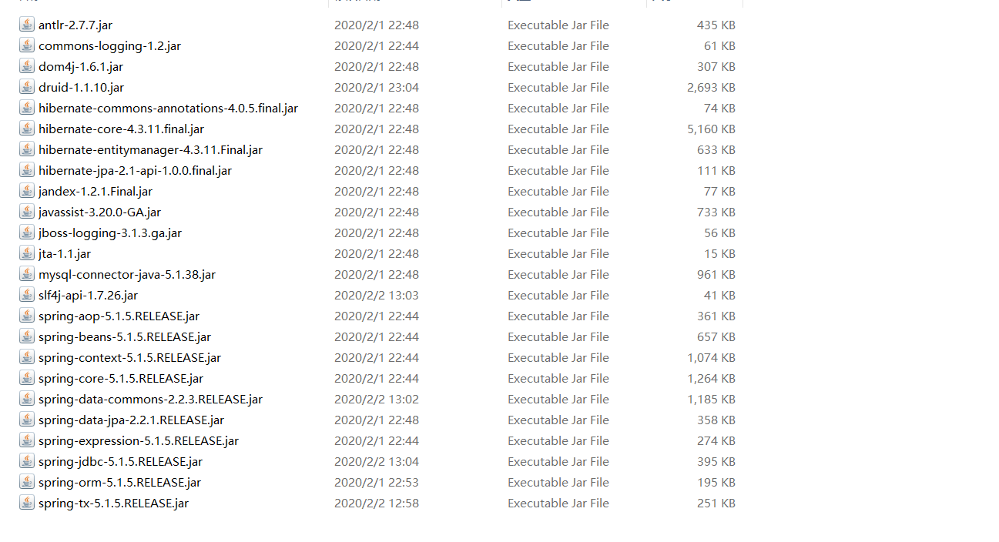

# SpringData Jpa

​	hibernate是对jdbc的轻量级封装，是jpa的实现之一，jpa是sun提供的orm规范，主要解决不同框架操作不同的问题，使不同框架操作相同，就类似于sun提供的jdbc规范，若想使用jdbc就得去找对应数据库的jdbc驱动，比如要使用mysql就找mysql的jdbc驱动，Oracle就使用Oracle的jdbc驱动，SpringData Jpa就是对sun提供的jpa进行优化，让操作更加简便，减少相同类型的代码问题.


**所需jar**




## 入门案例

**springdatajpa配置**

```xml
<beans xmlns="http://www.springframework.org/schema/beans"
	xmlns:xsi="http://www.w3.org/2001/XMLSchema-instance"
	xmlns:context="http://www.springframework.org/schema/context"
	xmlns:aop="http://www.springframework.org/schema/aop"
	xmlns:tx="http://www.springframework.org/schema/tx"
	xmlns:jpa="http://www.springframework.org/schema/data/jpa"
	xsi:schemaLocation="http://www.springframework.org/schema/beans 
	http://www.springframework.org/schema/beans/spring-beans.xsd
	http://www.springframework.org/schema/context
	http://www.springframework.org/schema/context/spring-context.xsd
	http://www.springframework.org/schema/aop
	http://www.springframework.org/schema/aop/spring-aop.xsd
	http://www.springframework.org/schema/tx
	http://www.springframework.org/schema/tx/spring-tx.xsd
	http://www.springframework.org/schema/data/jpa 
	http://www.springframework.org/schema/data/jpa/spring-jpa.xsd">
	<context:property-placeholder location="classpath:jdbc.properties" 
                                  ignore-unresolvable="true"/>
    
	<!-- 将entityManagerFactory对象交给spring管理 -->
	<bean id="entityManagerFactory" class="org.springframework.orm.jpa.LocalContainerEntityManagerFactoryBean">
		<!-- 配置数据源 -->
		<property name="dataSource" ref="dataSource" />
		<!-- 配置的扫描包(实体类所在包) -->
		<property name="packagesToScan" value="com.znsd.test.bean" />
		<!--  jpa的实现厂家 -->
		<property name="persistenceProvider">
			<bean class="org.hibernate.jpa.HibernatePersistenceProvider" />
		</property>
		<!-- jpa供应厂商适配器 -->
		<property name="jpaVendorAdapter">
			<bean class="org.springframework.orm.jpa.vendor.HibernateJpaVendorAdapter">
				<!-- 是否自动建表 -->
				<property name="generateDdl" value="true" />
				<!-- 指定数据库类型 -->
				<property name="database" value="MYSQL" />
				<!-- 数据库方言 -->
				<property name="databasePlatform" value="org.hibernate.dialect.MySQL5InnoDBDialect" />
				<!-- 是否打印sql -->
				<property name="showSql" value="true" />
			</bean>
		</property>
		<!-- jpa的方言 -->
		<property name="jpaDialect">
			<bean class="org.springframework.orm.jpa.vendor.HibernateJpaDialect" />
		</property>
	</bean>
	<!-- 配置数据库连接池 -->
	<bean id="dataSource"
		class="com.alibaba.druid.pool.DruidDataSource">
		<property name="driverClassName" value="${jdbc.driver}" />
        <property name="url" value="${jdbc.url}" />
        <property name="username" value="${jdbc.name}" />
        <property name="password" value="${jdbc.password}" />
	</bean>
    
	<!-- JPA事务管理器 -->
	<bean id="transactionManager"
		class="org.springframework.orm.jpa.JpaTransactionManager">
		<property name="entityManagerFactory" ref="entityManagerFactory" />
	</bean>
    
	<!-- 整合spring data jpa -->
	<jpa:repositories base-package="com.znsd.test.dao" 
                      transaction-manager-ref="transactionManager"/>
	<!-- 扫描spring注解 -->
	<context:component-scan base-package="com.znsd" />
</beans>
```

**jdbc.properties**

```properties
jdbc.driver=com.mysql.jdbc.Driver
jdbc.url=jdbc:mysql:///test2
jdbc.name=root
jdbc.password=123
```

**JavaBean**

```java
@Entity
@Table(name="user")
public class User {
	@Id
	@Column(name="id")
	@GeneratedValue(strategy=GenerationType.AUTO)
	private Integer id;
	@Column(name="name")
	private String name; 
    //此处应有set、get、toString，但省略
}
```

**Dao**

在创建dao时若想该Dao自带一些常规数据库操作时可以采取继承SpringDataJpa提供的接口，从而获取到许多常规操作例如crud等，若想更多操作比如分页一系列的操作则采取springdatajpa提供的其他接口即可.

```java
@Repository
public interface UserMapper extends JpaRepository<User, Integer>{
}
```

```cmd
Repository：
　　提供了findBy + 属性方法 
　　@Query 
　　HQL： nativeQuery 默认false
　　SQL: nativeQuery 默认true
	更新的时候，需要配合@Modifying使用
CurdRepository:
	继承了Repository 主要提供了对数据的增删改查
PagingAndSortRepository:
	继承了CrudRepository 提供了对数据的分页和排序，缺点是只能对所有的数据进行分页或者排序，不能做条件判
	断
JpaRepository： 
	继承了PagingAndSortRepository
	开发中经常使用的接口，主要继承了PagingAndSortRepository，对返回值类型做了适配
JpaSpecificationExecutor:
	提供多条件查询
```

## JpaRepository

常用方法，各种常用方法

```java
getOne返回一个实体的引用，无结果会抛出异常；
findById返回一个Optional对象；
findOne返回一个Optional对象，可以实现动态查询；
```


## JPQL引入

其特征与原生SQL语句类似，并且完全面向对象，通过类名和属性访问，而不是表名和表的属性 

```mysql
# sql语句查询全部 此处user为表名
select * from t_user
# jpql语句查询全部 统一为类名、属性名 不支持select * 但支持其他.
select id,name from User
```

jpql引入的主要作用就是当开发者所需的操作springdatajpa不能满足时可以自己定义查询语句.

使用jpql时只需要在dao中定义自己的操作方法并且标明注解@Query(value="jpql语句")即可.

> @Query("jpql语句")  代表查询

```java
value：语句[sql || jpql]
nativeQuery: true代表sql false代表jpql 默认为false
若不指定语句类型默认语句类型为jpql
```

**案例演示**

```java
@Repository
public interface UserMapper extends JpaRepository<User, Integer>{
    //?后的1代表方法传入的第一个参数也就是name
	@Query(value="from User where name = ?1")
	List<User> findByNamecc(String name);
}
```

在dao中写方法时注意方法名是否父类也包含，避免不必要的覆盖.

```java
public static void main(String[] args) {
  ApplicationContext c = new  ClassPathXmlApplicationContext("applicationContext.xml");
  UserMapper bean = c.getBean(UserMapper.class,"userMapper");
  List<User> findByName = bean.findByNamecc("张三");
  System.out.println(findByName);
}
```

当jpql语句中出现多个参数且顺序不一时即可这样标明

```java
@Repository
public interface UserMapper extends JpaRepository<User, Integer>,JpaSpecificationExecutor<User> {
	@Query(value="from User where name = ?2 id=?1")
	List<User> findByNamecc(String id,String name);
}
```

这样就代表name取方法中的第二个参数，id取方法中的第一个参数.


### LPQL更新

上面标明了@Query默认代表查询操作，若想把query中的jpql标识为修改操作则涉及到一个新注解

> @Modifying 

当@Query与该@Modifying组合就代表该操作是个更新操作

**Dao**

```java
@Repository
public interface UserMapper extends JpaRepository<User, Integer>{
    @Query("update t_user set name = ?2 where id = ?1")
    @Modifying
    public void m_Update(Integer id,String name);
}
```

这样当调用m_Update方法时就是一个修改操作，但springdata在执行修改或更新操作时要求被执行的方法提供事务操作，在操作方法上加上@Transactional即可，若不加当执行修改或删除操作时会抛出异常，Springdata在执行完一个方法时会默认进行事务回滚操作，若想真正对数据库进行操作则需要在方法上再加一个注解@Rollback(value=false)，这样springdata就不会进行事务回滚了.

**测试方法**

```java
public class c{
    @Autowired
    UserMapper userMapper;
    
    @Test
    @Transactional //springdata进行删除|修改操作时所需要提供事务操作
    @Rollback(value=false) //防止springdata自动回滚
    public void test(){
        //数据库原本 {id:1,name:"李四"} 修改为 张三
        userMapper.m_Update(1,"张三"); 
    }
}
```


## 方法命名规则

方法命名规则查询是对jpql更深层次的封装，主要解决了更多单个属性查询写语句的问题，只要按照SpringDataJpa提供的方法命名规则定义方法即可省略语句编写.

> 语法规则

```cmd
1.方法名以findBy开头
2.findBy后接要查询的属性名称[首字母大写]
	例如: 根据name查询则方法名findByName(String name)这样即可省略语句.
```

**Dao**

```java
@Repository
public interface UserMapper extends JpaRepository<User, Integer>{
	List<User> findByName(String name);
}
```

**测试类**

```java
public static void main(String [] args) {
  ApplicationContext c = new ClassPathXmlApplicationContext("applicationContext.xml");
  UserMapper bean = c.getBean(UserMapper.class,"userMapper");
  List<User> findByName = bean.findByName("张三");
  System.out.println(findByName);
}
```

若查询存在多个参数则可以使用And进行连接如

> 案例演示

```java
@Repository
public interface UserMapper extends JpaRepository<User, Integer>  {
	List<User> findByNameAndId(String name,Integer id);
}
```

若还包含模糊查询等其他操作 Like ...

```java
@Repository
public interface UserMapper extends JpaRepository<User, Integer>  {
	List<User> findByNameLikeAndId(String name,Integer id);
}
```

