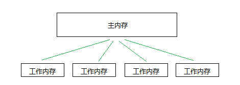
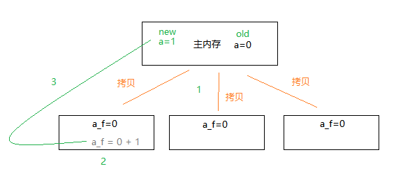

# JUC

**Java内存模型：** https://www.jianshu.com/p/15106e9c4bf3 

Java内存模型主要有俩个概念 主内存 与 工作内存

​	java虚拟机规定所有的变量都必须在主内存中产生，Java中每个线程都有自己的工作内存

​	所有的变量都存在主内存，工作内存存储的是各个线程用到的变量 主内存的副本拷贝，工作内存之间不能直接操作对方工作内存的变量，要通过主内存作为中间介，各个线程只能操作各自的工作线程变量，无法直接操作主内存变量，一旦某个线程将工作内存中的变量更改写回主内存，其他线程若没有需要接触主内存的操作则不会主动去主内存获取最新数据。

上图演示了原本主内存有一个变量为 a=0 ，下面有三个线程需要使用该变量，然后就将该变量拷贝到自己的工作内存中，此时第一个线程将拷贝的副本变量进行了更改操作，然后写回主内存，此时该变量值为1，但其他线程是不清楚主内存的变量被更改了的，恰好这些线程执行的操作也没有需要去主内存刷新数据的操作，那么这些线程就会一直使用这个不正确的变量，这个问题的解决方案就是 volatile 关键字

## volatile

**概念：**

每个线程都拥有自己的工作内存，1.7以前当线程开启之前会先将主内存的数据拷贝一份，然后当执行完毕线程之后再将数据写入主线程，中途若主线程数据被改变，线程是不知道的.

所以就要使用volatile

**特点：**

若主线程数据被volatile修饰后，当线程对volatile变量进行读操作时，会先将自己工作内存中的变量置为无效，之后再通过主内存拷贝新值到工作内存中使用.

volatile 并不能保证数据的原子性，只能保证线程之间的数据来自于主内存而不是工作内存中	

的缓存数据，若想保证数据的原子性，则使用同步Synchronized.

synchronized 修饰 当有线程获取锁则将主内存数据读取到线程的工作内存中，其他线程无法访问主内存.直到线程

执行完毕释放锁时，其他线程才能访问主内存[前提 主内存数据被完好锁住]

**总结(来源于：laosu)：**

​	1.volatile重要工作是避免线程脏读：当线程对volatile变量进行读操作时，会先将自己工作内存中的变量置为无效，之后再通过主内存拷贝新值到工作内存中使用。

​	2.volatile解决的是变量在多个线程之间的可见性，但不能完全保证数据的原子性。

​	3.现在JVM经过优化，已不会出现liveness failure 。所以没事别用volatile。

关键字volatile主要使用的场合是在多个线程中可以感知实例变量被更改了，并且可以获得最新的值使用，也就是用多线程读取共享变量时可以获得最新值使用。 

​	4.关键字volatile提示线程每次从共享内存中读取变量，而不是从私有内存中读取，这样就保证了同步数据的可见性。

