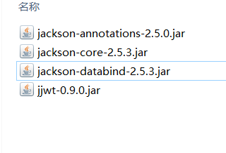

# JWT

JSON Web Token（JWT）是一个非常轻巧的规范。这个规范允许我们使用JWT在用户和服务器之间传递安全可靠的信息。

JWT实际上就是一个字符串，它由三部分组成，头部、载荷与签名

> maven

```xml
<!-- https://mvnrepository.com/artifact/io.jsonwebtoken/jjwt -->
<dependency>
    <groupId>io.jsonwebtoken</groupId>
    <artifactId>jjwt</artifactId>
    <version>0.9.0</version>
</dependency>
```

> jar



> 精选帖子

```java
https://www.jianshu.com/p/99a458c62aa4
```

**自定义工具类**

```java
package com.znsd;

import java.util.Date;

import io.jsonwebtoken.Claims;
import io.jsonwebtoken.JwtBuilder;
import io.jsonwebtoken.JwtParser;
import io.jsonwebtoken.Jwts;
import io.jsonwebtoken.SignatureAlgorithm;

public class JWTUtils {
	// 密钥[言]
	private String key;
	// 加密类型 默认 hs256
	private SignatureAlgorithm encrypt = SignatureAlgorithm.HS256;
	// jwt加密对象
	private JwtBuilder jwtBuilder = Jwts.builder();
	// jwt解密对象
	private JwtParser jwtParser =  Jwts.parser();
	
	/**
	 * @param key 密钥
	 */
	public JWTUtils(String key) {
		this.key = key;
	}
	
	/**
	 * @param delTime token 过期时间 若超过过期时间解密将抛出异常
	 */
	public void setDelTime(Date delTime) {
		JwtBuilder setExpiration = jwtBuilder.setExpiration(delTime);
	}
	
	/**
	 * 加密token
	 * @return 加密后的token
	 */
	public String builder() {
		return jwtBuilder.signWith(this.encrypt ,this.key).compact();
	}
	
	/**
	 * 解密token
	 * @param token
	 */
	public Claims parser(String token) {
		return jwtParser.setSigningKey(key).parseClaimsJws(token).getBody();
	}
	
	/**
	 * 加入自己需要加密的内容 比如用户信息
	 * @param key
	 * @param value
	 */
	public JWTUtils append(String key,Object value) {
		jwtBuilder.claim(key, value);
		return this;
	}
}
```

