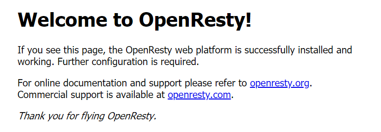

# Nginx-OpenResty

Nginx-OpenResty 


**openResty 安装**

> 下载地址

```shell
https://openresty.org/download/openresty-1.15.8.3.tar.gz
```

> 安装

```shell
# 解压 openResty
tar -vxzf openresty-1.15.8.3.tar.gz
# 进入 openResty
cd openresty-1.15.8.3
# 配置安装路径 选择安装到自己指定的目录中 /usr/local/luo/nginx/openResty/openRestySource
./configure --with-cc-opt="-I/usr/local/include" --with-ld-opt="-L/usr/local/lib" --prefix=[安装路径]
make
make install
# 启动 OpenResty 中的 nginx cd 到 [安装路径]/nginx/sbin
./nginx
```

> 启动完毕，访问地址

```tex
http://host:80/
```

**页面结果**



> 友情链接

```tex
https://www.cnblogs.com/babycomeon/p/11109501.html
```

