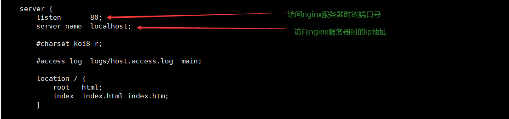
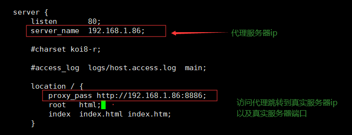
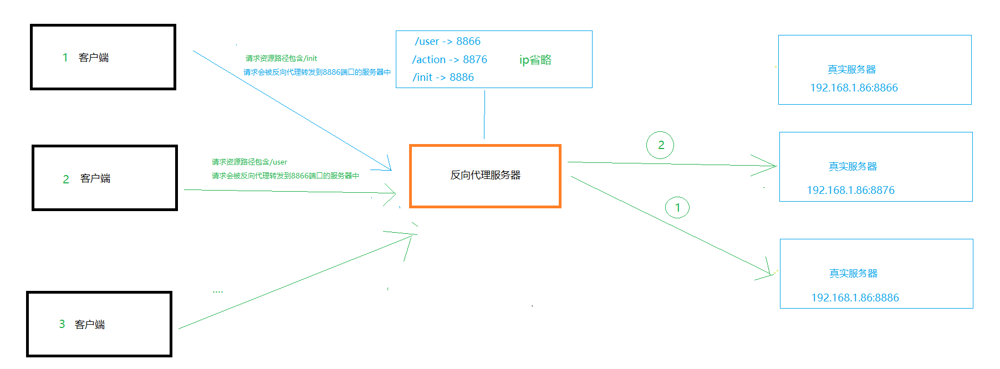
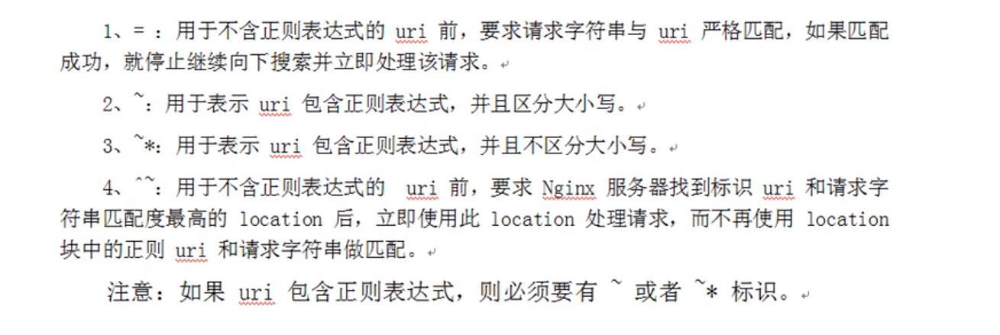

# nginx

**nginx简介**

 	*nginx* (engine x) 是一个高性能的[HTTP](https://baike.baidu.com/item/HTTP)和[反向代理](https://baike.baidu.com/item/反向代理/7793488)web服务器，特点就是占用内存特别少，并发能力强，在同类型网页服务器中表现较好

​	*nginx*专为性能优化而开发，性能是其最重要的考量，实现上非常注重效率，能经受高负载的考验，有报告表明能支持高达50, 000个并发连接数。


**正向代理**

​	客户端需要配置代理服务器，通过代理服务器进行互联网访问【代理服务器与目标服务器都知道】

```txt
比如说想访问国外的网站需要翻墙，先得挂vpn，然后再访问国外的网站.
```

**反向代理**

​	客户端不需要配置代理服务器，客户端直接访问反向代理服务器，由反向代理服务器将请求转发给目标服务器，目标服务器获取数据后在返回给反向代理服务器，此时对外界只暴露反向代理服务器而真实服务器则被隐藏.

```txt
比如说想访问百度的网站，输入www.baidu.com假设它是一个反向代理服务器，它将请求转发给真实的服务器，然后真实的服务器获取完数据后再返回给反向代理服务器，此时外界只知道www.baidu.com可以访问百度，并不知道真实的服务器ip.
```

**负载均衡**

```txt
主服务器：c1，c2，c3
反代理服务器：a1
当客户端发送请求给反代理服务器时，反代理服务器将请求均衡分布在c1，c2，c3主服务器中，从而使得将单个主服务器压力减少.
```

**动静分离**

```txt
将动态资源与静态资源分布在不同的服务器中，当客户端访问静态资源时
```


## nginx常用命令

要想使用nginx命令首先得进入nginx目录/nginx/sbin下中


**查看nginx版本号**

```cmd
./nginx -v
```

**启动nginx**

```cmd
./nginx
```

**关闭nginx**

```cmd
./nginx -s stop
```

**重新加载nginx**

```cmd
./nginx -s reload
```


## nginx.config配置文件组成

```xml
nginx.config配置文件由三部分组成.
```

###### 第一部分 全局块

从配置文件开始到events块之间的内容，主要会设置-些影响nginx服务器整体运行的配置指令

比如**worker processes 1; worker_ processes值越大，可以支持的并发处理量也越多.**

###### 第二部分 events块

events块涉及的指令主要影响Nginx服务器与用户的网络连接
比如**worker connections 1024; 支持的最大连接数**

###### 第三部分 http 块

Nginx服务器配置中最频繁的部分
http块也可以包括http全局块、server 块


### 案例演示

#### 案例一  反向代理

**目标：**通过输入代理服务器由代理转发给真实服务器，从而达到隐藏真实服务器IP的目的.


**Http模块下**

原始 conf/nginx.config 下的部分配置**[稍后会对这些进行修改]**



修改后 conf/nginx.config 下的部分配置



```xml
   因为资源有限，所以反向代理与真实服务器的ip是在同一台电脑上部署的，但各自的端口号不同，若资源充足可以部署在不同主机上，ip就不会相同.
以上案例【端口号区分】：
	真实服务器ip：192.168.1.86:8886
	反向代理服务器ip：192.168.1.86:80
    仅向外界暴露反向代理ip地址，当外界访问反向代理ip时由反向代理将请求转发给指定真实服务器，从而达到隐藏真实服务器ip的目的.
```


#### 案例二 反向代理

客户端通过不同路径访问反向代理服务器将请求转发给不同真实服务器



在反向代理案例1中，我们修改了server代码块中的一些字段，在案例2中我们会重新复制一个server代码块，

以前的server代码块可以不管，只要俩个代码块的端口号不同即可.

**案例演示**

```cmd
server {
listen 7777; #案例1端口是80 这里改成7777
server name 192.168.1.86;
location ~ /user/ { #当资源路径包含user则请求转发给8001的服务器
	proxy_ pass http://192.168.1.86:8001; 
location ~ /init/ { #当资源路径包含init则请求转发给8002的服务器
	proxy_ pass http://192.168.1.86:8002;
}
```



```text
当客户端请求192.168.1.86:7777时请求资源路径若包含init则请求转发给8002的服务器
```


#### 案例一 负载均衡

反代理将请求均衡分配给不同真实服务器，从而减少单个的服务器的压力.

```cmd
upstream MyServer{ #MyServer 自定义的
	server 192.168.1.86:8001; #第一台真实服务器
	server 192.168.1.86:8002; #第二台真实服务器
}
server{
 	listen	8888;
    server_name  192.168.1.86;
    location / {
       proxy_pass http://MyServer; #放自定义的那个服务MyServer
    }
}
```

当客户端访问反向代理时反向代理会将请求均衡的分配给不同的真实服务器，从而减少单个真实服务器的压力.


| 轮询               | 默认方式        |
| ------------------ | --------------- |
| weight             | 权重方式        |
| ip_hash            | 依据ip分配方式  |
| least_conn         | 最少连接方式    |
| fair（第三方）     | 响应时间方式    |
| url_hash（第三方） | 依据URL分配方式 |

```cmd
详情参考https://www.cnblogs.com/1214804270hacker/p/9325150.html
```


