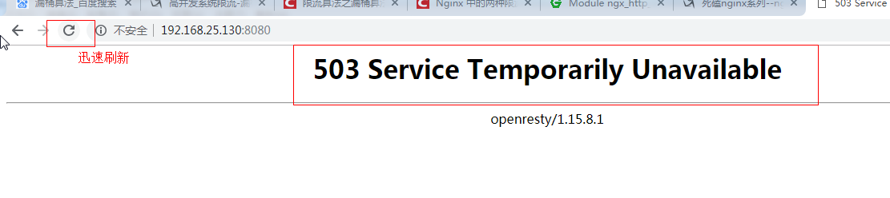

# nginx

**nginx简介**

 	*nginx* (engine x) 是一个高性能的[HTTP](https://baike.baidu.com/item/HTTP)和[反向代理](https://baike.baidu.com/item/反向代理/7793488)web服务器，特点就是占用内存特别少，并发能力强，在同类型网页服务器中表现较好

​	*nginx*专为性能优化而开发，性能是其最重要的考量，实现上非常注重效率，能经受高负载的考验，有报告表明能支持高达50, 000个并发连接数。


**正向代理**

​	客户端需要配置代理服务器，通过代理服务器进行互联网访问【代理服务器与目标服务器都知道】

```txt
比如说想访问国外的网站需要翻墙，先得挂vpn，然后再访问国外的网站.
```

**反向代理**

​	客户端不需要配置代理服务器，客户端直接访问反向代理服务器，由反向代理服务器将请求转发给目标服务器，目标服务器获取数据后在返回给反向代理服务器，此时对外界只暴露反向代理服务器而真实服务器则被隐藏.

```txt
比如说想访问百度的网站，输入www.baidu.com假设它是一个反向代理服务器，它将请求转发给真实的服务器，然后真实的服务器获取完数据后再返回给反向代理服务器，此时外界只知道www.baidu.com可以访问百度，并不知道真实的服务器ip.
```

**负载均衡**

```txt
主服务器：c1，c2，c3
反代理服务器：a1
当客户端发送请求给反代理服务器时，反代理服务器将请求均衡分布在c1，c2，c3主服务器中，从而使得将单个主服务器压力减少.
```

**动静分离**

```txt
将动态资源与静态资源分布在不同的服务器中，当客户端访问静态资源时
```


## nginx常用命令

要想使用nginx命令首先得进入nginx目录/nginx/sbin下中


**查看nginx版本号**

```cmd
./nginx -v
```

**启动nginx**

```cmd
./nginx
```

**关闭nginx**

```cmd
./nginx -s stop
```

**重新加载nginx**

```cmd
./nginx -s reload
```


## nginx.config配置文件组成

```xml
nginx.config配置文件由三部分组成.
```

###### 第一部分 全局块

从配置文件开始到events块之间的内容，主要会设置-些影响nginx服务器整体运行的配置指令

比如**worker processes 1; worker_ processes值越大，可以支持的并发处理量也越多.**

###### 第二部分 events块

events块涉及的指令主要影响Nginx服务器与用户的网络连接
比如**worker connections 1024; 支持的最大连接数**

###### 第三部分 http 块

Nginx服务器配置中最频繁的部分
http块也可以包括http全局块、server 块


### 案例演示

#### 案例一  反向代理

**目标：**通过输入代理服务器由代理转发给真实服务器，从而达到隐藏真实服务器IP的目的.


**Http模块下**

原始 conf/nginx.config 下的部分配置**[稍后会对这些进行修改]**


修改后 conf/nginx.config 下的部分配置


```xml
   因为资源有限，所以反向代理与真实服务器的ip是在同一台电脑上部署的，但各自的端口号不同，若资源充足可以部署在不同主机上，ip就不会相同.
以上案例【端口号区分】：
	真实服务器ip：192.168.1.86:8886
	反向代理服务器ip：192.168.1.86:80
    仅向外界暴露反向代理ip地址，当外界访问反向代理ip时由反向代理将请求转发给指定真实服务器，从而达到隐藏真实服务器ip的目的.
```


#### 案例二 反向代理

客户端通过不同路径访问反向代理服务器将请求转发给不同真实服务器


在反向代理案例1中，我们修改了server代码块中的一些字段，在案例2中我们会重新复制一个server代码块，

以前的server代码块可以不管，只要俩个代码块的端口号不同即可.

**案例演示**

```cmd
server {
listen 7777; #案例1端口是80 这里改成7777
server name 192.168.1.86;
location ~ /user/ { #当资源路径包含user则请求转发给8001的服务器
	proxy_ pass http://192.168.1.86:8001; 
location ~ /init/ { #当资源路径包含init则请求转发给8002的服务器
	proxy_ pass http://192.168.1.86:8002;
}
```


```text
当客户端请求192.168.1.86:7777时请求资源路径若包含init则请求转发给8002的服务器
```


#### 案例一 负载均衡

反代理将请求均衡分配给不同真实服务器，从而减少单个的服务器的压力.

```cmd
upstream MyServer{ #MyServer 自定义的
	server 192.168.1.86:8001; #第一台真实服务器
	server 192.168.1.86:8002; #第二台真实服务器
}
server{
 	listen	8888;
    server_name  192.168.1.86;
    location / {
       proxy_pass http://MyServer; #放自定义的那个服务MyServer
    }
}
```

当客户端访问反向代理时反向代理会将请求均衡的分配给不同的真实服务器，从而减少单个真实服务器的压力.


| 轮询               | 默认方式        |
| ------------------ | --------------- |
| weight             | 权重方式        |
| ip_hash            | 依据ip分配方式  |
| least_conn         | 最少连接方式    |
| fair（第三方）     | 响应时间方式    |
| url_hash（第三方） | 依据URL分配方式 |

```cmd
详情参考https://www.cnblogs.com/1214804270hacker/p/9325150.html
```


#### 案例一 动静分离

nginx 配置

```shell
# 将此处改为root，否则在访问静态资源时产生403没有权限访问
user  root;
http {
    server {
        listen       80;
        server_name  localhost;
        location / {
            proxy_pass http://47.113.89.167:8080;
        }
        # 拦截服务器的静态资源请求，并将该转发到指定路径中去获取静态资源
        location ~ .*\.(gif|jpg|jpeg|png|bmp|swf|js|css|ico|svg|json|html)$ {
            root /usr/local/luo/tomcat9/static;
        }
   }
}
```

html 片段 `来源：index.html`

```html
<body>
	hello！
	
</body>
```

HelloServlet.java `主要功能跳转index.html`

```java
@WebServlet("/HelloServlet")
public class HelloServlet extends HttpServlet {
	protected void doGet(HttpServletRequest request, HttpServletResponse response){
        // 重定向会被Nginx拦截
		request.getRequestDispatcher("index.html").forward(request, response);
	}
}
```

若项目名为Demo-Hello，访问路径前缀为：http://Demo-Hello/ 

```html

```

要想将图片分离，由nginx获取的话，图片必须存储在 `/usr/local/luo/tomcat9/static/Demo-Hello/images/`下

Demo-Hello 主要取决于访问路径.


## Nginx 限流

一般情况下，首页的并发量是比较大的，即使有了多级缓存，如果有大量恶意的请求，也会对系统造成影响。而限流就是保护措施之一。

nginx提供两种限流的方式：

- 一是控制速率
- 二是控制并发连接数

### 控制速率

控制速率的方式之一就是采用漏桶算法。

#### 漏桶算法实现控制速率限流

漏桶(Leaky Bucket)算法思路很简单,水(请求)先进入到漏桶里,漏桶以一定的速度出水(接口有响应速率),当水流入速度过大会直接溢出(访问频率超过接口响应速率),然后就拒绝请求,可以看出漏桶算法能强行限制数据的传输速率.示意图如下:

 


漏桶算法实现  nginx的配置  

配置示意图如下：


修改/usr/local/openresty/nginx/conf/nginx.conf:

```nginx
xxxxxxxxxx
#user  nobody;
user root root;
worker_processes  1;

#error_log  logs/error.log;
#error_log  logs/error.log  notice;
#error_log  logs/error.log  info;

#pid        logs/nginx.pid;


events {
    worker_connections  1024;
}


http {
    include       mime.types;
    default_type  application/octet-stream;

    #log_format  main  '$remote_addr - $remote_user [$time_local] "$request" '
    #                  '$status $body_bytes_sent "$http_referer" '
    #                  '"$http_user_agent" "$http_x_forwarded_for"';

    #access_log  logs/access.log  main;

    sendfile        on;
    #tcp_nopush     on;

    #keepalive_timeout  0;
    keepalive_timeout  65;

    #gzip  on;

    
    limit_req_zone $binary_remote_addr zone=myRateLimit:10m rate=2r/s;

    server {  
        listen       8081;
        server_name  localhost;
        charset utf-8;
        location / {
            limit_req zone=myRateLimit;
            root   html;
            index  index.html index.htm;
        }
    }
}
```

解释：

```
xxxxxxxxxx
binary_remote_addr 是一种key，表示基于 remote_addr(客户端IP) 来做限流，binary_ 的目的是压缩内存占用量。
zone：定义共享内存区来存储访问信息， myRateLimit:10m 表示一个大小为10M，名字为myRateLimit的内存区域。1M能存储16000 IP地址的访问信息，10M可以存储16W IP地址访问信息。
rate 用于设置最大访问速率，rate=10r/s 表示每秒最多处理10个请求。Nginx 实际上以毫秒为粒度来跟踪请求信息，因此 10r/s 实际上是限制：每100毫秒处理一个请求。这意味着，自上一个请求处理完后，若后续100毫秒内又有请求到达，将拒绝处理该请求.我们这里设置成2 方便测试。
```

测试：重新加载配置文件

```shell
xxxxxxxxxx
cd /usr/local/openresty/nginx/sbin

./nginx -s reload
```

访问页面： 直接报错。拒绝访问。

 

#### 处理突发流量

上面例子限制 2r/s，如果有时正常流量突然增大，超出的请求将被拒绝，无法处理突发流量，可以结合 **burst** 参数使用来解决该问题。

例如，如下配置表示：

```nginx
xxxxxxxxxx
server {
    location / {
        limit_req zone=myRateLimit burst=5;
        root   html;
        index  index.html index.htm;
    }
}
```

burst 译为突发、爆发，表示在超过设定的处理速率后能额外处理的请求数,当 rate=2r/s 时，将1s拆成2份，即每500ms可处理1个请求。

此处，**burst=5** ，若同时有6个请求到达，Nginx 会处理第一个请求，剩余5个请求将放入队列，然后每隔500ms从队列中获取一个请求进行处理。若请求数大于6，将拒绝处理多余的请求，直接返回503.

不过，单独使用 burst 参数并不实用。假设 burst=50 ，rate为10r/s，排队中的50个请求虽然每100ms会处理一个，但第50个请求却需要等待 50 * 100ms即 5s，这么长的处理时间自然难以接受。

因此，burst 往往结合 nodelay 一起使用。

例如：如下配置：

```nginx
xxxxxxxxxx
server {
    location / {
        limit_req zone=myRateLimit burst=5 nodelay;
        root   html;
        index  index.html index.htm;
    }
}
```

如上表示：

处理突发5个请求的时候，没有延迟，等到完成之后，按照正常的速率处理。

如上两种配置结合就达到了速率稳定，但突然流量也能正常处理的效果。配置代码如下：

```nginx
xxxxxxxxxx
#user  nobody;
user root root;
worker_processes  1;

#error_log  logs/error.log;
#error_log  logs/error.log  notice;
#error_log  logs/error.log  info;

#pid        logs/nginx.pid;


events {
    worker_connections  1024;
}


http {
    include       mime.types;
    default_type  application/octet-stream;

    #log_format  main  '$remote_addr - $remote_user [$time_local] "$request" '
    #                  '$status $body_bytes_sent "$http_referer" '
    #                  '"$http_user_agent" "$http_x_forwarded_for"';

    #access_log  logs/access.log  main;

    sendfile        on;
    #tcp_nopush     on;

    #keepalive_timeout  0;
    keepalive_timeout  65;

    #gzip  on;

    # 设置限流配置
    limit_req_zone $binary_remote_addr zone=myRateLimit:10m rate=2r/s;

    server {  
        listen       8081;
        server_name  localhost;
        charset utf-8;
        location / {
            limit_req zone=myRateLimit burst = 5 nodelay;
            root   html;
            index  index.html index.htm;
        }
    }
}
```

测试：如下图 在1秒钟之内可以刷新5次，正常处理。


 

但是超过之后，连续刷新5次，抛出异常。


根据IP进行限速参考

```tex
https://www.cnblogs.com/biglittleant/p/8979915.html
```

Nginx 限流

```tex
https://www.jianshu.com/p/2cf3d9609af3
```

Nginx 总限流 + ip限流

```tex
https://www.jianshu.com/p/59f7187a2b50
```


 


## Nginx安装

#####1、安装GCC 和GCC-C++

```
yum -y install make zlib zlib-devel gcc-c++ libtool  openssl openssl-devel
```

#####2、安装PCRE

a、下载http://exim.mirror.fr/pcre/

b、解压

```
tar zxvf pcre-8.35.tar.gz
```

c、编译安装

```
cd pcre-8.35
./configure
make
make install
pcre-config --version  ##检查是否安装成功
```

### 安装Nginx

a、下载tar包，下载地址：http://nginx.org/en/download.html

b、解压

```
tar zxvf nginx-1.13.6.tar.gz
```

c、编译安装

```
cd nginx-1.13.6
./configure --prefix=/usr/local/nginx --with-http_stub_status_module --with-http_ssl_module --with-pcre=/usr/local/pcre-8.35
make
make install
```

#####4、查看版本

```
/usr/local/nginx/sbin/nginx -v
```

#####5、常用命令

```
./nginx             # 启动nginx
./nginx -s reload   # 重新载入配置文件
./nginx -s reopen   # 重启 Nginx
./nginx -s stop     # 停止 Nginx
```


