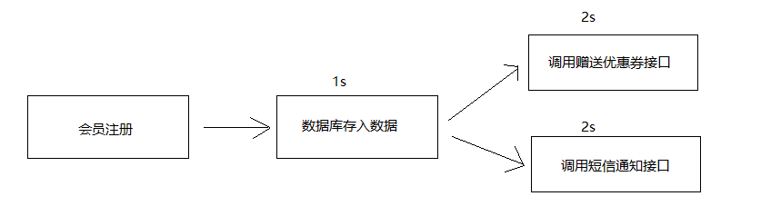
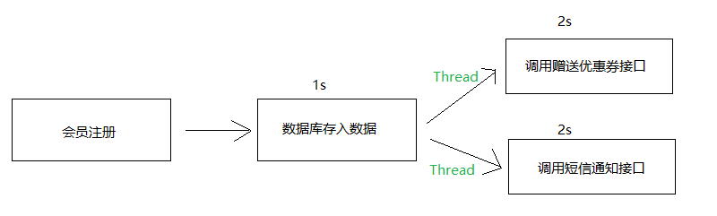
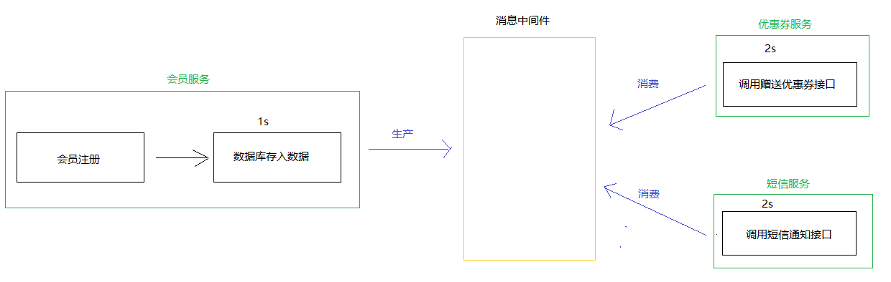
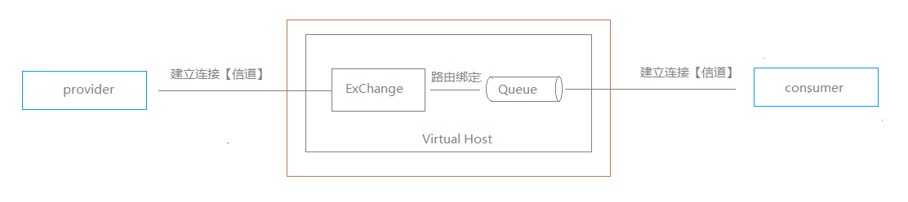
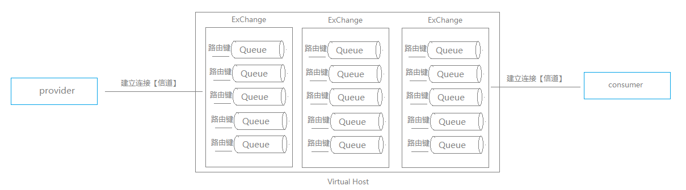

# RabbitMQ

消息中间件

**传统Http通信带来的问题**



​		传统的Http协议通过**请求与响应**进行交互，通过以上这张图可以看出当用户进行会员注册时首先注册信息会存入数据库会耗时1秒，当存入数据库完毕后调用优惠券接口进行优惠券派发耗时2秒，再接着调用短信通知接口进行短信通知耗时2秒，整体而言耗时大约5秒，这样的架构不仅效率低且用户体验差。

**引入另一种解决方案**



​	通过这种架构可以看出当用户进行注册时，首先将注册信息存入数据库，然后通过多线程异步进行接口调用，这样最终只会耗时大约1秒。

​	但这种架构若在高并发的情况下会频繁的创建线程、销毁线程，频繁创建线程会影响CPU性能，这时可能会想到引入线程池技术，但线程池的线程若被占用完那么其他任务还是得等待，这种解决方案还不是很完美。

而且以上俩种案例都有一个共同的缺点，就是当数据库存入数据后，调用其他接口时某些接口挂掉了，那么这次传输的数据丢失了，如：开通会员没有优惠券，因为在调用优惠券接口时优惠券接口挂掉了，这样还得加调用失败的一些业务处理逻辑，那么有没有一个完美的解决方案呢？那是当然，就是引入消息中间件。

**引入消息中间件**



​	当用户进行会员注册，数据库插入数据，然后将用户所需要的一系列的操作放入消息中间件，然后优惠券与短信服务监听中间件，一旦有消息立即消费，这样就解决了同步耗时，异步线程频繁创建，线程池满的问题，因为当用户进行完会员服务时就会将调用其他服务的信息放入消息中间件，等待其他服务消费，然后此时已经将结果返回给用户了，若此时其他的某些服务挂掉了，消息不会丢失会存在消息中间件中，当其他服务再恢复正常继续消费未消费的消息。

现在已知消息中间件就是存消息取消息，当消息存入消息中间件，消息中间件挂掉了消息会丢失吗？，这个是不会的，因为消息中间件有对消息持久化的功能，会将消息存储在硬盘中，后面慢慢明白。

## RabbitMQ 原理图



**消息的执行流程**

​		由生产者生产消息到消费者消费消息会产生很多步骤，首先生产者会与rabbitmq建立信道**channel**，然后将消息通过信道传输到指定虚拟主机**VirtualHost**的交换器**ExChange**中，交换器会通过路由键**routing_key**查找与之匹配的队列**Queue**，并把消息投入对应的队列中，消费者会一直监听指定队列中的消息，一旦产生立即消费。

**channel**

------

​		消费者或生产者与rabbitMQ之间的一条连接，本质上是TCP连接中的一条虚拟连接，在 RabbitMQ 中，消息的发送和接收、队列的订阅等操作都是通过信道完成的。

​		在操作系统中TCP连接的创建与销毁都是比较耗资源的，因为有3次握手与4次分手，而且在操作系统中TCP连接数量也是有限制的，很容易造成性能瓶颈， 而采用信道就不会有这种问题，可以在一个 TCP 连接中，任意的创建多条信道。

**Virtual Host**

------

虚拟主机的主要作用是隔离、权限。

​	隔离：发送的消息的时候只有在同一个虚拟主机下的满足条件的队列才能接受到消息。

​	权限：新建完账户就要指定该账户是属于哪个虚拟主机的，这样就可以控制哪些帐号使用哪些虚拟主机。

**ExChange**

------

​		生产者将消息发送给交换器，然后由交换器根据路由规则，决定将消息发送到哪个队列。

​		交换器本质上只是一个名称和一个队列绑定列表，当消息被发布到交换器时，实际上是所连接的信道将消息上的路由键和交换器中的绑定列表做比较，然后路由消息



**路由键**

------

​		routing_key，是一条特定的规则，决定了消息将要被发送到哪个队列。每条消息在发布的时候，都需要指定自己的 routing_key，RabbitMQ 通过路由键实现了队列和交换器之间的绑定。

​		当一条消息要被推送给多个不同的队列，不可能将消息手动发送给不同队列，这时就可以将队列通过路由键与交换器绑定，当要发送一条消息给多个队列时只需指定交换器与路由就可推送，一个队列可以有多个路由键

**队列**

------

​		消息会一条一条的在队列中存储，当消费者消费时会一条一条取出。

**RabbitMQ 常用的三种交换器类型**

**\> direct**

​		如果消息中的路由键和某个队列的路由键匹配的话，就将消息发送给该队列。

​		RabbitMQ 默认实现了一个名称为空的 direct 交换器，当声明一个队列时，如果没有指定交换器，那么 RabbitMQ 会把该队列自动绑定到这个默认的交换器，并以队列名称作为路由键。

```tex
单队列中一条消息只能被一个消费者消费。
```

**\> fanout**

​		设置为 fanout 的交换器，会将消息发送给所有绑定到它身上的队列，类似于广播。

```tex
可以将一条消息发送到多个队列中，类似于广播
```

**\> topic**

topic 类型的交换器，可以使来自不同源头的消息到达同一个队列，即支持在路由键中使用通配符。

```tex
将多个带着不同路由键的消息传输给同一个队列。
```

以上部分描述来自于以下网址，因为自身描述不够完美，这是一篇不错的文章。

```tex
https://www.jianshu.com/p/434eb8bfaa5f
```

三种常用交换器详情举例

https://github.com/2665976163/Note/tree/master/RabbitMQ/text/CommonExchanger.md


**RabbitMQ 安装**

```shell
# docker下载RabbitMQ
docker pull rabbitmq:3.8.3-management
# docker创建并启动RabbitMQ
docker run -d --hostname my-rabbit -p 5672:5672 -p 15672:15672 rabbitmq:3.8.3-management
```

RabbitMQ有图形化界面，当启动RabbitMQ时通过地址进入RabbitMQ，默认账号-密码：guest

```tex
localhost:15672
```

**注意：**在入门的时候没有了解过RabbitMQ的会把15672与5672搞混，因为在消息传输是是依靠5672端口而不是图形化界面的15672端口。

