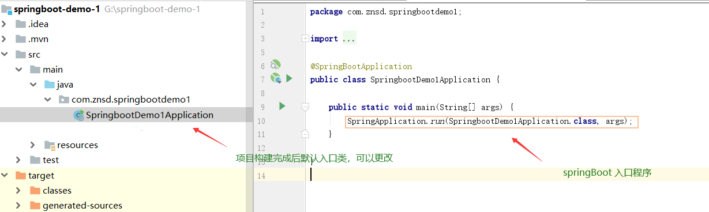
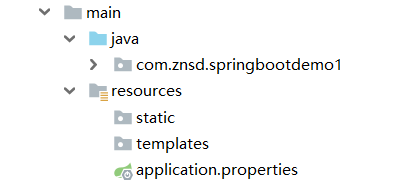

# Spring Boot

​			SpringBoot集成了许多框架，原本像spring、springMVC等一系列的框架已经简化了开发者大部分的操作，比如对象的统一管理，前台的请求接收，但这些框架也带来了许多繁琐重复的操作，比如配置注解扫描，请求拦截等，然后SpringBoot就将这一系列繁琐的操作做了很好的解决方案，提供了一系列默认的自动配置，使得很多常见的操作不需要开发者配置，当然当Spring Boot的默认自动配置不能解决开发者所需的配置时开发者可以手动更改默认配置，这样大大降低了开发者很多繁琐重复的问题.


## 快速入门 Hello SpringBoot！

**开发环境：**

​	**JDK版本：**1.8、**开发工具：**Idea、maven

> SpringBoot Idea快速构建

```java
https://www.cnblogs.com/hellokuangshen/p/11255967.html
```



​			当通过idea快速构建后会产生一个默认的类，该类就可以开启我们进入springboot的大门，这个类我们可以自己定义，但要满足一些条件，自己定义的类上必须标明@SpringBootApplication注解，且类中必须包含main函数，必须在main函数中调用SpringApplication类的静态run方法将main函数所在的类的calss与main的args参数传入，这个方法主要的功能就是启动springboot底层集成的tomcat，通过以上配置就完成了一个SpringBoot的入口类。


## @SpringBootApplication挖掘

​	@SpringBootApplication注解主要是将许多功能注解集成到一个注解之上，核心功能包括自动扫描入口类包以及子包将满足条件的类交给Spring容器管理，开启自动配置，以前有许多操作需要我们手动配置比如springmvc需要配置视图更改web.xml等一系列的操作，都不需要再让开发者去配置，而是交给springboot自动配置.

**详情介绍**

```tx
https://www.cnblogs.com/MaxElephant/p/8108140.html
```


## 生成项目目录介绍



**static：**用于存放静态资源，例如html、css、js等.

**templates：**保存所有的模板页面；（Spring Boot默认jar包使用嵌入式的Tomcat,默认不支持JSP）；可

以使用模板引擎（freemarker.thymeleaf）;

**application.properties：** 可以修改Spring Boot的默认配置，例如 server.port=8080


## 配置文件

spring boot的全局配置文件名称固定

- application.properties
- application.yml

配置文件作用：修改Spring Boot在底层封装好的默认值；

YAML（YAML AaIN'T Markup Language）

是一个标记语言

又不是一个标记语言

**标记语言：**

以前的配置文件；大多数使用的是 xxx.xml文件；

以数据为中心，比json、xml等更适合做配置文件

YAML：配置例子

```
server:
	port: 9000 
```

XML:

```
<server>
	<port>9000</port>
</server> 
```

## 2、YAML语法

### 1、基本语法

k:(空格)v:表示一堆键值对（空格必须有）；

以空格的缩进来控制层级关系；只要是左对齐的一列数据，都是同一层级的

```
server:
	port: 9000
	path: /hello 
```

属性和值也是大小写敏感

### 2、值的写法

**字面量：普通的值（数字，字符串，布尔）**

k: v:字面直接来写；

字符串默认不用加上单引号或者双引号

"":**双引号** 不会转义字符串里的特殊字符；特殊字符会作为本身想要表示的意思

```
name:"zhangsan\n lisi"` 输出：`zhangsan换行 lisi
```

'':**单引号** 会转义特殊字符，特殊字符最终只是一个普通的字符串数据

```
name:'zhangsan\n lisi'` 输出：`zhangsan\n lisi
```

**对象、Map（属性和值）键值对**

k :v ：在下一行来写对象的属性和值的关系；注意空格控制缩进

对象还是k:v的方式

```
frends:
	lastName: zhangsan
	age: 20 
```

行内写法

```
friends: {lastName: zhangsan,age: 18} 
```

**数组（List、Set）:** 用-表示数组中的一个元素

```
pets:
 ‐ cat
 ‐ dog
 ‐ pig 
```

行内写法

```
pets: [cat,dog,pig] 
```

**组合变量**

多个组合到一起


## 3、配置文件值注入

### 1、@ConfigurationProperties

1、application.yml 配置文件

```
person:
  age: 18
  boss: false
  birth: 2017/12/12
  maps: {k1: v1,k2: 12}
  lists:
   - lisi
   - zhaoliu
  dog:
    name: wangwang
    age: 2
  last-name: wanghuahua
```

`application.properties` 配置文件（二选一）

```
idea配置文件utf-8
properties 默认GBK
person.age=12
person.boss=false
person.last-name=张三
person.maps.k1=v1
person.maps.k2=v2
person.lists=a,b,c
person.dog.name=wanghuahu
person.dog.age=15
```

所以中文输出乱码，改进settings-->file encoding -->[property-->utf-8 ,勾选转成ascii]

javaBean

```
/**
* 将配置文件的配置每个属性的值，映射到组件中
* @ConfigurationProperties:告诉SpringBoot将文本的所有属性和配置文件中的相关配置进行绑定；
* prefix = "person" 配置文件按你的那个属性进行一一映射
* *
只有这个组件是容器中的组件，才能提供到容器中
*/
@Component
@ConfigurationProperties(prefix = "person")
public class Person {
    private String lastName;
    private Integer age;
    private Boolean boss;
    private Map<String,Object> maps;
    private List<Object> lists;
    private Dog dog;
```

导入配置文件处理器，以后编写配置就有提示了

```
<dependency>
	<groupId>org.springframework.boot</groupId>
	<artifactId>spring‐boot‐configuration‐processor</artifactId>
	<optional>true</optional>
</dependency> 
```


### 2、@Value注解

更改javaBean中的注解

```
@Component
public class Person {
    /**
     * <bean class="Person">
     *     <property name="lastName" value="字面量/${key}从环境变量/#{spEL}"></property>
     * </bean>
     */
    @Value("${person.last-name}")
    private String lastName;
    @Value("#{11*2}")
    private Integer age;
    @Value("true")
    private Boolean boss;
```

|                | @ConfigurationProperties |  @Value  |
| :------------: | :----------------------: | :------: |
|      功能      |   批量注入配置文件属性   | 单个指定 |
| 松散绑定(语法) |           支持           |  不支持  |
|      spEL      |          不支持          |   支持   |
|   JSR303校验   |           支持           |  不支持  |
|    复杂类型    |           支持           |  不支持  |

> 松散语法：javaBean中last-name(或者lastName) -->application.properties中的last-name;
>
> spEL语法：#{11*2}
>
> JSR303：@Value会直接忽略，校验规则

JSR303校验：

```
@Component
@ConfigurationProperties(prefix = "person")
@Validated
public class Person {
    @Email
    private String lastName;
```

复杂类型栗子：

```
@Component
public class Person {
    /**
     * <bean class="Person">
     *     <property name="lastName" value="字面量/${key}从环境变量/#{spEL}"></property>
     * </bean>
     */
    private String lastName;
    private Integer age;
    private Boolean boss;
   // @Value("${person.maps}")
    private Map<String,Object> maps;
```

以上会报错，不支持复杂类型

**使用场景分析**

```
如果说，我们只是在某个业务逻辑中获取一下配置文件的某一项值，使用@Value；
```

如果专门编写了一个javaBean和配置文件进行映射，我们直接使用@ConfigurationProperties

举栗子：

1、编写新的Controller文件

```
@RestController
public class HelloController {

    @Value("${person.last-name}")
    private String name;
    @RequestMapping("/hello")
    public  String sayHello(){
        return "Hello"+ name;
    }
}
```

2、配置文件

```
person.age=12
person.boss=false
person.last-name=李四
person.maps.k1=v1
person.maps.k2=v2
person.lists=a,b,c
person.dog.name=wanghuahu
person.dog.age=15
```

3、测试运行

访问 localhost:9000/hello

结果为`Hello 李四`


### 3、其他注解

**@PropertySource**

作用：加载指定的properties配置文件

1、新建一个person.properties文件

```
person.age=12
person.boss=false
person.last-name=李四
person.maps.k1=v1
person.maps.k2=v2
person.lists=a,b,c
person.dog.name=wanghuahu
person.dog.age=15
```

2、在javaBean中加入@PropertySource注解

```
@PropertySource(value = {"classpath:person.properties"})
@Component
@ConfigurationProperties(prefix = "person")
public class Person {
    private String lastName;
```

**@ImportResource**

作用：导入Spring配置文件，并且让这个配置文件生效

1、新建一个Spring的配置文件，bean.xml

```
<?xml version="1.0" encoding="UTF-8"?>
<beans xmlns="http://www.springframework.org/schema/beans"
       xmlns:xsi="http://www.w3.org/2001/XMLSchema-instance"
       xsi:schemaLocation="http://www.springframework.org/schema/beans http://www.springframework.org/schema/beans/spring-beans.xsd">

    <bean id="HelloService" class="com.wdjr.springboot.service.HelloService"></bean>
</beans>
```

2、编写测试类，检查容器是否加载Spring配置文件写的bean

```
@Autowired
ApplicationContext ioc;

@Test
public void testHelloService(){
    boolean b = ioc.containsBean("HelloService");
    System.out.println(b);
}
```

> import org.springframework.context.ApplicationContext;

3、运行检测

结果为false，没有加载配置的内容

4、使用@ImportResource注解

将@ImportResource标注在主配置类上

```
@ImportResource(locations={"classpath:beans.xml"})
@SpringBootApplication
public class SpringBoot02ConfigApplication {

    public static void main(String[] args) {
        SpringApplication.run(SpringBoot02ConfigApplication.class, args);
    }
}
```

5、再次运行检测

结果为true

缺点：每次指定xml文件太麻烦

SpringBoot推荐给容器添加组件的方式：

1、配置类=====Spring的xml配置文件（old）

2、全注解方式@Configuration+@Bean（new）

```
/**
 * @Configuration：指明当前类是一个配置类；就是来代替之前的Spring配置文件
 *
 * 在配置文件中用<bean></bean>标签添加组件
 */

@Configuration
public class MyAppConfig {

    //将方法的返回值添加到容器中；容器这个组件id就是方法名
    @Bean
    public HelloService helloService01(){
        System.out.println("配置类给容器添加了HelloService组件");
        return new HelloService();
    }
}
@Autowired
ApplicationContext ioc;

@Test
public void testHelloService(){
    boolean b = ioc.containsBean("helloService01");
    System.out.println(b);
}
```

*容器这个组件id就是方法名*

