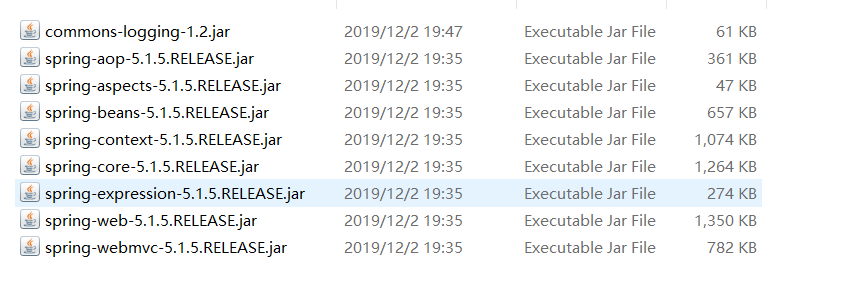

# Spring MVC

​	Spring MVC 就是一个MVC框架，它基于spring，是spring的一个子框架，属于spring的一部分，所以spring中的操作它都可以使用，比如IOC、AOP..等.


**Spring MVC 与 Struts2 区别**

```txt
 Struts2采用Filter 实现，SpringMVC 则采用Servlet实现 .
 详情参考：https://blog.csdn.net/jishuizhipan/article/details/79385190
```


## Spring MVC Jar包




## Spring MVC 约束

```xml
<?xml version="1.0" encoding="UTF-8"?>
<beans xmlns="http://www.springframework.org/schema/beans"
	xmlns:xsi="http://www.w3.org/2001/XMLSchema-instance"
	xmlns:context="http://www.springframework.org/schema/context"
	xmlns:aop="http://www.springframework.org/schema/aop"
	xmlns:tx="http://www.springframework.org/schema/tx"
	xmlns:mvc="http://www.springframework.org/schema/mvc"
	xsi:schemaLocation="http://www.springframework.org/schema/beans
        http://www.springframework.org/schema/beans/spring-beans.xsd
        http://www.springframework.org/schema/context
        http://www.springframework.org/schema/context/spring-context.xsd
        http://www.springframework.org/schema/aop
        http://www.springframework.org/schema/aop/spring-aop.xsd
        http://www.springframework.org/schema/tx
        http://www.springframework.org/schema/tx/spring-tx.xsd
        http://www.springframework.org/schema/mvc
        http://www.springframework.org/schema/mvc/spring-mvc.xsd">
    <!-- 内容 -->
</beans>
```


## 加载Spring MVC配置文件的方式

**默认路径：**文件名必须是springmvc-servlet.xml，且必须在WEB-INF文件夹下

**【该配置文件为spring mvc的配置文件】**

```xml
<?xml version="1.0" encoding="UTF-8"?>
<beans> <!-- 此处beans中应有约束,暂时省略,请复制菜单栏mvc约束中的 -->
     <!-- 开始基本注解 -->
    <context:component-scan base-package="com.ssm"></context:component-scan>
  	<!-- 内部资源视图解析器 -->
	<bean id="viewResolver" class="org.springframework.web.servlet.view.InternalResourceViewResolver">
		<property name="prefix" value="/WEB-INF/page/"></property>
		<property name="suffix" value=".jsp"></property>
	</bean>
</beans>
```


**指定路径：**需要在web.xml中配置mvc配置文件的所在位置.

**【该配置文件为web.xml的配置文件】**

```xml
<web-app xmlns:xsi="http://www.w3.org/2001/XMLSchema-instance" xmlns="http://xmlns.jcp.org/xml/ns/javaee" xsi:schemaLocation="http://xmlns.jcp.org/xml/ns/javaee http://xmlns.jcp.org/xml/ns/javaee/web-app_3_1.xsd" id="WebApp_ID" version="3.1">
  <display-name>SSM</display-name>
  
  <servlet>
  	<servlet-name>dispatcherServlet</servlet-name>
  	<servlet-class>org.springframework.web.servlet.DispatcherServlet</servlet-class>
	<init-param>
		<!--指定路径-->
  		<param-name>contextConfigLocation</param-name>
        <!--classpath:springmvc-servlet.xml 默认是src下找springmvc-->
  		<param-value>classpath:springmvc-servlet.xml</param-value>
  	</init-param> 
	<load-on-startup>1</load-on-startup>
  </servlet>
  
  <servlet-mapping>
  	<servlet-name>springmvc</servlet-name>
  	<url-pattern>/</url-pattern>
  </servlet-mapping>
    <filter>
		<filter-name>CharacterEncodingFilter</filter-name>
		<filter-class>
            org.springframework.web.filter.CharacterEncodingFilter
        </filter-class>
		<init-param>
			<param-name>encoding</param-name>
			<param-value>UTF-8</param-value>
		</init-param>
	</filter>
	<filter-mapping>
		<filter-name>CharacterEncodingFilter</filter-name>
		<url-pattern>/*</url-pattern>
	</filter-mapping>
</web-app>
```


## 入门案例

实现一个简单的请求转发.

**目标：**用户发送请求给spring mvc，mvc做出相应的响应，跳转到对应的界面.

**过程：**

```txt
导入 spring mvc 所需 jar 包,在src下创建 Spring_MVC.xml 【名字可以任意取】,创建Java类，类上跟上注解 @Controller ,在创建类中写入一个方法，跟上注解 @RequestMapping("请求名称"),Spring_MVC.xml中配置扫描
,配置SpringMVC的视图解析器,加载spring mvc 配置文件,输入localhost/项目名称/请求名称 则案例就完成了.
```

**创建Controller类**  类似于struts2的action

```java
@Controller
public class TestController{
    @RequestMapping("/test") //请求路径
    public String test(){
        System.out.println("你好 spring mvc！");
        //返回值就是跳转的资源名称，会与视图解析器拼接 /success.jsp
        return "success";
    }
}
```

**创建SpringMVC配置名为 Spring_MVC.xml **类似于struts2的struts.xml

配置扫描，视图解析器，映射器，适配器

```xml
<?xml version]="1.0" encoding="utf-8"?>
<beans> <!-- 此处beans中应有约束,暂时省略,请复制菜单栏mvc约束中的 -->
    <!-- 扫描com.znsd下所有声明注解的bean,将这些bean装载到spring容器中 -->
	<context:component-scan base-package="com.znsd" />
    <!-- 配置视图解析器 -->
    <bean name="internalResourceViewResolver"
		class="org.springframework.web.servlet.view.InternalResourceViewResolver">
        <!-- prefix 配置资源路径 /则是webContext下 -->
		<property name="prefix" value="/"></property>
         <!-- suffix 配置资源后缀 -->
		<property name="suffix" value=".jsp"></property>
	</bean>
    <!-- 配置该标签就相当于配置了映射器与适配器 -->
	<mvc:annotation-driven />
</beans>
```

**web.xml配置加载SpringMVC配置文件**

```xml
<?xml version="1.0" encoding="UTF-8"?>
<web-app>
	<servlet>
		<servlet-name>dispatcherServlet</servlet-name>
        <!-- DispatcherServlet 前端控制器 类似于 struts2的拦截器  -->
		<servlet-class>org.springframework.web.servlet.DispatcherServlet</servlet-class>
		<init-param>
            <!-- contetConfigLocaltion为springmvc.xml的地址变量 -->
			<param-name>contextConfigLocation</param-name>
            <!-- 配置地址变量的值 -->
			<param-value>classpath:Spring_MVC.xml</param-value>
		</init-param>

		<load-on-startup>1</load-on-startup>
	</servlet>

	<servlet-mapping>
		<servlet-name>dispatcherServlet</servlet-name>
		<url-pattern>/</url-pattern>
	</servlet-mapping>
</web-app>

```

这样一个springMVC入门案例就完成了


## @RequestMapping

 @RequestMapping 是一个用来处理请求地址映射的注解，可用于类或方法上。用于类上，表示类中的所有响应请求的方法都是以该地址作为父路径.

**该注解中的属性包含：**

```java
String[] path() default {};
String[] value() default {};
RequestMethod[] method() default {};
String[] params() default {};
String[] headers() default {};
String[] consumes() default {};
String[] produces() default {};
```

**path |value：**它们的作用是相同的，都是用于指定访问路径的

**method：**用于指定请求方式，RequestMethod中有一组常量包含GET、POST等.

**params：**用于指定请求必须带有某些参数或值，当前方法才会处理该请求

**headers：** 指定request中必须包含某些指定的header值，才能让该方法处理请求 

**consumes：** 指定处理请求的提交内容类型（Content-Type），例如application/json, text/html;

**produces：**  指定返回的内容类型，仅当request请求头中的(Accept)类型中包含该指定类型才返回；


**案例一 Path**

```java
//配置springmvc的.xml 本案例省略不写
//配置web.xml加载springmvc.xml的文件 本案例省略不写
@Controller
public class TestController{
    @RequestMapping(path="/hello") //当客户端输入localhost/项目名称/hello 请求就会到当前方法
    public String show(){
        System.out.println("...你好 MVC");
        return "index";
    }
}
```


**案例二 method**

```java
//配置springmvc的.xml 本案例省略不写
//配置web.xml加载springmvc.xml的文件 本案例省略不写
@Controller
public class TestController{
    @RequestMapping(path="/hello",method={RequestMethod.GET,RequestMethod.POST}) 
    //path=请求路径,method=请求方式 当前方法支持GET 与 POST 其他请求概不处理
    public String show(){
        System.out.println("...你好 MVC");
        return "index";
    }
}
```


**案例三 params**

```java
//配置springmvc的.xml 本案例省略不写
//配置web.xml加载springmvc.xml的文件 本案例省略不写
@Controller
public class TestController{
    @RequestMapping(path="/hello",method={RequestMethod.GET,RequestMethod.POST}
                    ,params={"user","psWord=123"}) 
    //path=请求路径,method=请求方式 params=客户端必须携带的参数 当客户端请求当前路径时必须最少携带俩个	参数,参数名必须为user、psWord，psWord的值必须是123，否则不处理该请求
    public String show(){
        System.out.println("...你好 MVC");
        return "index";
    }
}
```


## 属性自动注入

将客户端传入的参数自动注入到属性中.

**案例一 基本类型注入**

**Controller 类**

```java
//配置springmvc的.xml 本案例省略不写
//配置web.xml加载springmvc.xml的文件 本案例省略不写
@Controller
public class TestController{
    @RequestMapping("/home")
    public String test(String user,String psWord){
        //该方法的参数名称必须与前台保持一致，否则参数无法注入
        System.out.println("user="+user+",psWord="+psWord);
        return "success";
    }
}
```

**前台表单**

```html
<form action="home" method="post">
	<input name="user"/>
    <input name="psWord"/>
    <input type="submit" value="提交">
</form>
```

当表单被提交后，若请求路径中方法参数与表单提交的数据name一致则springmvc会将表单的数据传入请求方法并执行


**案例二 引用类型注入**

**JavaBean**

```java
public class User{
    private String name;
    private String psWord;
    //此处省略get、set、toString
}
public Test{
    private String a;
    private String b;
    private User user;
    //此处省略get、set、toString
}
```

**Controller 类**

```java
//配置springmvc的.xml 本案例省略不写
//配置web.xml加载springmvc.xml的文件 本案例省略不写
@Controller
public class TestController{
    @RequestMapping("/home")
    public String test(Test test){
        System.out.println(test);
        return "success";
    }
}
```

**前台表单**

```html
<form action="home" method="post">
	<input name="a"/>
    <input name="b"/>
    <input name="user.name"/>
    <input name="user.psWord"/>
    <input type="submit" value="提交">
</form>
```

【**模拟底层原理**】

​	首先当前台发送请求会到DispacherServlet中，由dispacherServlet获取指定请求资源访问路径的方法以及方法所属的对象，然后获取方法中的参数名称，若获取不到则通过反射看方法所需参数中是否包含该属性若包含则创建该类的实例，并暂时存储在一个集合中，若方法出现相同类型的参数时就将开始创建的实例一同传入方法中，比如(A a,B b,A as) 当中有俩个类型相同但传入的对象是同一个


**案例三 集合注入**

**JavaBean**

```java
public class User{
    private String name;
    private String psWord;
    //此处省略get、set、toString
}
public Test{
    private List<User> list;
    private Map<String,User> map;
    //此处省略get、set、toString
}
```

**Controller 类**

```java
//配置springmvc的.xml 本案例省略不写
//配置web.xml加载springmvc.xml的文件 本案例省略不写
@Controller
public class TestController{
    @RequestMapping("/home")
    public String test(Test test){
        System.out.println(test);
        return "success";
    }
}
```

**前台表单**

```html
<form action="home" method="post">
    <!-- List 封装方式 -->
	<input name="list[0].name"/>
    <input name="list[0].psWord"/>
    <!-- List 封装方式 -->
    
    <!-- Map 封装方式 -->
    <input name="map['user1'].name"/>
    <input name="map['user1'].psWord"/>
    <!-- Map 封装方式 -->
    
    <input type="submit" value="提交">
</form>
```

**格式**

```html
map名称['键名称'].对象属性
list名称[下标值].对象属性
```


## 属性自动注入中文乱码

在web.xml中配置spring mvc 提供的编码过滤器即可解决乱码

```xml
<filter>
	<filter-name>CharacterEncodingFilter</filter-name>
	<filter-class>
       org.springframework.web.filter.CharacterEncodingFilter
    </filter-class>
	<init-param>
		<param-name>encoding</param-name>
		<param-value>UTF-8</param-value>
	</init-param>
</filter>
<filter-mapping>
	<filter-name>CharacterEncodingFilter</filter-name>
	<url-pattern>/*</url-pattern>
</filter-mapping>
```


## 自定义类型转换器

若spring mvc 提供的类型转换器不能正确的转换客户端传入的参数则可以自定义类型转换器，将前台传入的参数转为指定类型.

**需要实现接口**

```java
org.springframework.core.convert.converter.Converter;
```

**创建自定义类型转换器**

```java
public class MyFomatDate implements Converter<String,Date>{
	//Converter<String,Date> 代表前端传入的String最后会转为Date类型
    @Override
	public Date convert(String source) {
        DateFormat df = new SimpleDateFormat("yyyy-MM-dd");
		return df.parse(source);
	}
}
```

**加载自定义类型转换器**

```xml
<!-- 当前为springmvc配置文件 -->
<bean name="ConversionService" class="org.springframework.context.support.ConversionServiceFactoryBean">
	<property name="converters">
		<set>
			<bean name="myFomatDate" class="com.znsd.MyFomatDate"></bean>
		</set>
	</property>
</bean>
<!-- conversion-service="ConversionService" 将该bean加入到mvc的类型转换器中 -->
<mvc:annotation-driven conversion-service="ConversionService"/>
```

**底层分析**

​	前端进行参数传递时若SpringMVC中无法正常将类型转换为正确类型时就会调用自定义类型转换器，对该类型转换.


## @RequestParam

当需要前端表单与后台接收的参数名称不同时但又需要将前端数据注入到后台接收参数中，则需要使用注解

@RequestParam，该注解主要声明在方法中的参数中。

**案例演示**

**Controller 类**

```java
//配置springmvc的.xml 本案例省略不写
//配置web.xml加载springmvc.xml的文件 本案例省略不写
@Controller
public class TestController{
    @RequestMapping("/home")
    public String show(@RequestParam(value="userName",required=false) String name){
        //required 默认为true 代表的是前端必须传入value名称的参数，否则不处理请求
        System.out.println("name="+name);
        return "success";
    }
}
```

**前台表单**

```html
<form action="home" method="post">
	<input name="userName"/>
    <input type="submit" value="提交">
</form>
```

此时前台参数名称为userName，请求的方法接收的参数名称为name，原本这样前台向Controller请求时，是不能将数据封装到name中，但是使用了RequestParam注解给原本name参数名改变了名称叫做userName，当前端传入参数时，就会自动注入到name属性中，因为此时name在spring mvc中已经是userName了，所以当前台又改成name传参时参数将不会注入到name中.


## @RequestBody

主要功能获取请求的请求体，一般post请求可以使用，因为get请求没有请求体，参数在url中，当声明该注解则当前台发送请求参数会以key=value&key=value...形式封装到被声明该注解的属性中

**案例演示**

**Controller 类**

```java
//配置springmvc的.xml 本案例省略不写
//配置web.xml加载springmvc.xml的文件 本案例省略不写
@Controller
public class TestController{
    @RequestMapping("/home")
    public String show(@RequestBody String body){
        System.out.println("body="+body);
        return "success";
    }
}
```

**前台表单**

```html
<form action="home" method="post">
	<input name="userName"/> <!-- 李老头 -->
	<input name="userAge"/>	<!-- 12 -->
    <input type="submit" value="提交">
</form>
```

当后台接收到参数的结果为：userName=李老头&userAge=12


## @PathVariable

**restful风格**就是可以通过同一个路径，不同参数或不同请求方式，访问同一个Controller中的不同方法.

PathVariable：在url中可以传递参数，解决restful在Controller方法请求方式相同的情况下调用到正确的方法.

**案例演示**

**Controller 类**

```java
@Controller
@RequestMapping("/Test")
public class TestController{
    @RequestMapping("/method",method={RequestMethod.PUT})
    public String add(){
        System.out.println("我是add的方法");
    }
     @RequestMapping("/method/{id}",method={RequestMethod.PUT})
    public String add(@PathVariable("id") String num){
        System.put.println("Id为"+num);
    }
}
```

**前台链接**

```html
<a href="Test/method/10"></a>
```

PathVariable url中直接写参数，并不是id=10.


## @RequestHeader

获取请求头信息，声明在方法参数中，并指明需要获取的请求头键，则该请求头的value会注入其中.

**案例演示**

**Controller 类**

```java
@Controller
public class TestController{
    @RequestMapping("/header")
    public String header(@RequestHeader("Accept") String header){
        System.out.println("Accept的value="+header);
        return "success";
    }
}
```

**前台表单**

```html
<form action="header" method="post">
	<input name="userName"/>
	<input name="userAge"/>
    <input type="submit" value="提交">
</form>
<!-- 虽然那边没有参数接收我们提交的参数，但丝毫不影响获取请求头信息 -->
```


## @CookieValue

获取Cookie的Value值，声明在方法参数中，并指明需要获取的cookie键，则该cookie的value会注入其中.

**案例演示**

**Controller 类**

```java
@Controller
public class TestController{
    @RequestMapping("/cookie")
    public String header(@CookieValue("jsessionid") String header){
        //jsessionid 为session存储在cookie中的id，一般session被创建时cookie中都有
        System.out.println("jsessionid的value="+header);
        return "success";
    }
}
```

**前台表单**

```html
<form action="cookie" method="post">
	<input name="userName"/>
	<input name="userAge"/>
    <input type="submit" value="提交">
</form>
<!-- 虽然那边没有参数接收我们提交的参数，但丝毫不影响获取Cookie中的value信息 -->
```


## @ModelAttribute

当前台表单数据不完整，注入到Controller中的方法参数对象中属性值不完全时，需要使用数据库原本的数据就需要该注解了，该注解主要功能就是将前台表单提交的数据不完全将数据库的数据填补进Controller方法参数的对象内。

该注解主要在被请求的Controller方法前执行被声明该注解的方法

**案例演示**

**数据库中的表字段**

```mysql
userName userAge userSex
```

**Controller 类**

```java
@Controller
public class TestController{
    @RequestMapping("/test")
    public String header(User user){
        System.out.println("User="+user);
        return "success";
    }
    @ModelAttribute
    public User Before(String userName,String userAge){
        //这里是我写的工具类，主要就是通过名称与年龄查找到该用户的全部信息此时将该User返回即可
        User user = DBFactorys.getUserDB().FindByName(userName,userAge);
        //只有前台没有的参数才会注入到header中，若前台有的参数不会被该返回的user覆盖
        return user;
    }
}
//还有第二种方式，不使用返回值的方式，但方法参数列表需要多一个map键为请求方法的属性，值为rtn的对象.
```

**前台表单**

```html
<form action="test" method="post">
	<input name="userName"/>
	<input name="userAge"/>
    <input type="submit" value="提交">
</form>
```

**过程分析**

首先前台发起请求，先执行before方法，然后在数据库中根据前台传入的不可变参数查询剩余的其他数据，然后将前台传入的新参数set到数据库查询出来的对象中，然后将查询出的数据以user形式返回，然后该user会暂时存储在集合中，然后在执行前台请求的路径方法，将暂时存储在集合中的user对象注入给请求路径方法参数内，然后前台没有传的数据使用数据库的老数据，传了的数据使用前台表单的新数据.


## Response

**【Spring MVC】**以上是客户端请求服务器的操作，接下来是响应给客户端的操作.

**开发注意：**当请求静态资源或没有在mvc或web中声明的请求都会被DispatherServlet拦截到.


### String 返回类型 

当客户端发送请求Controller请求完之后return的一般都是一个地址比如

```java
@Controller
public class TestController{
    @RequestMapping("/test")
    public String test(){
        System.out.println("请求来了...跳转目标是success");
        return "success";
    }
}
```

这种方式就称为String 返回类型.


### Void 返回类型

若Controller中的方法没有返回类型，客户端请求会发生什么情况呢？

```java
@Controller
public class TestController{
    @RequestMapping("/test")
    public void test(){
        System.out.println("请求来了...没有跳转目标");
    }
}
```

当没有返回类型时，会默认以RequestMapping中的name为跳转目标，然后将该目标交给视图解析器，由视图解析器拼接成访问路径，以上组成的访问路径就是localhost/项目名称/test.jsp，若没有该jsp则会404

**解决方案**

通过springmvc属性自动注入使用请求转发或重定向

```java
@Controller
public class TestController{
    @RequestMapping("/test")
    public void test(HttpServletRequest request,HttpServletResponse response){
        System.out.println("请求来了...通过重定向跳转");
        //request.getContextPath() 获取项目根路径
        response.sendRedirect(request.getContextPath()+"/success.jsp");
    }
}
```

当使用请求转发或重定向，那么将不会请求视图解析器了，就是说不会再使用spring mvc的方式跳转界面。


### ModelAndView

model与view的结合体，就是说该对象即可以存值也可以跳转界面.

```java
@Controller
public class TestController{
    @RequestMapping("/test")
    public ModelAndView test(User user){
        ModelAndView mav = new ModelAndView();
        mav.addObject(user);
		mav.setViewName("success");
        return mav;
    }
}
```

其实spring mvc底层无论返回的是什么类型都会将值转入ModelAndView中，然后将ModelAndView交给视图解析器进行页面跳转，这里我们只是写明了.


### 放行静态资源

当请求静态资源或没有在mvc或web中声明的请求都会被DispatherServlet拦截到.所以我们需要进行放行不必要的拦截。

比如常见的使用jquery，需要导入jquery的包，但当打开界面时若没放行静态资源请求则使用不了jquery

**格式**

```xml
<mvc:resources location="/images/" mapping="/images/**"/>
<mvc:resources location="/css/" mapping="/css/**"/>
<mvc:resources location="/js/" mapping="/js/**"/>
```


### AJAX 请求

当前台使用ajax请求时spring mvc 可以将前台发送的json对象封装到请求路径方法参数中。

需要导包【否则springmvc无法封装】

```xml
<dependency>
    <groupId>com.fasterxml.jackson.core</groupId>
    <artifactId>jackson-databind</artifactId>
    <version>2.9.8</version>
</dependency>
<dependency>
    <groupId>com.fasterxml.jackson.core</groupId>
    <artifactId>jackson-core</artifactId>
    <version>2.9.8</version>
</dependency>
<dependency>
    <groupId>com.fasterxml.jackson.core</groupId>
    <artifactId>jackson-annotations</artifactId>
    <version>2.9.8</version>
</dependency>
```

@RequestBody 将请求体中的数据注入到被声明的对象中

@ResponseBody 将响应的数据以json字符串方式响应给客户端

```java
@Controller
public class TestController{
    @RequestMapping("/test")
    public @ResponseBody User test(@RequestBody User user){
        //模拟查询数据库
        User userDB = new User("张三","17");
        return userDB;
    }
}
```


**不使用MVC的自动封装，使用自己的jar包，完成json接收与反馈**

```java
@Controller
public class TestController{
    @RequestMapping("/test")
    public void test(@RequestBody String body,HttpServletResponse response){
        User user = JSON.JsonObject(body,User.class); //模拟工具类将json转为User对象返回
        //模拟查询数据库
        User userDB = new User("张三","17");
        String jsonStr = JSON.JsonString(userDB); //模拟工具类将User转为json字符串返回
        response.getWriter().write(jsonStr);
    }
}
```


## 文件上传

普通文件上传请参考我的JavaWeb笔记，接下来是SpringMVC的笔记怎么上传.

SpringMVC文件上传

**导入jar：**commons-fileupload、commons-io

**使用类：**MultipartFile、MultipartHttpServletRequest

**MultipartFile**

代表前端表单单个文件对象，该对象中有表单的单个文件信息

**常用方法**

```java
public String getName(); //返回参数名称
public String getOriginalFilename(); //返回文件名称
public void transferTo(File dest); //将前台传入的文件保存到指定File路径下
...
```

**MultipartHttpServletRequest**

比MultiPartFile功能强大，可以获取多个文件信息以及表单中的参数

**常用方法**

```java
public String getParameter(String paramName); //传入一个参数名称返回参数value
public MultipartFile getFile(String fileName); //传入一个文件名称返回一个文件对象
public Iterator<String> getFileNames(); //获取一组文件名称
...
```


**配置文件处理器**

```xml
<bean id="multipartResolver"
		class="org.springframework.web.multipart.commons.CommonsMultipartResolver">
	<property name="maxUploadSize" value="-1"></property><!-- 上传文件总大小 -->
	<property name="defaultEncoding" value="UTF-8"></property><!-- 上传文件编码 -->
</bean>
```

**案例演示一  MultipartFile**

该类只能接收单个文件

**Controller 类**

```java
	@RequestMapping("upload")
	public String upload(MultipartFile upload,HttpServletRequest request) {
		String uploadPath = request.getServletContext().getRealPath("/upload");
		//获取文件名称，属性名称为getName()
		String file = upload.getOriginalFilename();
		File isExist = new File(uploadPath);
		System.out.println("文件存储的路径为="+isExist.getAbsolutePath());
		if(!isExist.exists()) {
			isExist.mkdirs();
			System.out.println("创建了！");
		}
		try {
			System.out.println(uploadPath+"/"+file);
			//将文件持久化存入本地磁盘
			upload.transferTo(new File(uploadPath,file));
		} catch (IllegalStateException e) {
			e.printStackTrace();
		} catch (IOException e) {
			e.printStackTrace();
		}
		return "success";
	}
```

**前端表单**

```html
<form action="upload" enctype="multipart/form-data" method="post">
	<input type="file" name="upload"/>
	<input type="submit" value="提交">
</form>
```


**案例演示二 MultipartHttpServletRequest**

接收多个文件且接收参数

**Controller 类**

```java
public class SpringMVC {
	@RequestMapping("upload")
	public String upload(MultipartHttpServletRequest request) throws Exception {
		//文件区域---------------
		String uploadPath = request.getServletContext().getRealPath("/upload");
		File isExist = new File(uploadPath);
		System.out.println("文件存储的路径为="+isExist.getAbsolutePath());
		if(!isExist.exists()) {
			isExist.mkdirs();
			System.out.println("创建了！");
		}
        //获取指定前端表单name的文件，若需要多个则使用多个getFile
		MultipartFile file = request.getFile("upload");
		String fileName = file.getOriginalFilename();
		file.transferTo(new File(isExist,fileName));
		//文件区域---------------
		
		//参数区域---------------
		String userName = request.getParameter("userName");
		System.out.println(userName);
		//参数区域---------------
		return "success";
	}
}
```

**前端表单**

```html
<form action="upload" enctype="multipart/form-data" method="post">
	<input type="file" name="upload"/>
	<input type="text" name="userName" />
	<input type="submit" value="提交">
</form>
```


## 文件下载

**核心代码Controller**

```java
@RequestMapping("/download")
	public ResponseEntity<byte[]> export(HttpServletRequest request,String fileName) throws IOException {
		//获取文件所在目录
		String realPath2 = request.getServletContext().getRealPath("file");
		//将文件路径与文件名称相加获取绝对路径
		File file = new File(realPath2+"/"+fileName);

		//设置头信息
		HttpHeaders headers = new HttpHeaders();
		headers.setContentType(MediaType.APPLICATION_OCTET_STREAM);
		headers.setContentDispositionFormData("attachment", fileName);

		//返回文件到前台
		return new ResponseEntity<byte[]>(FileUtils.readFileToByteArray(file), headers, HttpStatus.CREATED);
	}
```

**前台内容**

```html
<!DOCTYPE html>
<html>
<head>
<meta charset="UTF-8">
<title>Insert title here</title>
</head>
<body>
	<a href="download?fileName=a.png">下载</a>
</body>
</html>
```


## 拦截器

**实现步骤**

​	继承拦截器接口

​	mvc中配置拦截器


## 异常处理

**实现步骤**

​	自定义异常类

​	编写异常处理类

​	配置异常处理类

​	捕获并抛出异常

### 实现方式有三种

SimpleMappingExceptionResolver、HandlerExceptionResolver 、@ControllerAdvice + @ExceptionHandler

- **使用SimpleMappingExceptionResolver实现异常处理：** 仅能获取到异常信息，若在出现异常时，对需要获取除异常以外的数据的情况不适用 
- **实现HandlerExceptionResolver 接口自定义异常处理器：** 能获取导致出现异常的对象，有利于提供更详细的异常处理信息 
- **使用@ExceptionHandler注解实现异常处理：** 无需配置，不能获取除异常以外的数据 

**第一种不演示，可以使用注解代替**

**第二种HandlerExceptionResolver 异常处理**

**步骤描述：**创建异常类实现该接口重写该接口方法，将异常类加入spring容器即可.

**异常类**

```java
@Component
public class MyHandleException implements HandlerExceptionResolver {

	@Override
	public ModelAndView resolveException(HttpServletRequest request, 
                                         HttpServletResponse response, 
                                         Object bean,
                                         Exception ex) {
		System.out.println(bean+" -- "+ex.getMessage());
		ModelAndView modelAndView = new ModelAndView("error");
		modelAndView.addObject("ex", ex);
		return modelAndView;
	}

}
```

**bean:**发生异常的准确对象

**ex:**异常对象


**第三种@ControllerAdvice + @ExceptionHandler**

@ControllerAdvice定义全局异常类，@ExceptionHandler定义异常接收类型

```java
import org.springframework.web.servlet.ModelAndView;
@ControllerAdvice
public class MyException{
	@ExceptionHandler(value = { NullPointerException.class})
	public ModelAndView test( Object handler,Exception ex) {
		// 如果要将异常传递到视图中（jsp页面），必须使用ModelAndView来进行数据传递
		// 不能使用Map形参的方式，否则会报错
		Map<String, Object> map = new HashMap<String, Object>();
		map.put("ex", ex);
		ModelAndView mv = new ModelAndView("error", map);
		return mv;
	}
}
```

将该类加入spring容器即可.


## 读取spring.xml

```xml
<!--配置Spring的监听器 -->
<listener>
		<listener-class>
            org.springframework.web.context.ContextLoaderListener
    	</listener-class>
</listener>
	<!--设置配置文件的路径 -->
	<context-param>
		<param-name>contextConfigLocation</param-name>
		<param-value>classpath:applicationContext.xml</param-value>
	</context-param>
```

