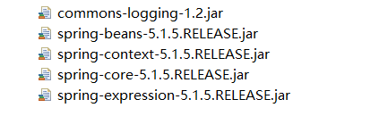

# Spring FrameWork


**Spring Bean 约束**

使用基本创建bean的功能导入以下约束即可.

```xml
<?xml version="1.0" encoding="UTF-8"?>
<beans xmlns="http://www.springframework.org/schema/beans"
   xmlns:xsi="http://www.w3.org/2001/XMLSchema-instance"
   xsi:schemaLocation="http://www.springframework.org/schema/beans  
   					   http://www.springframework.org/schema/beans/spring-beans.xsd">
</beans>
```

**四个核心jar包+log包**

可以基本使用创建bean的功能.




## 配置文件加载方式

spring加载配置方式已知的有俩种方式，分别为以下俩种.

```java
public ClassPathXmlApplicationContext(String configLocation);
public FileSystemXmlApplicationContext(String configLocation);
/* 以上皆为构造方法,省略内容 */
```


**案例演示一**

加载单个核心配置文件.

```java
public void test(){
    new ClassPathXmlApplicationContext("spring核心配置文件.xml");
}
```

**案例演示二**

加载核心配置文件.

```java
public void test(){
    new ClassPathXmlApplicationContext("classpath:spring核心配置文件.xml");
}
```


**俩者区别**

```java
ClassPathXmlApplicationContext:
	1. 当需要加载类路径下的资源时classPath:可以不加.
    2. 当需要加载绝对路径的资源时必须加上file:的前缀.
FileSystemXmlApplicationContext:
	1. 当需要加载类路径下的资源时必须加上classPath:的前缀
    2. 当需要加载绝对路径的资源时file:可以省略.
```


## bean


### 三种创建方式

1.在xml直接声明 bean 配置 (id || name) + class 创建

2.创建工厂类

​			静态工厂：利用spring配置调用静态工厂方法创建bean

​			非静态工厂：利用spring创建工厂，然后spring调用工厂获取bean.

**需要使用到的资源**

**User 类**

```java
public class User{
    private Integer id;
    //省略get、set、toString ..
}
```

**UserFactory 工厂类**

```java
public class UserFactory{
    public User createUser(){  /* 非静态方法 */
        return new User();
    }
    public static User createStaticUser(){ /* 静态方法 */
        return new User();
    }
}
```

##### 第一种方式

在spring核心配置文件中写入bean标签配置name+class属性.

```xml
<?xml version="1.0" encoding="UTF-8"?>
<beans> <!-- 此处应有schema约束,省略不写 -->
	<bean name="user" class="com.znsd.bean.User"></bean>
</beans>
```

**描述：**通过name获取class实例.

##### 第二种方式

利用工厂类**非静态**方法创建User对象. 

```xml
<?xml version="1.0" encoding="UTF-8"?>
<beans> <!-- 此处应有schema约束,省略不写 -->
    <!-- 第一步将工厂交给spring,这样spring就可以得到该工厂实例 -->
	<bean name="userFactory" class="com.znsd.factory.UserFactory" />
    <!-- 当调用user时会先找到userFactory的实例,执行该实例的createUser方法 则获取到User对象 -->
    <bean name="user" factory-bean="userFactory" factory-method="createUser" />
</beans>
```

**描述：**根据以上提供的资源可以看出若想调用createUser方法必须先创建该工厂的实例，因为该方法并非静态方法，所以在spring中配置也是如此，先创建工厂实例，再调用该工厂实例中的方法获取到user的实例.

##### 第三种方式

利用工厂类**静态**方法创建User对象.

```xml
<?xml version="1.0" encoding="UTF-8"?>
<beans> <!-- 此处应有schema约束,省略不写 -->
    <!-- 因为是调用工厂静态方法不需要创建工厂的实例,所以声明工厂的class以及执行的方法即可获取实例 -->
    <bean name="user" 
          class="com.znsd.factory.UserFactory" factory-method="createStaticUser" />
</beans>
```

**描述：**当用user从spring容器中获取实例时，会先判断是否存在factory-method属性若存在则会调用UserFactory中的createStaticUser方法，否则就实例化class中的类.


### **bean的作用范围**

主要描述bean标签内的属性scope中设置不同的值bean的作用域将会不同.

**singleton：**单例，容器创建时对象会被创建，获取的对象都是同一个.

**prototype：**非单例，获取时才会被创建，每次获取的对象都是新的.

**request：**在一次http请求中对应一个bean，类似于servlet

**session：**同一个web项目中对应一个bean

**global-session：**不同的web项目对应同一个session

> scope的默认值 singleton

```xml
<bean name="user" class="com.znsd.bean.User" scope="singleton"/>
```


### bean的生命周期

主要描述设置非单例或单例从出生到死亡的过程.

**单例：**

```md
初始化：当spring加载完配置文件时单例对象就被初始化了
存活：spring容器存在时单例对象存活.
销毁：spring容器关闭时单例对象销毁.
```

**非单例：**

```md
初始化：使用时对象才被创建
存活：对象在使用过程中一直存活
销毁：当对象长时间不使用GC机制会将该对象回收.
```

以上生命周期主要是对bean中的一些资源的生命周期，并不是真正意义上的对象被销毁了，而是当达成销毁条件时会调用该bean中的销毁方法进行资源释放，当资源释放了该bean中的功能也跑不起来了，该bean也没什么作用了.

**需要配置**

bean中所对应的类需要声明 初始化方法、销毁方法，核心配置文件中所对应的bean需要配置初始化方法、销毁方法，这俩者声明一个或俩个都声明都可以，只不过声明一个就调用一个.

**User 类**

```java
public class User{
    public void init(){
        System.out.println("初始化了！");
    }
    public void destroy(){
        System.out.println("销毁了！");
    }
}
```

**配置代码片段**

```xml
<?xml version="1.0" encoding="UTF-8"?>
<beans>
	<bean name="user" class="com.znsd.bean.User" 
          init-method="init" destroy-method="destroy"/>
</beans>
```

**init-method：**当对象初始化时会调用的方法.

**destroy-method：**当对象销毁时会调用的方法.


## 四类注解

**声明bean的注解**

当类被声明以下注解，在核心配置文件配置扫描后该类将会被spring管理

```md
@Component()、@Controller()、@Service()、@Repository()
```

**注入bean的注解**

```md
@Resource(): 找对应类型的bean若指定名称则根据对应类型+名称注入当被声明的属性中
>>>>>>>
@Autowired():根据类型注入，若出现多个相同bean类型，则按被声明属性的名称匹配.
>>>>>>>
@Autowired()
@Qualifier("car1"):不能单独使用，当出现多个同类型的bean想注入又不想修改属性名称时可以使用该注解
>>>>>>>基本类型以及包装类
@Value
```

**改变bean的作用范围**

```md
@Scope():相当于bean中的scope属性
```

**设置bean的生命周期**

```md
@PreDestroy():被该注解声明的方法会在bean销毁时被调用
@PostConstruct:被该注解声明的方法会在bean创建时被调用
```


## 注解注入值

@AutoWired：根据类型去spring容器查找并注入到当前属性【spring提供】

@Qualifier：根据名称到spring容器查询一般搭配AutoWired使用【spring提供】

@Resource：根据名称查询若spring容器中不存在则按类型查询【java提供】


## 自动装配

开发者不需要手动向某个属性声明需要被注入的信息了，当开启自动装配只要有属性需要被注入值仅提供set方法即可获取值，自动装配有根据类型、名称、构造装配.

在bean标签中配置

```xml
<bean id="a" class="com.znsd.A" autowire="no"> <!-- 默认为no则需要手动注入信息 -->
```

```tx
<bean>的autowire属性有如下六个取值，他们的说明如下：
No：即不启用自动装配。Autowire默认的值。默认情况下，需要通过"ref"来装配bean。

byName：按名称装配。可以根据属性的名称在容器中查询与该属性名称相同的bean，如果没有找到，则属性值为null。假设Boss类中有一个名为car的属性，如果容器中刚好有一个名为car的Bean，Spring就会自动将其装配给Boss的car属性。

byType：按类型装配。可以根据属性类型，在容器中寻找该类型匹配的bean，如有多个，则会抛出异常，如果没有找到，则属性值为null。假设Boss类中有一个Car类型的属性，如果容器中刚好有一个Car类型的Bean，Spring就会自动将其装配给Boss的这个属性。

constructor：与byType方式相似，不同之处在与它应用于构造器参数，如果在容器中没有找到与构造器参数类型一致的bean，那么将抛出异常。（根据构造函数参数的数据类型，进行byType模式的自动装配。）

autodetect：通过bean类的自省机制(introspection)来决定是使用constructor还是byType的方式进行自动装配。如果Bean有空构造器那么将采用“byType”自动装配方式，否则使用“constructor”自动装配方式。

default：由上级标签<beans>的default-autowire属性确定。

注：不是所有类型都能自动装配，不能自动装配的数据类型：Object、基本数据类型（Date、CharSequence、Number、URI、URL、Class、int）等。
```


## AOP配置

配置切面注解支持

```xml
<aop:aspectj-autoproxy />
```

配置切面类

```java
@Component
@Aspect
//@EnableAspectJAutoProxy  开启面向切面自动代理 声明后则不需要xml中配置切面注解支持
public class AroundClass {
	@Pointcut("execution(* com.znsd.service.*.*(..))")
	public void executions() {}
	
	@Around("executions()")
	public void around(ProceedingJoinPoint pjp) {
		try {
			System.out.println("前置通知");
			pjp.proceed();
			System.out.println("后置通知");
		}catch(Throwable t) {
			System.out.println("异常通知");
			System.out.println(t.getMessage());
		}finally {
			System.out.println("最终通知");
		}
	}
}
```

**相关注解**

```xml
@Before【前置通知】、
@AfterReturning【后置通知】、
@AfterThrowing【异常通知】、
@After【最终通知】、
@Around【环绕通知】、
@Pointcut【表达式】、
@Aspect【切面类】
```


## AOP配置事务

配置数据源

```xml
<!-- 配置读取properties文件jdbc.properties以连接数据库 -->
<context:property-placeholder location="classpath:jdbc.properties" />
<!-- 配置数据源 -->
<bean id="druidDataSource" class="com.alibaba.druid.pool.DruidDataSource">
	<property name="driverClassName" value="${jdbc.driver}"></property>
	<property name="url" value="${jdbc.url}"></property>
	<property name="username" value="${jdbc.username}"></property>
	<property name="password" value="${jdbc.password}"></property>
</bean>
```

编写db连接信息 名称jdbc.properties 可以自定义

```properties
jdbc.driver=com.mysql.jdbc.Driver
jdbc.url=jdbc:mysql:///test
jdbc.username=root
jdbc.password=123
```


### 声明式事务

使用Spring的事务管理，核心配置文件中配置

```xml
<!-- 配置事物 -->
<bean id="transactionManager"
	class="org.springframework.jdbc.datasource.DataSourceTransactionManager">
	<property name="dataSource" ref="druidDataSource"></property>
</bean>
```

开启事务注解扫描，将扫描到的注解交给指定事务管理管理该事务.

```xml
<tx:annotation-driven transaction-manager="transactionManager" />
```

当某一个方法或者整个类中所有方法需要开启事务则可以使用注解

```java
@Transactional
```


### 编程式事务

​		需要依赖spring提供的jdbc封装类实现，太鸡肋了，原本aop的产生就是为了解决耦合关系，但若使用spring提供的编程式事务则有许多重复的操作，又产生了大量的耦合关系，所以一般不使用，巧妙使用声明式事务的表达式即可完成大量的事务操作.