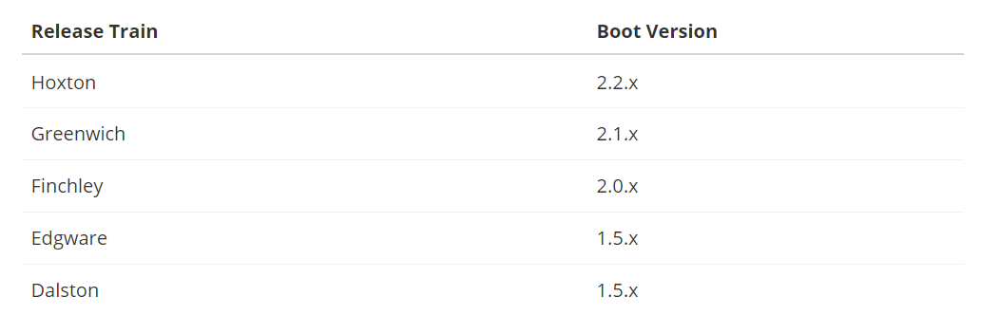
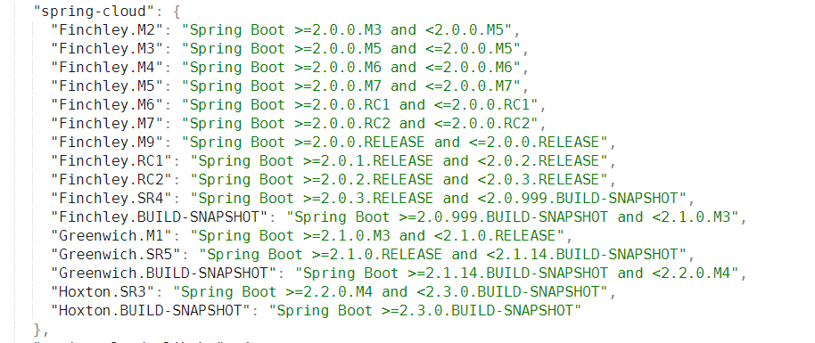
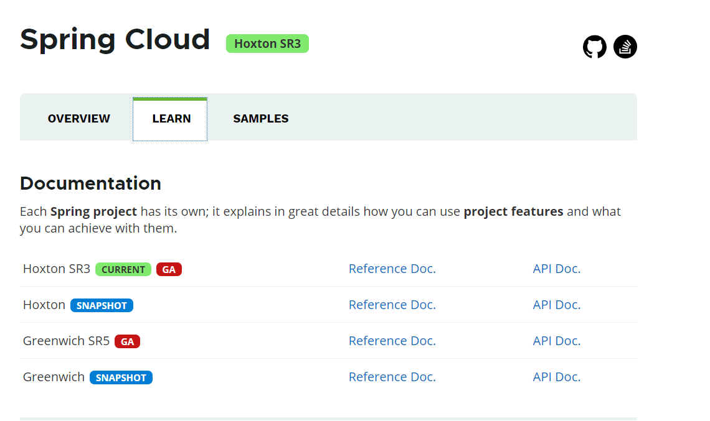
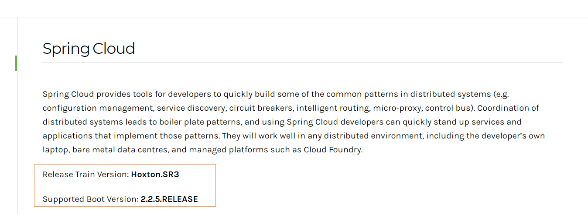
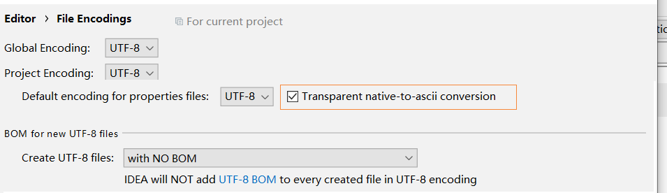
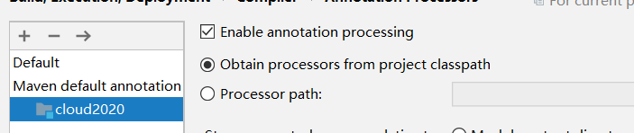

# SpringClound


## 一、微服务

什么是微服务？

```reStructuredText
	微服务化的核心就是将传统的一站式应用，根据业务拆分成一个一个的服务，彻底的去耦合，每一个微服务提供单个业务功能的业务，一个服务做一件事，从技术角度看就是一种小而独立的处理过程，类似于进程概念，能够自行单独启动或销毁，拥有自己独立的数据库。
```

### 优点与缺点

> 优点
>

```tex
	1.每个服务足够内聚，足够小，代码容易理解这样能聚焦一个指定的业务功能或业务需求，开发简单、开发效率提高，一个服务可能就是专一的只干一件事。
	2.微服务能够被小团队单独开发，这个小团队是2到5人的开发人员组成。
	3.微服务是松耦合的，是有功能意义的服务，无论是在开发阶段或部署阶段都是独立的。
	4.微服务能使用不同的语言开发
	5.易于和第三方集成，微服务允许容易且灵活的方式集成自动部署，通过持续集成工具，如Jenkins, Hudson, bamboo。
	6.微服务易于被一个开发人员理解，修改和维护，这样小团队能够更关注自己的工作成果。无需通过合作才能体现价值。
	7.微服务允许你利用融合最新技术。
	8.微服务只是业务逻辑的代码，不会和HTM, css或其他界面组件混合。
	9.每个微服务都有自己的存储能力，可以有自己的数据库。也可以有统一数据库。
```

> 缺点

```java
1.开发人员要处理分布式系统的复杂性
2.多服务运维难度，随着服务的增加，运维的压力也在增大
3.系统部署依赖
4.服务间通信成本
5.数据一致性
6.系统集成测试
7.性能监控.....
```

### Cloud 与 Boot 的关系

SpringCloud 与 springBoot 的关系

```java
	SpringBoot专注于快速方便的开发单个个体微服务，SpringCloud是关注全局的微服务协调整理治理框架，它将SpringBoot开发的一个个单体微服务整合并管理起来,为各个微服务之间提供,配置管理、服务发现、断路器、路由、微代理、事件总线、全局锁、决策竞选、分布式会话等等集成服务，SpringBoot可以离开SpringCloud独立使用开发项目，但是SpringCloud离不开SpringBoot, 属于依赖的关系.
```

SpringBoot专注于快速、方便的开发单个微服务个体, SpringCloud关注 全局的服务治理框架。


### 开发版本

严格按照官网标准.

**一、**



左边是springcloud 的大版本，右边是boot的版本

通俗点说就是H版本建议使用2.2.x的boot版本

G版本建议使用2.1.x的boot版本

...

-> 官网链接 ，往下滑就能看到cloud 与boot对应版本信息.

```tex
https://spring.io/projects/spring-cloud/
```

**二、**

准确版本（json格式）



如：若使用的是Finchley.M2的cloud版本，应该使用boot的版本大于等于2.0.0.M3 并且 小于 2.0.0.M5

查看json链接

```java
https://start.spring.io/actuator/info
```

json格式化网站

```tex
https://tool.lu/json/
```

**三、**

springcloud官网



当选择某一个cloud版本时，点击旁的Reference Doc，里面有清晰的记录着boot所需要的版本

如图：



以上三种方式都可以减少cloud与boot冲突的问题.


## idea配置

修改项目编码：file - settings - Editor - File encoding



将自己idea的配置与上图一致并且划线的地方也一定要勾选上

idea开启注解支持：file -> settings -> Builde,Execution .. -> Compiler -> Annotation processors 选择自己的项目，并且勾选Enable annotation ... 保存.



