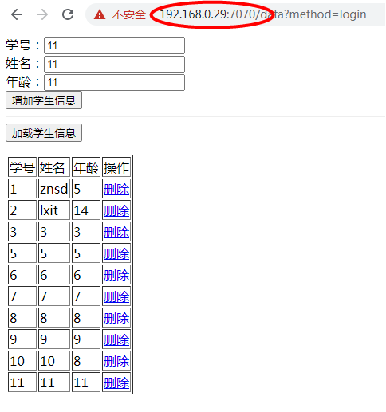
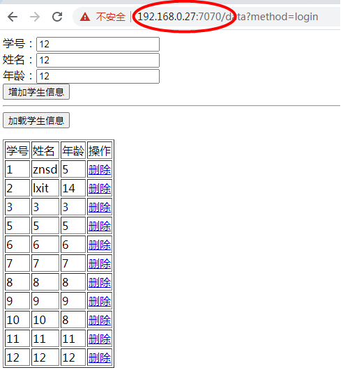

# 一次构建，到处运行

1.我们工作在/usr/local/docker/app目录下，创建**Dockerfile**文件

```shell
#Dockerfile文件
FROM tomcat:8.5
RUN rm -rf /usr/local/tomcat/webapps/ROOT/*
#这里我们要将我们的项目[webmaven.zip]copy到Dockerfile文件目录
COPY webmaven.zip /usr/local/tomcat/webapps/ROOT/

WORKDIR	/usr/local/tomcat/webapps/ROOT/
RUN unzip webmaven.zip \
    && rm -rf webmaven.zip

WORKDIR /usr/local/tomcat

EXPOSE	8080
```

构建镜像：

```shell
docker build -t app/znsd .
```

2.接下来看看我们的镜像能否正常运行；就要编写**docker-compose.yml**文件启动容器

```shell
version: '2.1'
services:
    myapp:
      image: app/znsd
      ports:
        - 7070:8080  
```


3.将镜像推送到远程hub.docker上

```shell
#远程仓库拷贝过来的推送代码
docker push laosu666/lele-tomcat:tagname 
```

参考上述代码，先打标签

```shell
docker tag   app/znsd    laosu666/lele-tomcat:1.1
```

在推送镜像到仓库

```shell
docker push laosu666/lele-tomcat:1.1
```

**结果如图：**



再到另外一台电脑：192.168.0.27

1.拉取镜像

```shell
docker pull laosu666/lele-tomcat:1.1
```

2.编写

```shell
version: '2.1'
services:
    myapp:
      image: laosu666/lele-tomcat:1.1
      ports:
        - 7070:8080  
```

**结果如图：**

