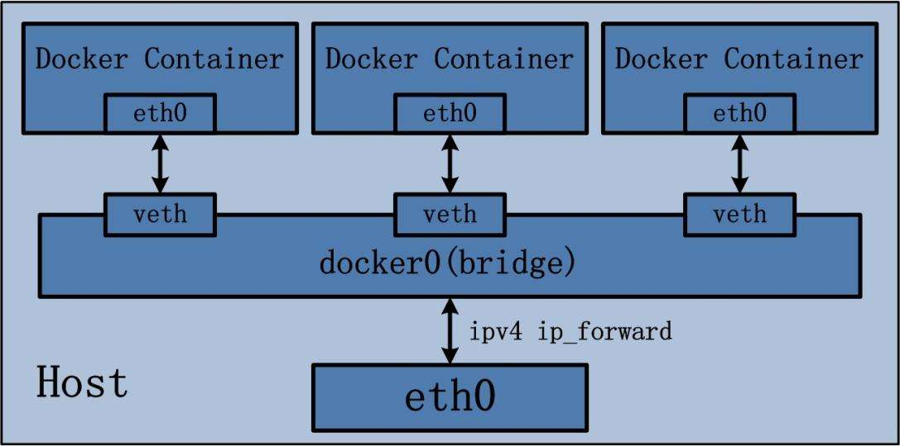

### Docker容器的网络基础

#### Docker提供的网桥

*docker服务进程在启动的时候会生成一个名为docker0的网桥，容器默认都会挂载到该网桥下.但是我们可以通过添加docker启动参数-b Birdge 或更改docker配置文件来选择使用哪个网桥。* 

首先，查看一个名为docker0的网络设备：

```shell
[root@localhost ~]# ifconfig docker0
```

docker守护进程就是通过docker0为docker容器提供网络连接的各种服务。docker0实质事Linux的虚拟网桥

网桥是在OSI七层模型的数据链路层的网络设备，通过mac地址对网络进行划分，并且在不同网络直接传递数据，对于Linux的虚拟网桥：

* 可以设置IP地址
* 相当于拥有一个隐藏的虚拟网卡




docker守护进程在一个容器启动时，实际上要创建网络连接的两端；一端是在容器中的网络设备，另一端在运行docker容器的宿主机上，打开一个veth*的一个接口，用来实现docker0网桥与容器的网络通信 

```shell
[root@localhost ~]# yum install bridge-utils
```

```shell
(base) [root@localhost ~]# docker ps
CONTAINER ID   IMAGE     COMMAND       CREATED       STATUS     PORTS    NAMES
39ff2f83533a   centos   "/bin/bash"    2 hours ago   Up 2 hours           sss
bd074cd5fef1   centos   "/bin/bash"    3 hours ago   Up 2 hours           xxx  

(base) [root@localhost ~]# brctl show
bridge name     bridge id               STP enabled     interfaces
docker0         8000.0242a4744e98       no              veth1755298
                                                        veth6922627

```

可以对docker0进行修改，使之成为我们希望的网段 

```shell
ifconfig docker0 IP netmask NATMASK
```

```shell
[root@localhost docker]# ifconfig docker0 172.25.11.1 netmask 255.255.255.0
[root@localhost docker]# ifconfig docker0
docker0: flags=4163<UP,BROADCAST,RUNNING,MULTICAST>  mtu 1500
        inet 172.25.11.1  netmask 255.255.255.0  broadcast 172.25.11.255
        inet6 fe80::42:2fff:fe56:7b2e  prefixlen 64  scopeid 0x20<link>
        ether 02:42:2f:56:7b:2e  txqueuelen 0  (Ethernet)
        RX packets 27406  bytes 2657911 (2.5 MiB)
        RX errors 0  dropped 0  overruns 0  frame 0
        TX packets 42047  bytes 58023011 (55.3 MiB)
        TX errors 0  dropped 0 overruns 0  carrier 0  collisions 0
[root@localhost docker]# service docker restart
Redirecting to /bin/systemctl restart  docker.service
```

#### 自定义虚拟网桥

有时候，不希望使用docker默认提供的虚拟网桥，就可以添加自定义的虚拟网桥

* 添加虚拟网桥： 

```shell
brctl addbr br_name

ifconfig br_name IP netmask NETMASK_NAME
```

* 修改/lib/systemd/system.docker.service文件 

```shell
ExecStart=ExecStart=/usr/bin/dockerd -b=br0		//br0为宿主机的网络桥接设备
//完成之后要重启服务
```

BRIDGE=br0  --这个很重要 

/etc/init.d/network restart

```shell
centos 7:

Configure Docker to use the new bridge by setting the option in the daemon.json file, which is located in /etc/docker/ on Linux or C:\ProgramData\docker\config\ on Windows Server. On Docker for Mac or Docker for Windows, click the Docker icon, choose Preferences, and go to Daemon.

If the daemon.json file does not exist, create it. Assuming there are no other settings in the file, it should have the following contents:

{

"bridge": "br0"

}

centos 6:

~#:vim /etc/sysconfig/docker #在OPTIONS='--selinux-enabled'这行中修改为OPTIONS='--selinux-enabled -b=br0'即让docker服务启动时使用br0网卡进行桥接
```

