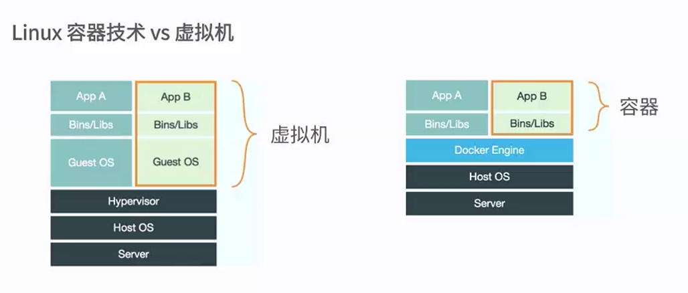
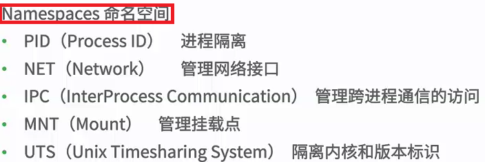
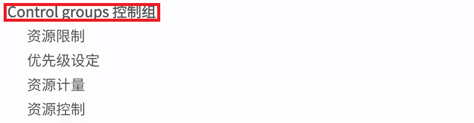

# docker

Docker 是一个开源的应用容器引擎，让开发者可以打包他们的应用以及依赖包到一个可移植的容器中，然后发布到任何流行的 Linux 机器上，也可以实现虚拟化，容器是完全使用沙箱机制，相互之间不会有任何接口。 

Docker 使用客户端-服务器 (C/S) 架构模式 使用远程API来管理和创建Docker容器。Docker 容器（Container）通过 Docker 镜像（Image）来创建，二者之间的关系类似于面向对象编程中的对象与类 

## 1.由来

以前运输肉类、水果、钢琴、汽车、玻璃、衣服都是直接放到运输工具上，但是不同的货物处理方式不同，有的易碎，有的没事，后来就发明了集装箱。集装箱是货物运输的一大进步！

docker就类似集装箱，以前我们的项目有运行在测试环境，虚拟机、云环境等不同场所；jdk、数据库、tomcat等就需要安装配置，现在都配置到docker后，在自己电脑可以运行的话，就可以将docker搬运到任何地方。

## 2.组成

那Docker由什么组成呢， 包括三个基本概念:

- **仓库（Repository）**
- **镜像（Image）**
- **容器(Container）**

**容器：**

​	一种虚拟化的方案(一种虚拟技术区别于传统的虚拟机)

​	操作系统级别的虚拟化

​	只能运行在相同或相似内核的操作系统

​	依赖于Linux内核特性：Namespace和Cgroups(ControlGroup)---缺点



**容器优点：**

1、**它启动很快** 。这也意味着，在它执行的过程中几乎没有额外的开销。 

2、虚拟机占用物理空间大

3、虚拟机要模拟硬件的行为，对cpu和memory损耗特别大

4、**一键（单命令）部署。** 它是真的简单到安装一个应用只需输入一行命令。想要安装MySQL？一行命令。想到一下子把WordPress, MySQL, Nginx and Memcache全部安装并且配置完成？还是一行命令。 

5、**预配置应用。** 在上一次统计中，有超过13000个应用已经打包成了Docker镜像。这样的话，如果你正在使用一个通用的应用，则大部分的初始化工作都应经为你事先做好了。还不止这样，你还可以再得到应用镜像之后，进行个性化的修改，再重新部署到你专属的资源库里。 

**什么是Docker?**

​	将应用程序自动部署到容器

​	Go语言开源引擎 Github地址：https://github.com/docker/docker

​	2013年初，dotCloud发布

**Docker的目标**

​	1、提供简单轻量级的建模方式（启动快速、可以开启多个容器）

​	2、职责的逻辑分离（开发只关心容器内运行的程序、运维只关心如何管理容器）

【docker设计的目的就是加强开发人员写代码的开发环境与应用程序要部署到生产环境的一致性】

​	3、快速高效的开发生命（ 开发、测试、生产同一环境，避免额外的部署、调试时间）

​	4、鼓励使用面向服务的架构（鼓励单个容器只运行一个应用程序，形成分布式架构）

**Docker使用场景**

​	1、使用docker容器开发、测试、web应用的自动化打包和发布部署服务

​	2、创建隔离的运行环境【在过去，如果你想运行所有的服务在同一台服务器上，这可能会耗尽服务器的所有资源。Docker允许你基于各自应用或服务，进行设置、监听、调整。 】

​	3、搭建测试环境；自动化测试和持续集成、发布；

​	4、构建多用户的平台即服务

​	5、提供软件即服务应用程序

​	6、高性能能、超大规模的宿主机部署

**容器相关技术：**





## 3.安装

Docker for Windows版下载：<https://github.com/boot2docker/boot2docker> 

**Linux版安装：**

3.1、把yum包更新到最新 

```shell
yum update
卸载旧版本docker
yum -y  remove docker  docker-common docker-selinux docker-engine
```

3.2、安装需要的软件包， yum-util 提供yum-config-manager功能，另外两个是devicemapper驱动依赖的 

```shell
yum install -y yum-utils device-mapper-persistent-data lvm2
```

3.3、设置yum源 

```shell
yum-config-manager --add-repo https://download.docker.com/linux/centos/docker-ce.repo
```

3.4、可以查看所有仓库中所有docker版本，并选择特定版本安装 

```shell
yum list docker-ce --showduplicates | sort -r
```

3.5、安装Docker，命令：yum install -y docker-ce-版本号，我选的是17.12.0.ce，如下 

```shell
yum install -y docker-ce-17.12.0.ce-1.el7.centos
#由于repo中默认只开启stable仓库，故这里安装的是最新稳定版17.12.0.ce-1.el7.centos
```

3.6、启动Docker，命令：systemctl start docker，然后加入开机启动，如下 

```shell
systemctl start docker
systemctl enable docker
```

3.7、验证安装是否成功(有client和service两部分表示docker安装启动都成功了) 

```shell
[root@localhost docker]# docker version
Client:
 Version:       17.12.0-ce
 API version:   1.35
 Go version:    go1.9.2
 Git commit:    c97c6d6
 Built: Wed Dec 27 20:10:14 2017
 OS/Arch:       linux/amd64

Server:
 Engine:
  Version:      17.12.0-ce
  API version:  1.35 (minimum version 1.12)
  Go version:   go1.9.2
  Git commit:   c97c6d6
  Built:        Wed Dec 27 20:12:46 2017
  OS/Arch:      linux/amd64
  Experimental: false

```

简单的安装在centos:

```shell
yum install docker -y
systemctl start docker.service
systemctl enable docker.service
```

## 4.docker配置

配置加速器：https://cr.console.aliyun.com

centos系统：

```shell
1. 安装／升级Docker客户端
推荐安装1.10.0以上版本的Docker客户端，参考文档 docker-ce

2. 配置镜像加速器
针对Docker客户端版本大于 1.10.0 的用户

您可以通过修改daemon配置文件/etc/docker/daemon.json来使用加速器
sudo mkdir -p /etc/docker
sudo tee /etc/docker/daemon.json <<-'EOF'
{
  "registry-mirrors": ["https://3gecvtyg.mirror.aliyuncs.com"]
}
EOF
sudo systemctl daemon-reload
sudo systemctl restart docker
```


## 升级docker

先卸载之前的docker 

```shell
docker --version
```

开始卸载 

```shell
yum remove docker  docker-client  docker-client-latest docker-common  docker-latest       docker-latest-logrotate   docker-logrotate  docker-selinux  docker-engine-selinux         docker-engine
```

安装新的docker，首先要先update一下，不然后面会报错 

```shell
root@topcheer harbor]# systemctl restart docker.service
Job for docker.service failed because the control process exited with error code. See "systemctl status docker.service" and "journalctl -xe" for details.
[root@topcheer harbor]#  sudo yum update -y
```

开始正式安装 

```shell
yum install -y yum-utils
```

```shell
yum-config-manager --add-repo https://mirrors.aliyun.com/docker-ce/linux/centos/docker-ce.repo
```

```shell
yum list docker-ce --showduplicates|sort -r
```

```shell
yum install docker-ce-17.06.2.ce-1.el7.centos -y
```


卸载：

　　1、查询docker安装过的包：

　　　　yum list installed | grep docker

​      　

　　2、删除安装包：

　　　yum remove  docker-ce.x86_64   docker-ce-cli.x86_64 -y

　　3、删除镜像/容器等

　　　　rm -rf /var/lib/docker