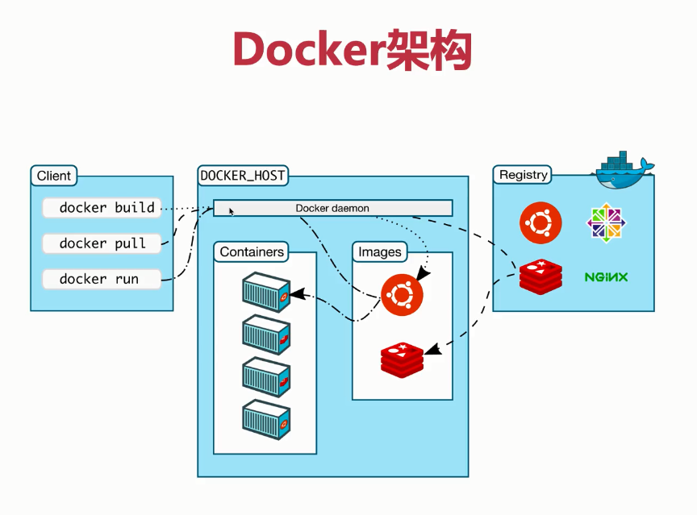

# docker容器

### 结构：C/S架构




<1\>Images：镜像（容器的源代码，保存容器运行的各种环境）

​	容器的基石

​	层叠的只读文件系统

​	联合加载（union mount）

<2\>Containers：（通过镜像启动，启动执行阶段[Image是构建打包阶段]）


docker容器的能力：

​	1、文件系统的隔离：每一个容器都有自己的root文件系统

​	2、进程隔离：每个容器都运行在自己的进程环境中

​	3、网络隔离：容器间的虚拟网络接口和IP地址是分开的

​	4、资源隔离和分组：使用cgroups 将CPU和内存之类的资源独立分配给每个Docker容器

<3\>Registry：仓库

​	共有仓库：Docker hub是默认的仓库

​	私有仓库

### Docker容器命令

版本查看：docker version

通过run命令创建一个新的容器（container） 

```dockerfile
docker  run  [OPTIONS]  IMAGE COMMAND 
```

示例：docker run --name NAME -i -t [IMAGE\] [ARG\]

​	-i --interaction=true|false 默认：false（提供 一个标准输入）

​	-t --tty=true|false默认：false（提供一个伪tty终端Console）

一次性容器：只运行一次

```dockerfile
示例1：docker run centos echo 'hello' 
```

交互式容器：命令结束(exit)后即停止

```dockerfile
示例2：docker run --name NAME -i -t centos  /bin/bash
```

查看特定容器：docker ps -a -l

​		   docker inspect  ID|NAME   [ 查看指定ID或名字的容器]

自定义docker名字：docker run --name 自定义名字 -i -t  [IMAGE]   /bin/bash

重启容器：docker start  [-i\]  NAME|ID

容器停止：docker stop  ID

容器删除：docker  rm   ID

```shell
#删除所有未运行的容器（已经运行的删除不了，未运行的就一起被删除了）
sudo docker rm $(sudo docker ps -a -q)
```

**创建守护式容器：无需会话，无需终端，可以长期运行；非常适合运行应用程序和服务**

```dockerfile
docker run -i -t IMAGE /bin/bash
	Ctrl +P  Ctrl+Q命令退出；不需要exit退出
```

再次进入一个守护式容器

```shell
docker attach NAME|ID
```

**创建启动守护式容器：docker run -d 镜像名\[COMMAND\][ARG...]**

查看容器日志：

```shell
docker logs [-f]  [-t]  [--tail] 0 容器名
	-f --follow=true|false 默认为false
	-t --timestamps=true|false 默认为false
	--tail = "all"
```

查看某一个容器内的进程情况：

```shell
docker top  容器名
```

在守护式容器中启动进程：(在运行中的容器启动新进程)

```shell
docker exec -d  -i  -t  容器名|ID [COMMAND][ARG...]
	示例：docker exec -i -t lele  /bin/bash [在lele容器中开启/bin/bash进程]
	注意：因为使用-i  -t 会进入终端；我们可以使用Ctrl +P  Ctrl+Q命令退出
```

停止守护式容器：

```shell
docker stop 容器名：发一个停止命令，等待容器停止
docker kill 容器名：直接停止容器
```

端口映射：处理容器内端口和宿主机端口的映射

```shell
run -P -p
```

-P ：--publish-all=true|false 默认false；为容器暴露的所有端口映射

​	语法：

```shell
docker run -P -i -t centos /bin/bash
```

-p：--publish=[]

​	语法：

```shell
containerPort:
	docker run -p 80 -i -t centos /bin/bash
hostPort:containerPort
	docker run -p 8080:80  -i -t centos /bin/bash
ip:containerPort
	docker run -p 0.0.0.0:80  -i -t centos /bin/bash
ip:hostPort:containerPort
	docker run -p 0.0.0.0:8080:80  -i -t centos /bin/bash	
```


挂存储卷(通过映射将容器内mysql数据存储到宿主机目录下)

查看容器日志：docker logs -f 0257f0154b97

设置环境变量


**示例：创建MySQL两种方式**

```mysql
第一、不需要建立目录映射
sudo docker run -p 3306:3306 --name mysql -e MYSQL_ROOT_PASSWORD=123456 -d mysql:5.7
–name：容器名，此处命名为mysql
-e：配置信息(环境变量)，此处配置mysql的root用户的登陆密码
-p：端口映射，此处映射 主机3306端口 到 容器的3306端口
第二、如果要建立目录映射
duso docker run -p 3306:3306 --name mysql \
-v /home/docker/mysql/conf:/etc/mysql \
-v /home/docker/mysql/logs:/var/log/mysql \
-v /home/docker/mysql/data:/var/lib/mysql \
-e MYSQL_ROOT_PASSWORD=123456 \
-d mysql:5.7
说明：
/home/docker/mysql/conf宿主机目录
冒号后面的目录为docker容器的目录
```

检查容器是否正确运行 

```shell
docker container ls或docker ps
可以看到容器ID，容器的源镜像，启动命令，创建时间，状态，端口映射信息，容器名字
```

**连接mysql**

```shell
进入docker本地连接mysql客户端
sudo docker exec -it mysql bash
mysql -uroot -p123456
```

如果你的容器运行正常，但是无法访问到MySQL，一般有以下几个可能的原因： 

1.防火墙阻拦 

```shell
# 开放端口：
$ systemctl status firewalld
$ firewall-cmd  --zone=public --add-port=3306/tcp -permanent
$ firewall-cmd  --reload
# 关闭防火墙：
$ sudo systemctl stop firewalld
```

2.需要进入docker本地客户端设置远程访问账号 

```shell
$ sudo docker exec -it mysql bash
$ mysql -uroot -p123456
mysql> grant all privileges on *.* to root@'%' identified by "password";
mysql> flush privileges;
```

**重启mysql**

```shell
sudo systemctl start docker
docker ps -a
docker restart 1b4671904bfa
```

> 小结：

- 运行一个在后台执行的容器，同时，还能用控制台管理

  `docker run -i -t -d ubuntu:latest`

- 运行一个带命令在后台不断执行的容器，不直接展示容器内部信息

  `docker run -d ubuntu:latest ping www.docker.com`

- 运行一个在后台不断执行的容器，同时带有命令，程序被终止后还能重启继续跑，还能用控制台管理，`docker run -d --restart=always ubuntu:latest ping www.docker.com`

- 为容器指定一个名字

  `docker run -d --name=ubuntu_server ubuntu:latest`

- 容器暴露80端口，并指定宿主机80端口与其通信(**:** 之前是宿主机端口，之后是容器需暴露的端口)，

  `docker run -d --name=ubuntu_server -p 80:80 ubuntu:latest`

- 指定容器内目录与宿主机目录共享(**:** 之前是宿主机文件夹，之后是容器需共享的文件夹)

  `docker run -d --name=ubuntu_server -v /etc/www:/var/www ubuntu:latest`

#### 仓库登录

docker login

### 容器的生命周期

