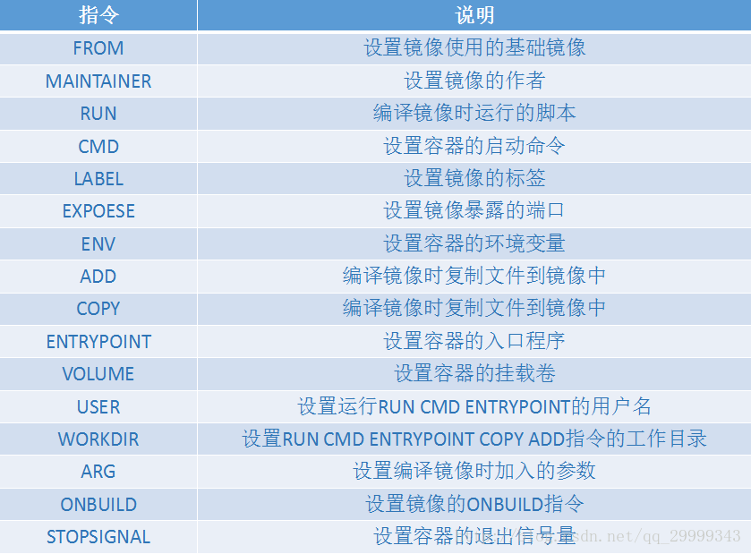

# DockerFile

​	由一系列命令和和参数构成的脚本。这些命令应用于操作系统(centos|Ubuntu)基础镜像并最终创建的一个新镜像。

​	我们前面通过手动commit方式构建，这种比较麻烦且容易出错，不能复用；通过Dockerfile构建可复用、高效，是企业级开发首选。

​	在软件开发生命周期中，采用DockerFile来构建镜像：

1.对于开发人员：可以为开发团队提供一个完全一致的开发环境

2.对于测试人员：可以直接拿开发时所构建的进行或通过DockerFile文件构建一个新的镜像开始工作

3.对于运维人员：在部署时，可以实现应用无缝移植

## 1.命令目录



dockerfile执行build命令时，是从上倒下依次执行的，dockerfile的基本组成部分如下。

​      主要部分                     代表性命令
​    基础镜像信息                   FROM
​    维护者信息                       MAINTAINER
​    镜像操作指令                   RUN、COPY、ADD、EXPOSE、WORKDIR、ONBUILD、USER、VOLUME、ENV等
​    容器启动时执行指令       CMD、ENTRYPOINT

## 2.构建自己的centos

以下创建文件myCentos；且添加如下数据：

```shell
FROM centos
MAINTAINER laosu<owpower01@gmail.com>
LABEL name="laosu666 Centos Image" build-date="2020-05-11"
ENV WROKPATH /home/
WORKDIR $WROKPATH
RUN yum -y install net-tools
RUN yum -y install vim

EXPOSE 80
CMD /bin/bash
```

构建命令：

```shell
格式：docker build -f 构建文件名称 -t laosu666/mycentos:1.1 .
```

```shell
docker build -f myCentos -t laosu666/mycentos:1.1 .
```

之后就可以运行这个镜像


如果要查看构建历史：

docker history ID


## 3.构建自己的Tomcat

```shell
FROM centos
MAINTAINER laosu<owpower01@gmail.com>
LABEL name="laosu666 Centos Image" build-date="2020-05-11"

ADD apache-tomcat-9.0.34.tar.gz /home/
ADD jdk-8u171-linux-x64.tar.gz /home/

ENV WROKPATH /home/apache-tomcat-9.0.34/
WORKDIR $WROKPATH


ENV JAVA_HOME /home/jdk1.8.0_171
ENV CLASSPATH $JAVA_HOME/jre/lib/rt.jar:$JAVA_HOME/lib/dt.jar:$JAVA_HOME/lib/tools.jar
ENV CATALINA_HOME /home/apache-tomcat-9.0.34/
ENV CATALINA_BASE /home/apache-tomcat-9.0.34/
ENV PATH $PATH:$JAVA_HOME/bin:$CATALINA_HOME/lib:$CATALINA_HOME/bin

EXPOSE 8080
CMD ["/home/apache-tomcat-9.0.34/bin/catalina.sh","run"]
```

构建命令：

```shell
[root@localhost docker]# docker build -f mytomcatdockerfile -t laosu666/mytomcat:2.0 .
```

之后就可以运行这个镜像

```shell
docker run -it --name mytomcat1 -p 8080:8080 -d 6d279e252e0b
```

进入容器查看：

```shell
docker exec -it mytomcat1 /bin/bash
```


## 4.CMD和ENTRYPOINT区别

都是容器启动以后执行的命令;都支持shell和exec方式

**语法：**

```shell
ENTRYPOINT ["executable","param1","param2"]
```

```shell
运行一个可执行文件，并提供参数
CMD ["executable","param1","param2"] 
为ENTRYPOINT提供参数
CMD ["param1","param2"] 
```

**用法：**

（1）CMD单独使用

（2）先ENTRYPOINT，后CMD结合使用

加入有多个CMD后面会覆盖前面的

---

看两个示例：

**到官网：hub.docker.com->tomcat查看**

我们找一个自己的tomcat镜像运行：

```shell
 docker run -it -p 8080:8080 镜像ID [/bin/bash | ls -l 就覆盖了]
```

后面不加命令就可以运行

**到官网：hub.docker.com->redis查看**

---

手写示例：

(1)

```
FROM centos
CMD echo 'hehe-lele'
#CMD ["/bin/echo","111222333"]
```

(2)

```shell
FROM centos
ENTRYPOINT ["ls"]
CMD ["-l"]
```

解释：-l 好像也可以直接加到ENTRYPOINT后，为啥要加到CMD，不是多余吗？

这样写用法更加灵活；它会覆盖，在我们自己写命令是后面可以跟一个我们自己的命令如下： 

docker run  ID  【-a】


