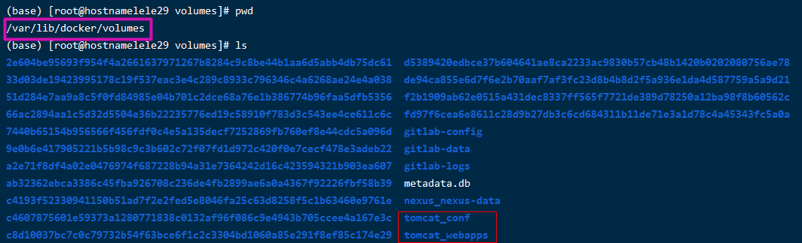

# Docker Compose 

### 1、Docker Compose 概述与安装？

- 前面我们使用 Docker 的时候，定义 Dockerfile 文件，然后使用 docker build、docker run 等命令操作容器。然而微服务架构的应用系统一般包含若干个微服务，每个微服务一般都会部署多个实例，如果每个微服务都要手动启停，那么效率之低，维护量之大可想而知
- **使用 Docker Compose 可以轻松、高效的管理容器，它是一个用于定义和运行多容器 Docker 的应用程序工具**

### 2、安装 Docker Compose

- 安装 Docker Compose 可以通过下面命令自动下载适应版本的 Compose，并为安装脚本添加执行权限

 从 [官方GitHub Release](https://github.com/docker/compose ) 处直接下载编译好的二进制文件

 ```shell
#官网
curl -L https://github.com/docker/compose/releases/download/1.25.5/docker-compose-`uname -s`-`uname -m` -o /usr/local/bin/docker-compose
chmod +x /usr/local/bin/docker-compose
#局域网[docker-compose version 1.25.0dev, build bc57a1bd]
curl -L http://192.168.0.28/znsd/tools/docker-compose-`uname -s`-`uname -m` -o /usr/local/bin/docker-compose
chmod +x /usr/local/bin/docker-compose
 ```

- 查看安装是否成功

```
docker-compose -v
```

### 3、修改主机名

1. 查看一下当前主机名的情况

   ```shell
   hostnamectl 
   ```

**方法1：临时有效**

hostname 主机名 //只能临时修改的主机名，当重启机器后，主机名称又变回来了。

```
hostname lele29

cat /etc/redhat-release
```

**方法2：永久生效**

修改配置文件/etc/hostname来实现主机名的修改。把该文件内容hostname name中的name替换成自己想要的主机名重启即可。

```shell
vim /etc/hostname 
hostname  myname
```

重启CentOS 7 

```
reboot -f 
```

### 4、简单使用

在**/usr/local/docker/tomcat/**docker-compose.yml

```yml
version: '2.2'
services: 
  tomcat: 
    restart: always
    image: tomcat
    container_name: tomcat
    ports:
      - 3333:8080
```

### 5、docker-compose部署应用程序

#### **5.1部署tomcat**

```shell
version: '2.2'
services: 
  tomcat: 
    restart: always
    image: tomcat
    container_name: tomcat
    ports:
      - 3333:8080
    volumes:
      - ./webapps:/usr/local/tomcat/webapps
```

> 启动命令：docker-compose up -d

**或者**

```shell
version: '2.2'
services: 
  tomcat: 
    restart: always
    image: tomcat
    container_name: tomcat
    ports:
      - 3333:8080
    volumes:
      - webapps:/usr/local/tomcat/webapps
      - conf:/usr/local/tomcat/conf

volumes:
    webapps:
    conf:
```



#### **5.2部署Mysql**

```shell
version: "3.3"
services:

  mysql:
    image: mysql
    restart: always
    command: 
      #这行代码解决无法访问的问题
      --default-authentication-plugin=mysql_native_password
      --character-set-server=utf8mb4 
      --collation-server=utf8mb4_unicode_ci
    ports:
      - "3306:3306"
    environment:
      MYSQL_ROOT_PASSWORD: 123456
      MYSQL_USER: 'test'
      MYSQL_PASS: 'test'
    volumes:
      - ./data:/var/lib/mysql

  adminer:
    image: adminer
    restart: always
    ports:
      - "4444:8080"
```

```shell
运行容器
在 docker-compose.yml 目录下执行：

> docker-compose up
如果要在后台运行，使用 docker-compose up -d 。

停止容器：

> docker-compose down
如果是前台运行的，使用：Ctrl + C 停止。这两种方式在停止后都会删除容器，下次启动必须使用 up 命令。

停止但不删除容器：

> docker-compose stop
使用 stop 停止后，再次启动使用 start 命令即可。
```

**如果出问题：**

1.[查看 SELinux状态及关闭SELinux](http://bguncle.blog.51cto.com/3184079/957315/)

2.查看SELinux状态
sestatus -v
getenforce

3.临时关闭SELinux
setenforce 0


##### Environment 变量

- `MYSQL_ROOT_PASSWORD` ：这个不用解释，root 用户的密码。
- `MYSQL_USER`，`MYSQL_PASSWORD` ：这两个变量为可选，创建一个新用户，这个用户在 `MYSQL_DATABASE` 变量指定的数据库上拥有超级用户权限。
- `MYSQL_DATABASE` ：指定一个数据库，在容器启动时创建。
- `MYSQL_ALLOW_EMPTY_PASSWORD` ：设置为 yes 允许 root 用户的密码为空。（不推荐）
- `MYSQL_RANDOM_ROOT_PASSWORD` ：设置为 yes 将在容器启动时为 root 用户生成一个随机的密码，密码会显示到标准输出流（`GENERATED ROOT PASSWORD:......`）。
- `MYSQL_ONETIME_PASSWORD` ：字面意思就是一次性密码，为 root 用户设置，第一次登录后必须修改密码（仅支持 5.6 以上的版本）。


#### **5.3部署GitLab**

GitLab是一个利用 [Ruby on Rails](http://www.oschina.net/p/ruby+on+rails) 开发的开源应用程序，实现一个自托管的[Git](http://www.oschina.net/p/git)项目仓库，可通过Web界面进行访问公开的或者私人项目。

它拥有与[Github](http://www.oschina.net/p/github)类似的功能，能够浏览源代码，管理缺陷和注释。可以管理团队对仓库的访问，它非常易于浏览提交过的版本并提供一个文件历史库。它还提供一个代码片段收集功能可以轻松实现代码复用，便于日后有需要的时候进行查找。

GitLab 5.0以前版本要求服务器端采用 [Gitolite](http://www.oschina.net/p/gitolite) 搭建，5.0版本以后不再使用 [Gitolite](http://www.oschina.net/p/gitolite) ，采用自己开发的 gitlab-shell 来实现。如果你觉得安装麻烦可以使用 [GitLab Installers](http://www.oschina.net/p/gitlab+installers) 一键安装程序。

```shell
version: '2'
services:
  gitlabweb:
      image: 'twang2218/gitlab-ce-zh:11.1.4'
      restart: always
      hostname: '192.168.0.29'
      environment:
        TZ: 'Asia/Shanghai'
        GITLAB_OMNIBUS_CONFIG:
          external_url 'http://192.168.0.29'
          gitlab_rails['time_zone'] = 'Asia/Shanghai'
          gitlab_rails['gitlab_shell_ssh_port'] = 2222
          unicorn['port']=8888
          nginx['listen_port']=80
      ports:
        - '80:80'
        - '443:443'
        - '2222:22'
      volumes:
        - config:/etc/gitlab
        - data:/var/opt/gitlab
        - logs:/var/log/gitlab
```


首先，Docker 容器数据应该存储于卷中，在这里我们使用最简单的本地命名卷：

- `gitlab-config` 存储 GitLab 配置信息
- `gitlab-data` 存储数据库
- `gitlab-logs` 存储日志

然后，我们需要创建自定义网络，从而让容器运行于独立的网络中，区别于默认网桥。

```
docker network create gitlab-net
```

准备好后，开始运行 Gitlab 容器： 

```shell
docker run -d \
    --hostname hostnamelele29 \
    -p 8180:80 \
    -p 443:443 \
    -p 2222:22 \
    --name gitlab \
    --restart unless-stopped \
    -v gitlab-config:/etc/gitlab \
    -v gitlab-logs:/var/log/gitlab \
    -v gitlab-data:/var/opt/gitlab \
    --network gitlab-net \
    twang2218/gitlab-ce-zh:11.1.4
```

##### 简单运行

如果想简单的运行一下看看，可以执行这个命令：

```
docker run -d -p 3000:80 --name le-gitlab 
-v ./configs:/etc/gitlab 
-v ./data:/var/opt/gitlab 
-v ./logs:/var/log/gitlab 
twang2218/gitlab-ce-zh:11.1.4
```

*可以将 11.1.4 换成你所需要的版本标签。*

启动后就可以通过主机的 `3000` 端口看到运行结果了，比如用的是本机 Docker 的话，访问：[http://192.168.0.29:3000](http://192.168.0.29:3000/) 即可。

测试结束后，彻底清除容器可以用命令：

```
docker rm -fv <容器ID>
```

这样可以停止、删除容器，并清除数据。


#### 5.4部署Nexus

**什么是Nexus？**

​	Nexus是Google公司的品牌 。Nexus是一个强大的Maven仓库管理器，它极大地简化了自己内部仓库的维护和外部仓库的访问。利用Nexus你可以只在一个地方就能够完全控制访问 和部署在你所维护仓库中的每个Artifact。Nexus是一套“开箱即用”的系统不需要数据库，它使用文件系统加Lucene来组织数据。Nexus 使用ExtJS来开发界面，利用Restlet来提供完整的REST APIs，通过m2eclipse与Eclipse集成使用。Nexus支持WebDAV与LDAP安全身份认证。 

* 对底层代码进行了大规模的重构，提升性能，增加可扩展性以及改善用户体验
* 升级界面，极大简化了用户界面的操作和管理
* 提供新的安装包，让部署更加简单
* 增加对Docker，NeGet，npm，Bower的支持
* 提供新的管理接口，以及增强对自动任务的管理

```shell
version: '3.1'
services:
  nexus:
    restart: always
    image: sonatype/nexus3
    container_name: nexus
    ports:
       - 8082:8081 
    volumes:
       - nexus-data:/nexus-data
volumes:
  nexus-data: 
```

默认密码要进入容器：

```shell
/opt/sonatype/sonatype-work/nexus3/admin.password
```


#### 5.5 	Harbor安装

**1.下载** 

（1）官方 [Harbor](https://github.com/goharbor/harbor/ ) （2）内网 [Harbor](http://192.168.0.28/znsd/tools/harbor-offline-installer-v2.0.0.tgz ) 

**2.解压harbor压缩包** 

```shell
tar -zxvf /usr/local/src/harbor-offline-installer-v2.0.0.tgz -C /usr/local
#看到如下效果####################
harbor/harbor.v2.0.0.tar.gz
harbor/prepare
harbor/LICENSE
harbor/install.sh
harbor/common.sh
harbor/harbor.yml.tmpl
######################################
cd /usr/local/harbor/
```

**3.给harbor写配置文件**

注释：
● hostname写上你要访问的harbor的地址当主机名。
● certificate和private_key是支持HTTPS访问的证书的路径，文件名最好和主机名对应，便于记忆。
● harbor_admin_password是默认的harbor登录的密码
● database-password我猜是默认的harbor数据库密码，默认的是root123，建议改掉。
● data_volume 是数据默认存放目录，即harbor的docker持久化目录默认放在了/data下。

```shell
cat > /usr/local/harbor/harbor.yml <<-EOF
hostname: 192.168.0.29
 
http:
  port: 80
https:
  port: 443
  certificate: /usr/local/harbor/certs/harbor.hiibm.com.crt
  private_key: /usr/local/harbor/certs/harbor.hiibm.com.key
 
harbor_admin_password: Harbor12345
 
database:
  password: harbor123db
  max_idle_conns: 50
  max_open_conns: 100
 
data_volume: /data
 
clair:
  updaters_interval: 12
trivy:
  ignore_unfixed: false
  skip_update: false
  insecure: false
jobservice:
  max_job_workers: 10
 
notification:
  webhook_job_max_retry: 10
chart:
  absolute_url: disabled
 
log:
  level: info
  local:
    rotate_count: 50
    rotate_size: 200M
    location: /var/log/harbor
_version: 2.0.0
 
proxy:
  http_proxy:
  https_proxy:
  no_proxy:
  components:
    - core
    - jobservice
    - clair
    - trivy
EOF
```

**4.给harbor创建SSL证书** 

● 安装openssl证书工具

```
yum install -y openssl
```

● 创建证书存放文件夹

```
mkdir /usr/local/harbor/certs

cd /usr/local/harbor/certs
```

● 生成无加密的根证书私钥（注意一定要进到证书目录）

```
openssl genrsa -out ca.key 4096

(base) [root@hostnamelele29 certs]# ls
ca.key
```

● 使用刚才生成的私钥制作自签名证书（将这里的harbor.hiibm.com替换成你的域名即可） 

```shell
openssl req -x509 -new -nodes -sha512 -days 3650 -subj "/C=CN/ST=Beijing/L=Beijing/O=harbor.hiibm.com/OU=harbor.hiibm.com/CN=harbor.hiibm.com" -key ca.key -out ca.crt
```

● 生成服务器端自己域名的key（将这里的harbor.hiibm.com替换成你的域名即可） 

```shell
openssl genrsa -out harbor.hiibm.com.key 4096

(base) [root@hostnamelele29 certs]# ls
ca.crt  ca.key  harbor.hiibm.com.key
```

● 生成服务器端自己域名的CSR签名请求（将这里的harbor.hiibm.com替换成你的域名即可） 

```shell
openssl req -sha512 -new -subj "/C=CN/ST=Beijing/L=Beijing/O=harbor.hiibm.com/OU=harbor.hiibm.com/CN=harbor.hiibm.com" -key harbor.hiibm.com.key -out harbor.hiibm.com.csr
```

●  生成一个 openssl 命令需要的外部配置文件 xexternalfile`.ext`（将这里的harbor.hiibm.com替换成你的域名即可） 

```shell
cat > xexternalfile.ext <<-EOF
authorityKeyIdentifier=keyid,issuer
basicConstraints=CA:FALSE
keyUsage = digitalSignature, nonRepudiation, keyEncipherment, dataEncipherment
extendedKeyUsage = serverAuth
subjectAltName = @alt_names
[alt_names]
DNS.1=harbor.hiibm.com
EOF
```

● 通过外部配置文件 x`externalfile.ext`和 csr 生成 crt（将这里的harbor.hiibm.com替换成你的域名即可） 

```shell
openssl x509 -req -sha512 -days 3650 -extfile xexternalfile.ext -CA ca.crt -CAkey ca.key -CAcreateserial -in harbor.hiibm.com.csr -out harbor.hiibm.com.crt
```

● 将服务端的 crt 转换成客户端用的 cert（将这里的harbor.hiibm.com替换成你的域名即可） 

```shell
openssl x509 -inform PEM -in harbor.hiibm.com.crt -out harbor.hiibm.com.cert
```

**5.预编译harbor** (这个过程可能会需要十来分钟，因为要到外部获取各种必须的镜像) 

```shell
cd /usr/local/harbor
./prepare
```

**6.执行安装**

```shell
cd /usr/local/harbor
./install.sh
```

直到看到[✔ ----Harbor has been installed and started successfully.----]才说明harbor安装成功了。 

**7.（可略过）查看docker进程，看harbor是否安装成功** 

```shell
(base) [root@hostnamelele29 harbor]# docker ps
CONTAINER ID        IMAGE                                COMMAND                  CREATED             STATUS                             PORTS                                           NAMES
b28bfb67e3f6        goharbor/harbor-jobservice:v2.0.0    "/harbor/entrypoint.…"   30 seconds ago      Up 28 seconds (health: starting)                                                   harbor-jobservice
3b2bc1d13a2a        goharbor/nginx-photon:v2.0.0         "nginx -g 'daemon of…"   30 seconds ago      Up 28 seconds (health: starting)   0.0.0.0:8083->8080/tcp, 0.0.0.0:443->8443/tcp   nginx
e31800e0c48d        goharbor/harbor-core:v2.0.0          "/harbor/entrypoint.…"   33 seconds ago      Up 30 seconds (healthy)                                                            harbor-core
1b62628c9d8f        goharbor/harbor-registryctl:v2.0.0   "/home/harbor/start.…"   37 seconds ago      Up 32 seconds (healthy)                                                            registryctl
2301564b8c8f        goharbor/redis-photon:v2.0.0         "redis-server /etc/r…"   37 seconds ago      Up 33 seconds (healthy)            6379/tcp                                        redis
f4a2066dbc1a        goharbor/harbor-portal:v2.0.0        "nginx -g 'daemon of…"   37 seconds ago      Up 32 seconds (healthy)            8080/tcp                                        harbor-portal
f96513f7aa33        goharbor/harbor-db:v2.0.0            "/docker-entrypoint.…"   37 seconds ago      Up 33 seconds (healthy)            5432/tcp                                        harbor-db
809346e17845        goharbor/registry-photon:v2.0.0      "/home/harbor/entryp…"   37 seconds ago      Up 34 seconds (healthy)            5000/tcp                                        registry
b4d59ba8dda0        goharbor/harbor-log:v2.0.0           "/bin/sh -c /usr/loc…"   38 seconds ago      Up 37 seconds (healthy)            127.0.0.1:1514->10514/tcp                       harbor-log

```


**harbor的默认登录账号是admin，默认密码是Harbor12345** 

# harbor的启动和停止

```shell

cd /usr/local/harbor
 
#停止harbor
docker-compose -f docker-compose.yml down
 
#启动harbor
docker-compose -f docker-compose.yml up -d
```


或者写两个简单的脚本更方便 

```shell
cat > ~/stopHarbor.sh <<EOF
#!/usr/bin/env bash
docker-compose -f /usr/local/harbor/docker-compose.yml down
 
if [ $? -eq 0 ];then
	echo -e "\e[1;32mINFO: harbor is close!!!\e[0m"
else
	echo -e "\e[1;31mERROR: harbor has failed to close...\e[0m"
fi
EOF
 
 
cat > ~/startHarbor.sh <<EOF 
#!/usr/bin/env bash
docker-compose -f /usr/local/harbor/docker-compose.yml up -d
 
if [ $? -eq 0 ];then
	echo -e "\e[1;32mINFO: harbor is running!!!\e[0m"
else
	echo -e "\e[1;31mERROR: harbor start failed...\e[0m"
fi
EOF
```

## 上传镜像

#### 1. 修改Docker配置

docker 默认是按 https 请求的，由于我搭的私有库是 http 的，所以需要修改 docker 配置，将信任的库的地址写上
修改文件 `/etc/docker/daemon.json`

```shell
{
  "registry-mirrors": ["https://3gecvtyg.mirror.aliyuncs.com"],
  "insecure-registries": [
    "192.168.0.29"
  ]
}
```

然后重启docker

```
systemctl restart docker

cd /usr/local/harbor
docker-compose up -d
```

#### 2. 制作镜像

```shell
docker tag laosu666/centos_if 192.168.0.29/centos-if:1.1.1
```

#### 3. 上传

###### 1. 先登陆私有库

```
docker login A.B.C.D
```

###### 2. PUSH

```
docker push 192.168.0.29/centos-if:1.1.1
```