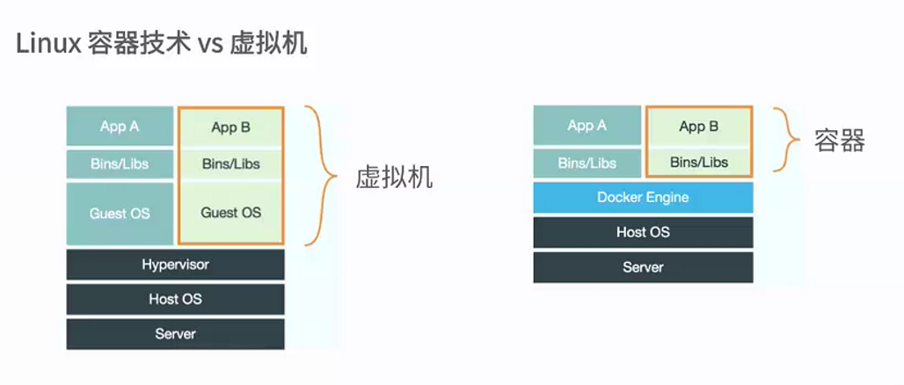
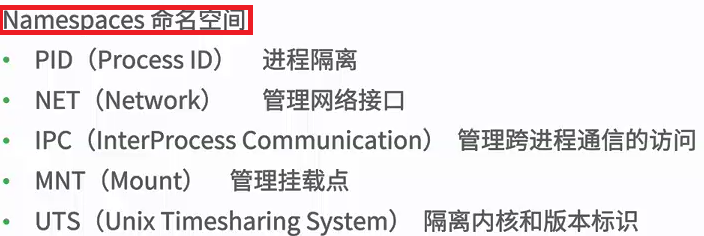
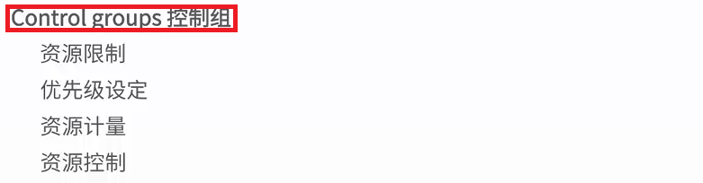

# docker

Docker 是一个开源的应用容器引擎，让开发者可以打包他们的应用以及依赖包到一个可移植的容器中，然后发布到任何流行的 Linux 机器上，也可以实现虚拟化，容器是完全使用沙箱机制，相互之间不会有任何接口。 

Docker 使用客户端-服务器 (C/S) 架构模式 使用远程API来管理和创建Docker容器。Docker 容器（Container）通过 Docker 镜像（Image）来创建，二者之间的关系类似于面向对象编程中的对象与类 

## 1.由来

以前运输肉类、水果、钢琴、汽车、玻璃、衣服都是直接放到运输工具上，但是不同的货物处理方式不同，有的易碎，有的没事，后来就发明了集装箱。集装箱是货物运输的一大进步！

docker就类似集装箱，以前我们的项目有运行在测试环境，虚拟机、云环境等不同场所；jdk、数据库、tomcat等就需要安装配置，现在都配置到docker后，在自己电脑可以运行的话，就可以将docker搬运到任何地方。

## 2.组成

那Docker由什么组成呢， 包括三个基本概念:

- **仓库（Repository）**
- **镜像（Image）**
- **容器(Container）**

**容器：**

​	一种虚拟化的方案(一种虚拟技术区别于传统的虚拟机)

​	操作系统级别的虚拟化

​	只能运行在相同或相似内核的操作系统

​	依赖于Linux内核特性：Namespace和Cgroups(ControlGroup)---缺点



**容器优点：**

1、**它启动很快** 。这也意味着，在它执行的过程中几乎没有额外的开销。 

2、虚拟机占用物理空间大

3、虚拟机要模拟硬件的行为，对cpu和memory损耗特别大

4、**一键（单命令）部署。** 它是真的简单到安装一个应用只需输入一行命令。想要安装MySQL？一行命令。想到一下子把WordPress, MySQL, Nginx and Memcache全部安装并且配置完成？还是一行命令。 

5、**预配置应用。** 在上一次统计中，有超过13000个应用已经打包成了Docker镜像。这样的话，如果你正在使用一个通用的应用，则大部分的初始化工作都应经为你事先做好了。还不止这样，你还可以再得到应用镜像之后，进行个性化的修改，再重新部署到你专属的资源库里。 

**什么是Docker?**

​	将应用程序自动部署到容器

​	Go语言开源引擎 Github地址：https://github.com/docker/docker

​	2013年初，dotCloud发布

**Docker的目标**

​	1、提供简单轻量级的建模方式（启动快速、可以开启多个容器）

​	2、职责的逻辑分离（开发只关心容器内运行的程序、运维只关心如何管理容器）

【docker设计的目的就是加强开发人员写代码的开发环境与应用程序要部署到生产环境的一致性】

​	3、快速高效的开发生命（ 开发、测试、生产同一环境，避免额外的部署、调试时间）

​	4、鼓励使用面向服务的架构（鼓励单个容器只运行一个应用程序，形成分布式架构）

**Docker使用场景**

​	1、使用docker容器开发、测试、web应用的自动化打包和发布部署服务

​	2、创建隔离的运行环境【在过去，如果你想运行所有的服务在同一台服务器上，这可能会耗尽服务器的所有资源。Docker允许你基于各自应用或服务，进行设置、监听、调整。 】

​	3、搭建测试环境；自动化测试和持续集成、发布；

​	4、构建多用户的平台即服务

​	5、提供软件即服务应用程序

​	6、高性能能、超大规模的宿主机部署

**容器相关技术：**





## 3.安装

Docker for Windows版下载：<https://github.com/boot2docker/boot2docker> 

**Linux版安装：**

3.1、把yum包更新到最新 

```shell
yum update
卸载旧版本docker
yum -y  remove docker  docker-common docker-selinux docker-engine
```

3.2、安装需要的软件包， yum-util 提供yum-config-manager功能，另外两个是devicemapper驱动依赖的 

```shell
yum install -y yum-utils device-mapper-persistent-data lvm2
```

3.3、设置yum源 

```shell
yum-config-manager --add-repo https://download.docker.com/linux/centos/docker-ce.repo
```

3.4、可以查看所有仓库中所有docker版本，并选择特定版本安装 

```shell
yum list docker-ce --showduplicates | sort -r
```

3.5、安装Docker，命令：yum install -y docker-ce-版本号，我选的是17.12.0.ce，如下 

```shell
yum install -y docker-ce-17.12.0.ce-1.el7.centos
#由于repo中默认只开启stable仓库，故这里安装的是最新稳定版17.12.0.ce-1.el7.centos
```

3.6、启动Docker，命令：systemctl start docker，然后加入开机启动，如下 

```shell
systemctl start docker
systemctl enable docker
```

3.7、验证安装是否成功(有client和service两部分表示docker安装启动都成功了) 

```shell
[root@localhost docker]# docker version
Client:
 Version:       17.12.0-ce
 API version:   1.35
 Go version:    go1.9.2
 Git commit:    c97c6d6
 Built: Wed Dec 27 20:10:14 2017
 OS/Arch:       linux/amd64

Server:
 Engine:
  Version:      17.12.0-ce
  API version:  1.35 (minimum version 1.12)
  Go version:   go1.9.2
  Git commit:   c97c6d6
  Built:        Wed Dec 27 20:12:46 2017
  OS/Arch:      linux/amd64
  Experimental: false

```

简单的安装在centos:

```shell
yum install docker
systemctl start docker.service
systemctl enable docker.service
```

## 4.docker配置

配置加速器：https://cr.console.aliyun.com

centos系统：

```shell
1. 安装／升级Docker客户端
推荐安装1.10.0以上版本的Docker客户端，参考文档 docker-ce

2. 配置镜像加速器
针对Docker客户端版本大于 1.10.0 的用户

您可以通过修改daemon配置文件/etc/docker/daemon.json来使用加速器
sudo mkdir -p /etc/docker
sudo tee /etc/docker/daemon.json <<-'EOF'
{
  "registry-mirrors": ["https://3gecvtyg.mirror.aliyuncs.com"]
}
EOF
sudo systemctl daemon-reload
sudo systemctl restart docker
```

## 5.Docker基本使用

### 5.1、结构：C/S架构


<1\>Images：镜像（容器的源代码，保存容器运行的各种环境）

​	容器的基石

​	层叠的只读文件系统

​	联合加载（union mount）

<2\>Containers：（通过镜像启动，启动执行阶段[Image是构建打包阶段]）


docker容器的能力：

​	1、文件系统的隔离：每一个容器都有自己的root文件系统

​	2、进程隔离：每个容器都运行在自己的进程环境中

​	3、网络隔离：容器间的虚拟网络接口和IP地址是分开的

​	4、资源隔离和分组：使用cgroups 将CPU和内存之类的资源独立分配给每个Docker容器

<3\>Registry：仓库

​	共有仓库：Docker hub是默认的仓库

​	私有仓库

### 5.2、容器

版本查看：docker version

通过run命令创建一个新的容器（container） 

```dockerfile
docker  run  [OPTIONS]  IMAGE COMMAND 
```

示例：docker run --name NAME -i -t [IMAGE\] [ARG\]

​	-i --interaction=true|false 默认：false（提供 一个标准输入）

​	-t --tty=true|false默认：false（提供一个伪tty终端Console）

一次性容器：只运行一次

```dockerfile
示例1：docker run centos echo 'hello' 
```

交互式容器：命令结束(exit)后即停止

```dockerfile
示例2：docker run --name NAME -i -t centos  /bin/bash
```

查看特定容器：docker ps -a -l

​		   docker inspect  ID|NAME   [ 查看指定ID或名字的容器]

自定义docker名字：docker run --name 自定义名字 -i -t  [IMAGE]   /bin/bash

重启容器：docker start  [-i\]  NAME|ID

容器停止：docker stop  ID

容器删除：docker  rm   ID

```shell
#删除所有未运行的容器（已经运行的删除不了，未运行的就一起被删除了）
sudo docker rm $(sudo docker ps -a -q)
```

**创建守护式容器：无需会话，无需终端，可以长期运行；非常适合运行应用程序和服务**

```dockerfile
docker run -i -t IMAGE /bin/bash
	Ctrl +P  Ctrl+Q命令退出；不需要exit退出
```

再次进入一个守护式容器

```shell
docker attach NAME|ID
```

**创建启动守护式容器：docker run -d 镜像名\[COMMAND\][ARG...]**

查看容器日志：

```shell
docker logs [-f]  [-t]  [--tail] 0 容器名
	-f --follow=true|false 默认为false
	-t --timestamps=true|false 默认为false
	--tail = "all"
```

查看某一个容器内的进程情况：

```shell
docker top  容器名
```

在守护式容器中启动进程：(在运行中的容器启动新进程)

```shell
docker exec -d  -i  -t  容器名|ID [COMMAND][ARG...]
	示例：docker exec -i -t lele  /bin/bash [在lele容器中开启/bin/bash进程]
	注意：因为使用-i  -t 会进入终端；我们可以使用Ctrl +P  Ctrl+Q命令退出
```

停止守护式容器：

```shell
docker stop 容器名：发一个停止命令，等待容器停止
docker kill 容器名：直接停止容器
```

端口映射：处理容器内端口和宿主机端口的映射

```shell
run -P -p
```

-P ：--publish-all=true|false 默认false；为容器暴露的所有端口映射

​	语法：

```shell
docker run -P -i -t centos /bin/bash
```

-p：--publish=[]

​	语法：

```shell
containerPort:
	docker run -p 80 -i -t centos /bin/bash
hostPort:containerPort
	docker run -p 8080:80  -i -t centos /bin/bash
ip:containerPort
	docker run -p 0.0.0.0:80  -i -t centos /bin/bash
ip:hostPort:containerPort
	docker run -p 0.0.0.0:8080:80  -i -t centos /bin/bash	
```


挂存储卷(通过映射将容器内mysql数据存储到宿主机目录下)

查看容器日志：docker logs -f 0257f0154b97

设置环境变量


**示例：创建MySQL两种方式**

```mysql
第一、不需要建立目录映射
sudo docker run -p 3306:3306 --name mysql -e MYSQL_ROOT_PASSWORD=123456 -d mysql:5.7
–name：容器名，此处命名为mysql
-e：配置信息(环境变量)，此处配置mysql的root用户的登陆密码
-p：端口映射，此处映射 主机3306端口 到 容器的3306端口
第二、如果要建立目录映射
duso docker run -p 3306:3306 --name mysql \
-v /home/docker/mysql/conf:/etc/mysql \
-v /home/docker/mysql/logs:/var/log/mysql \
-v /home/docker/mysql/data:/var/lib/mysql \
-e MYSQL_ROOT_PASSWORD=123456 \
-d mysql:5.7
说明：
/home/docker/mysql/conf宿主机目录
冒号后面的目录为docker容器的目录
```

检查容器是否正确运行 

```shell
docker container ls或docker ps
可以看到容器ID，容器的源镜像，启动命令，创建时间，状态，端口映射信息，容器名字
```

**连接mysql**

```shell
进入docker本地连接mysql客户端
sudo docker exec -it mysql bash
mysql -uroot -p123456
```

如果你的容器运行正常，但是无法访问到MySQL，一般有以下几个可能的原因： 

1.防火墙阻拦 

```shell
# 开放端口：
$ systemctl status firewalld
$ firewall-cmd  --zone=public --add-port=3306/tcp -permanent
$ firewall-cmd  --reload
# 关闭防火墙：
$ sudo systemctl stop firewalld
```

2.需要进入docker本地客户端设置远程访问账号 

```shell
$ sudo docker exec -it mysql bash
$ mysql -uroot -p123456
mysql> grant all privileges on *.* to root@'%' identified by "password";
mysql> flush privileges;
```

**重启mysql**

```shell
sudo systemctl start docker
docker ps -a
docker restart 1b4671904bfa
```

> 小结：

- 运行一个在后台执行的容器，同时，还能用控制台管理

  `docker run -i -t -d ubuntu:latest`

- 运行一个带命令在后台不断执行的容器，不直接展示容器内部信息

  `docker run -d ubuntu:latest ping www.docker.com`

- 运行一个在后台不断执行的容器，同时带有命令，程序被终止后还能重启继续跑，还能用控制台管理，`docker run -d --restart=always ubuntu:latest ping www.docker.com`

- 为容器指定一个名字

  `docker run -d --name=ubuntu_server ubuntu:latest`

- 容器暴露80端口，并指定宿主机80端口与其通信(**:** 之前是宿主机端口，之后是容器需暴露的端口)，

  `docker run -d --name=ubuntu_server -p 80:80 ubuntu:latest`

- 指定容器内目录与宿主机目录共享(**:** 之前是宿主机文件夹，之后是容器需共享的文件夹)

  `docker run -d --name=ubuntu_server -v /etc/www:/var/www ubuntu:latest`

### 5.4仓库登录

docker login

### 5.5镜像命令

1、存储位置：docker info 【/var/lib/docker/】

2、镜像查看：docker images

```shell
docker imsages [OPTIONS] [REPOSITORY]
-a ,--all=false
-f，--filter=[]
--no-trunc=false
-q，--quiet=false
```

3、TAG

​	centos:7.0

​	centos:latest

4、查看镜像

docker inspect [OPTIONS]  CONTAINER |IMAGE  [CONTAINER|IMAGE...]

-f，--format=false

镜像删除：docker rmi  名称(centos:7.3)

```shell
-f , --force=false 强制删除
--no-prune=false 保留被打标签的父镜像
```

**删除所有的镜像：docker rmi $(docker images centos -q)**

5、搜索镜像: docker search centos

```shell
(1)通过官方网站：https://hub.docker.com/ 

(2)通过命令：docker search IMAGE
--automated=false
--no-trunc=false
-s, --stars=0
示例： docker search -s 3 centos  只查找3星以上
```

6、镜像拉去：docker pull  mysql:5.7（不加:5.7拉取最新版mysql镜像）

7、镜像推送：docker  push NAME[:TAG]


8、镜像构建：

```shell
作用：保存对容器的修改，并再次使用

	 自定义镜像的能力

	 以软件的形式打包并分发服务及其运行环境
```

**方式一：docker commit 通过容器构建**

> 语法：docker commit 运行时NAME|运行时ID  新的镜像名称

```shell
-a，--author="" 
-m，--message="" Commit message
-p，--pause=true  Pause container during commit
```

示例：

```shell
1.docker run -it -p 80 --name commit-test centos /bin/bash
2.yum install -y nginx
3.docker commit -a "laosu666" -m "nginx" commit-test laosu666/comm_ngnix 
4.docker images
```

docker run -d -p 80  --name  ngnix_web1   laosu666/comm_ngnix    nginx   -g   "daemon off"


**方式二：docker  build 通过Dockerfile文件构建**


镜像打tag：docker tag


5.6 Dockerfile语法

FROM 、RUN、CMD、ENTRYPOINT、EXPOSE