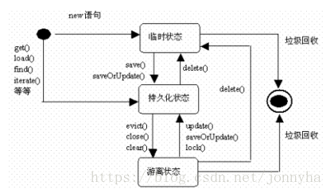

# Hibernate

 Hibernate是一个开放源代码的对象关系映射框架，它对JDBC进行了非常轻量级的对象封装，它将POJO与数据库表建立映射关系，是一个全自动的ORM框架.

hibernate 框架就是对jdbc的封装，使用hibernate的好处就是不需要写复杂的jdbc代码，也不需要写sql实现了.

**什么是ORM？**

​	对象关系映射，将Java中的对象与关系型数据库的表建立映射关系，从而操作对象就可以操作表.


**映射类配置文件约束**

```xml
<?xml version="1.0" encoding="UTF-8"?>
<!DOCTYPE hibernate-mapping PUBLIC 
    "-//Hibernate/Hibernate Mapping DTD 3.0//EN"
    "http://www.hibernate.org/dtd/hibernate-mapping-3.0.dtd">
<hibernate-mapping>
   <!--  内容 -->
</hibernate-mapping>
```

**核心配置文件约束**

```xml
<?xml version="1.0" encoding="UTF-8"?>
<!DOCTYPE hibernate-configuration PUBLIC
	"-//Hibernate/Hibernate Configuration DTD 3.0//EN"
	"http://www.hibernate.org/dtd/hibernate-configuration-3.0.dtd">
<hibernate-configuration>
    <!--  内容 -->
</hibernate-configuration>
```


## 入门案例

​	**步骤：**导入所需jar包，创建属性类、创建对应属性类的映射配置文件【必须与属性类同包下】，创建核心配置文件【src/】，一般名为hibernate.cfg.xml 因为当使用hibernate时需要提供核心配置文件的路径，若不提供则默认读名为hibernate.cfg.xml 那个名称的配置文件.

**属性类**

```java
private class User{
	private Integer id;
    private String name;
    private String psWord;
    //get、set、toString此处省略
}
```

**对应属性类的映射配置文件**

配置文件名称一般为：类名.hbm.xml  当前配置文件名称：User.hbm.xml

```xml
<?xml version="1.0" encoding="UTF-8"?>
<!DOCTYPE hibernate-mapping PUBLIC 
    "-//Hibernate/Hibernate Mapping DTD 3.0//EN"
    "http://www.hibernate.org/dtd/hibernate-mapping-3.0.dtd">
<hibernate-mapping>
    <!-- name="全类名" table="属性类所对应的数据库表名" -->
    <class name="com.znsd.User" table="user">
        <!-- id标签设置的字段为主键 -->
        <!-- name="属性类字段名" cloumn="属性类所对应的表字段名" -->
        <id name="id" cloumn="id">
        	<generator class="native" />
        </id>
        <!-- 普通字段 property -->
        <!-- name="属性类字段名" cloumn="属性类所对应的表字段名" -->
        <property name="name" column="name" />
		<property name="psWord" column="psWord" />
    </class>
</hibernate-mapping>
```

**核心配置文件** hibernate.cfg.xml

```xml
<?xml version="1.0" encoding="UTF-8"?>
<!DOCTYPE hibernate-configuration PUBLIC
	"-//Hibernate/Hibernate Configuration DTD 3.0//EN"
	"http://www.hibernate.org/dtd/hibernate-configuration-3.0.dtd">
<hibernate-configuration>
	<session-factory>
		<!-- 链接数据库的基本参数 -->
		<property name="hibernate.connection.driver_class">
            com.mysql.jdbc.Driver
        </property>
		<property name="hibernate.connection.url">
            jdbc:mysql:///test
        </property>
		<property name="hibernate.connection.username">
            root
        </property>
		<property name="hibernate.connection.password">
            123
        </property>
		<!-- 配置Hibernate方言 主要目的使用任何操作时生成对应的数据库的sql -->
		<property name="hibernate.dialect">
            org.hibernate.dialect.MySQLDialect
        </property>
 
		<!-- 可选配置 -->
		<!-- 打印sql -->
		<property name="hibernate.show_sql">true</property>
		<!-- 格式化sql -->
		<property name="hibernate.format_sql">true</property>
 
		<!-- 读取映射配置文件 -->
		<mapping resource="com/znsd/user/User.hbm.xml" />
	</session-factory>
 
 
</hibernate-configuration>
```

**测试类**

```java
package com.znsd.user;

import org.hibernate.Session;
import org.hibernate.SessionFactory;
import org.hibernate.Transaction;
import org.hibernate.cfg.Configuration;

public class Main {
	public static void main(String[] args) {
		// 1.加载Hibernate的核心配置文件
		Configuration configuration = new Configuration().configure();

		// 2.创建一个SessionFactory对象：类似于JDBC中连接池
		SessionFactory sessionFactury = configuration.buildSessionFactory();

		// 3.通过SessionFactory获取到Session对象：类似于JDBC中Connection
		Session session = sessionFactury.openSession();

		// 4.手动开启实物（兼容Hibernate3）： 可以不写，h5默认有
		Transaction transaction = session.beginTransaction();

		// 5.编写代码
		User customer = new User();
		customer.setId(1);
		customer.setUserName("张三");
		customer.setUserPsWord("123");

		session.save(customer);
		// 6.事务提交
		transaction.commit();

		// 7.资源释放
		session.close();
	}
}
```


### 映射配置文件属性详解

**自动建表配置**

```xml
<!-- 自动建表语句，其属性值有多个，update是其中一个，属性值不同功能不同 -->
<property name="hibernate.hbm2ddl.auto" >update</property>  
<!-- 参考：https://www.cnblogs.com/liutao1122/p/8507917.html -->
<!-- 该标签主要写在核心配置文件头节点下即可 -->
```


**映射类配置文件约束**

```xml
<?xml version="1.0" encoding="UTF-8"?>
<!DOCTYPE hibernate-mapping PUBLIC 
    "-//Hibernate/Hibernate Mapping DTD 3.0//EN"
    "http://www.hibernate.org/dtd/hibernate-mapping-3.0.dtd">
<hibernate-mapping>
   <!--  内容 -->
</hibernate-mapping>
```

<hibernate-mapping> 为映射类的头标签，从此处内开始写映射信息.

首先此标签有许多子标签，但我们现在主要关注怎么让属性类与数据库表对应，只需要关注class标签.

<class> 该标签就可以让属性类与数据库中的表对应，以下介绍标签中的常用属性.

```txt
name="属性类全类名" 
table="数据库表名" 
catalog="数据库名称" #若不指定则使用核心配置文件配置的数据库.
```

**案例演示**

```xml
<!-- 省略约束 -->
<hibernate-mapping>
    <class name="com.znsd.user" table="user" catalog=“testDB”>
    	<!-- 此处内容会慢慢标明 -->
    </class>
    <class name="com.znsd.class" table="class" catalog=“test2DB”>
    </class>
</hibernate-mapping>
```


<class> 内的入门常用标签 <id>  与 <properties>

<id> 主要作用用于设置属性类的主键字段，以下有id包含的属性

```xml
name="属性类字段名" 
column="表字段名" 
<!-- 以下属性是id关于创建表，hibernate在对表做操作时首先会判断是否存在表若不存在则会创建 需要配置 -->
length="字段长度" <!-- 创建表中表字段的长度，若不设置则为默认值 例如:varchar默认值为255 -->
type="字段类型" <!-- 不写的话hibernate自动转换为对应类型 --> 
```

**案例演示**

```xml
<!-- 省略约束 -->
<hibernate-mapping>
    <!-- java 类型 -->
    <class name="com.znsd.user" table="user" catalog=“testDB”>
        <id name="uId" column="uId" type="java.lang.Integer">
        	<generator class="native" />
        </id>
    </class>
    <!-- hibernate 类型 -->
    <class name="com.znsd.user" table="user" catalog=“testDB”>
    	<id name="uId" column="uId" type="integer" />
    </class>
</hibernate-mapping>
```

更多字段类型参考

```txt
https://www.cnblogs.com/notably/p/10522351.html
```

**sql类型演示**

```xml
<!-- 省略约束 -->
<hibernate-mapping>
    <!-- hibernate 类型 -->
    <class name="com.znsd.user" table="user" catalog=“testDB”>
        <id name="uId">
        	<column name="uId" sql-type="int"></column>
			<generator class="native" />
        </id>
    </class>
</hibernate-mapping>
```


<properties> 主要映射普通字段.

```txt
 name="属性类字段名" 
 column="表字段名" 
 length="字段长度" 
 type="字段类型" 
 not-null="true||false" #生成表时该字段是否不为null 默认false
 unique="true||false"	#生成表示该字段是否作为唯一 默认为false
```

**案例演示**

```xml
<!-- 省略约束 -->
<hibernate-mapping>
    <class name="com.znsd.user" table="user" catalog=“testDB”>
        <id name="uId" column="uId">
        	<generator class="native" />
        </id>
        <!-- 创建表时该字段属性会包含不为空，唯一键 -->
        <properties name="uName" column="uName" not-null="true" unique="true" />
    </class>
</hibernate-mapping>
```

以上就是class、id、properties 的介绍.


### 核心配置文件详解

**必须的配置**

​	数据库驱动、数据库地址、数据库账号、数据库密码、配置方言

```xml
<hibernate-configuration>
	<session-factory>
		<!-- 链接数据库的基本参数 -->
		<property name="hibernate.connection.driver_class">
            com.mysql.jdbc.Driver
        </property>
		<property name="hibernate.connection.url">
            jdbc:mysql:///test
        </property>
		<property name="hibernate.connection.username">
            root
        </property>
		<property name="hibernate.connection.password">
            123
        </property>
        <!-- 方言 -->
		<property name="hibernate.dialect">
            org.hibernate.dialect.MySQLDialect
        </property>
	</session-factory>
</hibernate-configuration>
```

**可选的配置**

​	sql格式化、sql打印、表创建

```xml
<hibernate-configuration>
	<session-factory>
		<!-- 链接数据库的基本参数 -->
		<property name="hibernate.connection.driver_class">
            com.mysql.jdbc.Driver
        </property>
		<property name="hibernate.connection.url">
            jdbc:mysql:///test
        </property>
		<property name="hibernate.connection.username">
            root
        </property>
		<property name="hibernate.connection.password">
            123
        </property>
		<!-- 配置Hibernate方言 主要目的使用任何操作时生成对应的数据库的sql -->
		<property name="hibernate.dialect">
            org.hibernate.dialect.MySQLDialect
        </property>
 
		<!-- --------------------------可选配置-------------------------- -->
		<!-- 打印sql -->
		<property name="hibernate.show_sql">true</property>
		<!-- 格式化sql -->
		<property name="hibernate.format_sql">true</property>
        <!-- hibernate建表 -->
        <property name="hibernate.hbm2ddl.auto" >update</property>
		<!-- --------------------------可选配置-------------------------- -->
	</session-factory>
</hibernate-configuration>
```

建表标签中其他属性参考

```txt
https://blog.csdn.net/cactusz/article/details/74557154
```

**映射文件引入**

```xml
<?xml version="1.0" encoding="UTF-8"?>
<!DOCTYPE hibernate-configuration PUBLIC
	"-//Hibernate/Hibernate Configuration DTD 3.0//EN"
	"http://www.hibernate.org/dtd/hibernate-configuration-3.0.dtd">
<hibernate-configuration>
	<session-factory>
		<!-- 链接数据库的基本参数 -->
		<property name="hibernate.connection.driver_class">
            com.mysql.jdbc.Driver
        </property>
		<!-- 链接数据库的基本参数 -->
		<property name="hibernate.connection.driver_class">
            com.mysql.jdbc.Driver
        </property>
		<property name="hibernate.connection.url">
            jdbc:mysql:///test
        </property>
		<property name="hibernate.connection.username">
            root
        </property>
		<property name="hibernate.connection.password">
            123
        </property>
		<!-- 配置Hibernate方言 主要目的使用任何操作时生成对应的数据库的sql -->
		<property name="hibernate.dialect">
            org.hibernate.dialect.MySQLDialect
        </property>
 
		<!-- 可选配置 -->
		<!-- 打印sql -->
		<property name="hibernate.show_sql">true</property>
		<!-- 格式化sql -->
		<property name="hibernate.format_sql">true</property>
 
		<!-- 包路径换成 / -->
		<mapping resource="com/znsd/user/User.hbm.xml" />
	</session-factory>
 
 
</hibernate-configuration>
```

核心配置文件创建方式有俩种：xml || .properties 区别是xml可以引入映射 另一个不可以.

**创建方式** 名称 hibernate.properties

```properties
hibernate.connection.driver_class=com.mysql.jdbc.Driver
hibernate.connection.driver_clas=com.mysql.jdbc.Driver
...
```


### Configuration 对象

 Configuration 类的作用是对Hibernate 进行配置，以及对它进行启动。

​		在Hibernate 的启动过程中，Configuration 类的实例首先定位映射文档的位置，读取这些配置，然后创建一个SessionFactory对象。虽然Configuration 类在整个Hibernate 项目中只扮演着一个很小的角色，但它是启动hibernate 时所遇到的第一个对象。 

**功能简介：**可以读取核心配置文件，映射配置文件，创建连接池 ...

**使用条件：**导入hibernatejar包，配置核心配置文件

```java
public void main(String [] s){
    //该方式默认读 hibernate.cfg.xml 
    Configuration config = new Configuration().configure();
    //该方式默认读 hibernate.properties
    Configuration config = new Configuration();
    //前面说了使用.properties不能配置映射文件，但config对象提供了方法在运行时加载映射文件
    //以下方法就可以加载映射配置文件
    configuration.addResource("com/znsd/user/User.hbm.xml");
}
```


### 创建sessionFactory的方式

不同版本的hibernate创建的方式都不太相同，虽然有些可以兼容，但也会有一些缺陷.

hibernate 3.x

```java
public void test(){
    Configuration config = new Configuration().configure();
	SessionFactory sessionFactory = config.buildSessionFactory();
}
```

hibernate 4.x

```java
SessionFactory sessionFactory = null;
Configuration configuration =  new Configuration().configure();
ServiceRegistry serviceRegistry = new ServiceRegistryBuilder().
    applySettings(configuration.getProperties()).buildServiceRegistry();
sessionFactory = configuration.buildSessionFactory(serviceRegistry);
```

hibernate 5.x

```java
final StandardServiceRegistry registry = new StandardServiceRegistryBuilder().configure().build();
	sessionFactory = new MetadataSources( registry ).buildMetadata().buildSessionFactory();
```

**详情链接**

```cmd
https://blog.csdn.net/river6666/article/details/83445154
```


### CRUD操作

> 增加

```java
public Serializable save(Object obj);	//传入对象:返回生成自增长的id 强转int
```

> 查询

```java
>>> 根据id查询
public Object get(Class clazz,Serializable id); //传入Class,id:返回Object类型的Class对象
public Object load(Class clazz, Serializable id); //传入Class,id:返回Object类型的Class对象
>>> 查询全部
public Query createQuery(String sql); //传入sql语句:返回查询结果 详情在其他API目录中
public SQLQuery createSQLQuery(String sql); //传入sql
```

**案例演示**

```java
public void test(){
    Configuration cfg = new Configuration().configure();
    SessionFactory factory = cfg.buildSessionFactory();
    Session session = factory.openSession();
    >>> 核心代码 from后必须是实体类的名称，并非数据表
    Query query = session.createQuery("from User");
    List<User> list = query.list();
}
```

**get 与 load 的区别参考【很重要】**

```txt
https://www.cnblogs.com/yichenscc/p/11244227.html
#映射类被final修饰后get与load将没有区别，因为final不能被继承，那么将不存在有代理类.
```

> 修改

```java
public void update(Object obj); //传入JavaBean:修改成功! 
//bean中必须包含id,老值,新值,否则bean中属性为null也会导致修改时数据库的老值消失
//推荐先查询，set新值后再将bean传入update方法内.
```

> 删除

```java
public void delete(Object obj); //传入JavaBean:删除成功! 必须包含id
//推荐先查询,再删除.
```


### 主键生成策略


##### 主键的分类

> 自然主键

```txt
将表中某一个唯一的字段设为主键. 比如：用户的身份证号.
```

> 代理主键

```txt
新建一个与表毫无关系的字段作为id. 比如：通常用的id字段.
```


##### Hibernate的主键生成策略

解开映射类id中native的疑惑.

```xml
<id name="uId" column="uId">
    <generator class="native" />
</id>
```

> increment

```tex
hibernate提供的自动增长,底层首先会通过sql语句获取主键的最大值在最大值的基础上加1,在单个项目中可以正常使用，因为底层使用了synchronized,不建议在集群环境使用,因为此时会产生线程安全问题.
```

> identity

```tex
使用的是数据库自带的自增长,使用时对应表中的该字段必须为主键且自动增长. 
--Oracle这类没有自增字段的则不支持.
```

> sequence

```tex
使用的是数据库自带的序列[类似于自增长].
不支持sequence的数据库则不行,比如MySQL没有序列.
```

> native

```java
由hibernate根据使用的数据库自行判断采用identity、hilo、sequence其中一种作为主键生成方式.
```

> assigned

```java
表示不需要hibernate帮助生成id,当映射对象中属性id是什么存入数据库就是什么.
```

> uuid

```java
字符串字段生成主键可以通过该方式生成.
```


### 三种状态

hibernate为了更好管理对象，将对象划分了三种状态：瞬时态、持久态、脱管态.



**瞬时(临时)态：**数据库中不存在该对象，不被session管理 直接通过new创建的.

**持久态：**被session管理，数据库中存在.

**脱管(游离)态：**对象的主键在缓存中不存在，且数据库中存在.


### 一级缓存

​			hibernate优化反复查询数据库性能消耗问题，数据库数据存储在磁盘中，当读取数据库数据时需要到磁盘中查找，但磁盘读取速度比较慢，此时hibernate就会将磁盘中的数据读取到内存中，然后当读取数据时在内存中读取即可，若内存中没有该数据时才会到数据库中读取该数据并存储在hibernate缓存中，这样提高了再次读取数据的速度。主要缓存存在session中，session被销毁缓存就消失了.

**详细参考**

```tex
https://www.cnblogs.com/toby-ruan/p/8510408.html
```


### Threadlocal

共享session对象，保证多个类执行的是同一个session对象

需要在核心配置文件中配置以下标签

```xml
<property name="current_session_context_class">thread</property>
```

获取threadlocal的session

```java
public void test(){
	Configuration configuration = new Configuration().configure();
	SessionFactory sessionFactury = configuration.buildSessionFactory();
    Session currentSession = sessionFactury.getCurrentSession();
    //该session不需要close 只需要commit 就行，底层会close.
}
```

**设置事务的隔离级别**

```xml
<!--  事务隔离级别 
  0：TRANSACTION_NONE
  1：TRANSACTION_READ_UNCOMMITTED
  2：TRANSACTION_READ_COMMITTED
  4：TRANSACTION_REPEATABLE_READ
  8：TRANSACTION_SERIALIZABLE
-->
<property name="hibernate.connection.isolation">4</property>
```


### 其他API

#### Query 结果集对象.

Query对象执行HQL(Hibernate Query Language)语句

**普通HQL**

```java
public void test(){
    //from 映射类名(不是表名) session是hibernate的session 此处省略
    Query query = session.createQuery("from User");
    List<User> userList = query.list();
    System.out.println(userList);
}
```

**条件HQL**

```java
public void test(){
    //from 映射类名 where 映射类中的字段名称
    Query query = session.createQuery("from User where name = ?");
    query.setParamter(0,"张三");
    List<User> userList = query.list();
    System.out.println(userList);
}
```

**特殊条件HQL**

```java
public void test(){
    //from 映射类名 where 映射类中的字段名称
    Query query = session.createQuery("from User where name like ?");
    query.setParamter(0,"张%");
    List<User> userList = query.list();
    System.out.println(userList);
    //结果：name以张开头的信息全部被查询出来
}
```

**分页查询**

```java
public void test(){
    Query query = session.createQuery("from User");
    query.setFirstResult(0); //起始位置
	query.setMaxResults(5);	//需要数据个数
    List<User> userList = query.list();
    System.out.println(userList);
    //当数据个数超出时会按结果的最大size显示，并不会抛异常
}
```


### 一对多关系配置

**什么是一对多：**一个班级有很多学生.

**数据表设置：**class表[clsId:clsName]、student表[stuId:stuName:fk_clsId]

**描述：**student表字段有对class的引用，而class表中没有，那么就代表学生是知道自己属于某个班级的.

**要做的事情：**在我们存入数据时就将学生与班级的关系建立起来，当到数据库查看时就知道某个学生在某个班级.

**映射类 ClsBean**

```java
public class ClsBean{
    private Integer clsId;
    private String clsName;
    private Set<Student> stuSet = new HashSet();
    //省略get、set、toString 方法
}
```

**stuSet:**class表中没有该字段，但是用于建立关系，目的就是当插入class对象之后，再插入student对象，然后再通过class中的stuSet中存储的对象修改student表的fk_cls字段，从而使得学生清楚自己属于某一个班级.

**ClsBean映射配置文件**

```xml
<?xml version="1.0" encoding="UTF-8"?>
<!-- 此处应有约束,省略 -->
<hibernate-mapping>
	<class name="com.znsd.bean.ClsBean" table="class">
        <id name="clsId" cloumn="clsId">
        	<generator class="native" />
        </id>
        <property name="clsName" cloumn="clsName"/>
        <set>
        	<key column="fk_clsId" />
            <!-- key的 column表示多的一方外键名 -->
			<one-to-many class="com.znsd.bean.StuBean" />
            <!-- one-to-many的class属性表示多的一方类的全限定名  -->
        </set>
    </class>
</hibernate-mapping>
```

**映射类 StuBean**

```java
public class StuBean{
    private Integer stuId;
    private String stuName;
    private Integer fk_clsId;
    //省略get、set、toString 方法
}
```

**fk_clsId:**该字段与class中的clsId是多对一的关系，用于标识当前学生属于某一个班级.

**StuBean映射配置文件**

```xml
<?xml version="1.0" encoding="UTF-8"?>
<hibernate-mapping>
	<class name="com.znsd.bean.StuBean" table="student">
        <id name="stuId" cloumn="stuId">
        	<generator class="native" />
        </id>
        <property name="stuName" cloumn="stuName"/>
        <property name="fk_clsId" cloumn="fk_clsId"/>
    </class>
</hibernate-mapping>
```


**hibernate核心配置文件**

```xml
<?xml version="1.0" encoding="UTF-8"?>
<hibernate-configuration>
	<session-factory>
		<!-- 链接数据库的基本参数 -->
		<property name="hibernate.connection.driver_class">
            com.mysql.jdbc.Driver
        </property>
		<property name="hibernate.connection.url">jdbc:mysql:///test2</property>
		<property name="hibernate.connection.username">root</property>
		<property name="hibernate.connection.password">123</property>
		<!-- 配置Hibernate方言 -->
		<property name="hibernate.dialect">org.hibernate.dialect.MySQLDialect</property>
 
		<!-- 可选配置 -->
		<!-- 打印sql -->
		<property name="hibernate.show_sql">true</property>
		<!-- 格式化sql -->
		<property name="hibernate.format_sql">true</property>
 
        
		<!-- 加载映射配置文件 -->
		<mapping resource="com/znsd/bean/ClasBean.hbm.xml" />
		<mapping resource="com/znsd/bean/StuBean.hbm.xml" />
		
	</session-factory>
</hibernate-configuration>
```

**测试代码**

```java
public void test(){
    Configuration configure = new Configuration().configure();
	SessionFactory factory = configure.buildSessionFactory();
	Session openSession = factory.openSession();
	Transaction beginTransaction = openSession.beginTransaction();
    ClsBean cls1 = new ClsBean("1号班级");
		ClsBean cls2 = new ClsBean("2号班级");
		
		StuBean stu1 = new StuBean("1号学生");
		StuBean stu2 = new StuBean("1号学生");
		StuBean stu3 = new StuBean("1号学生");
		cls1.getStuSet().add(stu1);
		cls2.getStuSet().add(stu2);
		cls2.getStuSet().add(stu3);
    	//班级增加
		openSession.save(cls1);
		openSession.save(cls2);
    	//学生增加
		openSession.save(stu1);
		openSession.save(stu2);
		openSession.save(stu3);
		
		beginTransaction.commit();
		openSession.close();
		factory.close();
}
```

**数据库中的数据结果**

class [clsId clsName] -> [1,"1号班级"],[2,"2号班级"]

student[stuId stuName fk_clsId] -> [1,"1号学生",1],[2,"2号学生",2],[3,"3号学生",2]

**通过hibernate自动向每个学生注入了所属班级.**

```xml
<!-- 核心配置 一对多 -->
<one-to-many class="com.znsd.bean.StuBean" />
```


#### 多对一

多的一方持有对象，一的一方持有集合

```xml
<many-to-one name="一方的对象" class=" 一方的类" column="外键的列名" />
```

#### 一对多

```
<set name="属性">
	<key column="外键列名" />
	<one-to-many class="多方的类路径" />
</set>
```

#### 多对多

```
<set name="属性" table="中间表名">
	<key column="外键列名[]" />
	<many-to-many class="另外多的一方的类路径" column="外键列名[]" />
</set>
注意：多对多通过中间表关联，且中间表不能够写实体类和实体映射文件
```

#### 基于外键的多对一关联映射

采用<many-to-one>标签，指定多的一端的unique=true，这样就限制了多段的多重性为一。

```
<many-to-one name="属性名" column="外键列名" unique="true"></many-to-one>
```

#### 双向一对一关联映射

需要在一端添加<one-to-one>标签，用property-ref来指定反向属性引用

```
<one-to-one name="属性名" property-ref="主控端的属性ID"></one-to-one>
```

#### 基于主键的一对一关联映射

- 单向一对一

主控端在生成主键策略时，选择foreign方式。

```
<id name="id">
	<generator class="foreign">
		<param name="property">引用的被控端的属性</param>
	</generator>
</id>
```

- 通过one-to-one来设置一对一映射,constrained表示告诉当前主键，你的值采用另一个表中的主键的值，当前主键对于有关系的另一个表来说就是外键。

```
<one-to-one name="被控端的属性" constrained="true"></one-to-one>
```

- 双向一对一，需要在实体类中添加双方的引用

```
<one-to-one name="被控端的属性"></one-to-one>
```


### Hibernate注解开发

**类级别注解**

```java
@Entity 表示实体类，对应DB中一张表
@Table  表示DB中的表
@Embeddable  嵌入类
```

**@Entity 实例**

**主要作用：**Entity 只有一个属性就是name，该属性的作用就是用于跟数据库中的表对应，若不设置则默认是类名，类似于配置文件中的<class>.

```java
@Entity
public class User{
    @Id //声明主键
    @GeneratedValue(strategy=GenerationType.AUTO)  //声明主键生成策略 auto 与 native 相同
    private id;
    private psWord;
    //省略set、get、toString方法.
}
```


**@Table 实例**

**主要作用：**Table 属性包括 name[表名称]、catalog[mysql数据库名称]、schema[oracle数据库名称]，主要是对注解@Entity做扩展，若使用@table设置了name就不建议用@entity再设置name，**当想使用指定数据库时可以使用@Table，否则没什么必要使用@Table**

```java
@Entity
@Table(name="t_User",catalog="test")
public class User{
    @Id //声明主键
    @GeneratedValue(strategy=GenerationType.AUTO)  //声明主键生成策略 auto 与 native 相同
    private Integer id;
    private String name;
    //省略 set、get、toString
}
```

以上当创建或使用表的时候则会指定到test数据库中找名为t_User的表做操作.


**@Embeddable 实例**

**主要作用：**将类中属性包含引用类型的字段与类融合成一体，该注解主要声明在引用类的public class 之上，且需要搭配 @EmbeddedId || @Embedded 注解使用.

**User**

```java
@Entity
public class User{
    @Id
    @GeneratedValue(strategy=GenerationType.AUTO)
    private Integer id;
    @Embedded
    private Address address;
    //省略get、set、toString
}
```

**Address**

```java
@Embeddable
public class Address{
    private String name;
    private String location;
    //省略get、set、toString
}
```

当生成User表时，表中字段为id、name、location.

因为User的address字段声明了@Embedded[嵌入式]，代表该引用中的字段会在表中生成，前提时该类支持[可嵌入式]，而在Address类上声明了@Embeddable[可嵌入式]，那么当生成user表时就会产生3个字段，就是以上说明的三个字段 id、name、location.


 **属性级别注解** 

```java
@Id	设置主键
@GeneratedValue 设置主键生成策略 jpa 提供
@GenericGenerator 自定义主键生成策略 hibernate 提供
@Column	设置字段属性 如name、length等
@Embedded 设置嵌入字段 通常为引用 引用类必须声明@Embeddable
@EmbeddedId 设置复合主键 通过为引用 引用类必须声明@Embeddable
@Transient	忽略该字段，生成表时忽略该字段.
```

**@Id 案例**

**主要作用：**设置主键，可以声明多个当作复合主键使用，使用该注解时还需要搭配

​					@GeneratedValue[主键生成策略]使用.

**@GeneratedValue属性：** 

​					**generator:**生成器默认为""，可以选择自定义生成器(使用hibernate的增长策略).

​					**strategy:**

​							**GenerationType.AUTO(默认)：**根据不同数据库使用不同增长策略 类似与native.

​							**GenerationType.IDENTITY：**使用Mysql的自动增长.

​							**GenerationType.SEQUENCE：**使用Oracle的序列(类似于自动增长).

​					

**常见主键创建方式**

```java
@Entity
public class User{
    @Id
    @GeneratedValue(strategy=GenerationType.AUTO)
    private Integer id;
    private String name;
    //省略get、set、toString
}
```

**复合主键创建方式**

```java
@Entity
public class User{
    @Id
    private Integer id;
    @Id
    private String name;
    //省略get、set、toString
}
```

**嵌入主键创建方式**

**主表类**

```java
@Entity
public class User{
    @EmbeddedId
    private UserMain userMain;
    private Integer age;
    //省略get、set、toString
}
```

**主键嵌入类**

```java
@Embeddable
public class UserMain{
    private Integer id;
    private String name;
    //省略get、set、toString
}
```

数据库中生成表字段：id、name、age.

核心配置文件只需要读取主表类即可.


#### 一对一