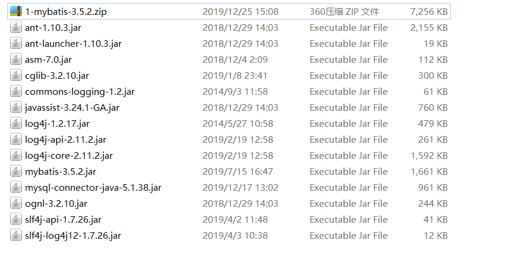

# MyBatis

​	一款流行的ORM框架，主要解决开发者在开发时遇到的非业务的繁琐操作，使得开发者在开发时仅关注自己需要做的事情，底层封装了JDBC .

**ORM（对象关系映射）**	

```java
将pojo与关系型数据库表建立映射，通过操作pojo就可以操作数据库数据，就称为ORM
```

**什么是框架**

```java
一套解决方案，不同的框架解决不同的问题，如spring mvc解决控制层、hibernate解决持久层等.
```


**所需JAR包**



**核心配置约束**

```xml
<?xml version="1.0" encoding="UTF-8" ?>
<!DOCTYPE configuration
        PUBLIC "-//mybatis.org//DTD Config 3.0//EN"
        "http://mybatis.org/dtd/mybatis-3-config.dtd">
<configuration>
    <!-- 内容 -->
</configuration>
```

**案例演示**

```xml
<?xml version="1.0" encoding="UTF-8" ?>
<!DOCTYPE configuration
        PUBLIC "-//mybatis.org//DTD Config 3.0//EN"
        "http://mybatis.org/dtd/mybatis-3-config.dtd">
<configuration>
    <!-- 和spring整合后 environments配置将废除 -->
    <environments default="development">
        <environment id="development">
            <!-- 使用jdbc事务管理 -->
            <transactionManager type="JDBC" />
            <!-- 数据库连接池 -->
            <dataSource type="POOLED">
                <!-- mysql驱动 -->
                <property name="driver" value="com.mysql.jdbc.Driver" />
                <!-- url -->
                <property name="url" value="jdbc:mysql://localhost:3306/test2" />
                <!-- 账号 -->
                <property name="username" value="root" />
                <!-- 密码 -->
                <property name="password" value="123" />
            </dataSource>
        </environment>
    </environments>

    <mappers>
        	<!-- 加载映射配置 -->
        	<mapper resource="com/znsd/model/UserMapper.xml"/>
    </mappers>
</configuration>
```

**映射配置约束**

```xml
<?xml version="1.0" encoding="UTF-8"?>
<!DOCTYPE mapper
        PUBLIC "-//mybatis.org//DTD Mapper 3.0//EN"
        "http://mybatis.org/dtd/mybatis-3-mapper.dtd">
<mapper namespace="com.znsd.dao.IUser">
	<select id="findAll" resultType="com.znsd.model.User">
		select * from user
	</select>
</mapper>
```


## 入门案例

**步骤演示：**导入jar包 -> 创建JavaBean -> 创建映射接口 -> 创建映射配置文件 -> 创建核心配置文件 -> 测试代码.

**JavaBean User**

```java
package com.znsd.model;

public class User {
	private Integer id;
	private String name;
    //省略set、get、toString
}
```

**映射接口**

```java
interface IUserDao{
    List<User> findAll();
}
```

**映射配置文件 IUserMapper.xml**

```xml
<?xml version="1.0" encoding="UTF-8"?>
<!DOCTYPE mapper
        PUBLIC "-//mybatis.org//DTD Mapper 3.0//EN"
        "http://mybatis.org/dtd/mybatis-3-mapper.dtd">
<mapper namespace="com.znsd.dao.IUserDao">
	<select id="findAll" resultType="com.znsd.model.User">
		select * from user
	</select>
</mapper>
```

**namespace:**映射接口名称

**id:**接口方法

**resultType:**执行sql之后的返回值类型.

**核心配置文件 Mybatis-Config.xml**

```xml
<?xml version="1.0" encoding="UTF-8" ?>
<!DOCTYPE configuration
        PUBLIC "-//mybatis.org//DTD Config 3.0//EN"
        "http://mybatis.org/dtd/mybatis-3-config.dtd">
<configuration>
    <!-- 和spring整合后 environments配置将废除 -->
    <environments default="development">
        <environment id="development">
            <!-- 使用jdbc事务管理 -->
            <transactionManager type="JDBC" />
            <!-- 数据库连接池 -->
            <dataSource type="POOLED">
                <property name="driver" value="com.mysql.jdbc.Driver" />
                <!-- jdbc:mysql://localhost:3306/test2?characterEncoding=utf-8 -->
                <property name="url" value="jdbc:mysql://localhost:3306/test2" />
                <property name="username" value="root" />
                <property name="password" value="123" />
            </dataSource>
        </environment>
    </environments>

    <mappers>
        	<!-- 加载映射xml -->
        	<mapper resource="com/znsd/model/IUserMapper.xml"/>
    </mappers>
</configuration>
```

**测试代码**

```java
public static void main(String[] args) throws Exception{
    //查找配置文件,创建输入流
    InputStream inputStream = Resources.getResourceAsStream("Mybatis-Config.xml");
	//创建SqlSessionFactoryBuilder对象
    SqlSessionFactoryBuilder sfb = new SqlSessionFactoryBuilder();
    //加载配置文件,创建SqlSessionFactory
    SqlSessionFactory sqlSessionFactory = sfb.build(inputStream);
    //创建SqlSession
    SqlSession sqlSession = sqlSessionFactory.openSession();
    IUser mapper = sqlSession.getMapper(IUserDao.class);
    List<User> findAll = mapper.findAll();
    //输入查询结果
    System.out.println(findAll);
	//释放资源
	sqlSession.close();
}
```


##### 插入数据并返回主键Id

返回的主键ID存储在传入对象的Id中

```xml
<?xml version="1.0" encoding="UTF-8"?>
<!DOCTYPE mapper
        PUBLIC "-//mybatis.org//DTD Mapper 3.0//EN"
        "http://mybatis.org/dtd/mybatis-3-mapper.dtd">
<mapper namespace="com.znsd.dao.IUserMapper">
	<insert id="findSave" parameterType="com.znsd.model.User">
        <!-- keyProperty属性类的id keyColumn数据表的id after在插入之后执行查询 返回Integer  -->
		<selectKey keyProperty="id" 
                   keyColumn="id" 
                   order="AFTER" 
                   resultType="java.lang.Integer">
			select last_insert_id();
		</selectKey>
		insert into User(name) values(#{name})
	</insert>
</mapper>
```

**第二种方式**

```xml
<insert id="save" 
        keyColumn="id"  
        keyProperty="id" 
        useGeneratedKeys="true" 
        parameterType="com.znsd.dao.User">
		insert into user(name) values(#{name})
</insert>
<!--
	keyColumn:数据库列字段
	keyProperty:JavaBean字段
	useGeneratedKeys: 生成主键
-->
```


##### 查询迭代in的数据

```xml
<!-- 根据ids查询用户 -->
<select id="queryUserByIds" parameterType="java.util.List" resultType="user">
	SELECT * FROM `user`
	<where>
		<foreach collection="ids" item="item" open="id IN (" close=")"
			separator=",">
			#{item}
		</foreach>
	</where>
</select>
```


##### 迭代修改字段

```xml
<update id="update" parameterType="java.util.Map">
	update `user` set
    <foreach collection="ids" item="value" index="key" separator=",">
			#{item}
	</foreach>
</update>
```


##### 表与JavaBean对应

让JavaBean与数据库中的表字段关联.

```xml
<?xml version="1.0" encoding="UTF-8"?>
<!-- 省略约束 -->
<mapper namespace="com.znsd.dao.IUserMapper">
    <!-- type=表对应的映射类 id="任意"  -->
	<resultMap type="com.znsd.model.User" id="user">
        <!-- id代表主键绑定字段 property="映射类主键名称" column="表主键名称" -->
		<id property="id" column="uid"/>
        <!-- result代表普通属性字段 property="映射类字段名称" column="表字段名称" -->
		<result property="name" column="uuname"/>
	</resultMap>
    <!-- resultMap="被引用的resultMap的Id" -->
	<select id="findAll" resultMap="user">
		select * from User
	</select>
</mapper>
```


##### properties 标签介绍

主要用于加载数据库配置信息.

**第一种方式【定义全局属性】**

```xml
<?xml version="1.0" encoding="UTF-8" ?>
<!DOCTYPE configuration
        PUBLIC "-//mybatis.org//DTD Config 3.0//EN"
        "http://mybatis.org/dtd/mybatis-3-config.dtd">
<configuration>
	<properties>
		<property name="driver" value="com.mysql.jdbc.Driver"/>
		<property name="url" value="jdbc:mysql://localhost:3306/test2"/>
		<property name="username" value="root"/>
		<property name="password" value="123"/>
	</properties>
    <!-- 和spring整合后 environments配置将废除 -->
    <environments default="development">
        <environment id="development">
            <!-- 使用jdbc事务管理 -->
            <transactionManager type="JDBC" />
            <!-- 数据库连接池 -->
            <dataSource type="POOLED">
                <!-- mysql驱动 -->
                <property name="driver" value="${driver}" />
                <!-- url -->
                <property name="url" value="${url}" />
                <!-- 账号 -->
                <property name="username" value="${username}" />
                <!-- 密码 -->
                <property name="password" value="${password}" />
            </dataSource>
        </environment>
    </environments>
    <mappers>
        	<!-- 加载映射配置 -->
        	<mapper resource="com/znsd/model/UserMapper.xml"/>
    </mappers>
</configuration>
```


**第二种方式【定义.properties文件】**在核心配置文件同级目录

核心配置文件信息

```xml
<?xml version="1.0" encoding="UTF-8" ?>
<!DOCTYPE configuration
        PUBLIC "-//mybatis.org//DTD Config 3.0//EN"
        "http://mybatis.org/dtd/mybatis-3-config.dtd">
<configuration>
    <!-- 此处加载数据库配置信息 -->
	<properties resource="jdbc.properties" />
    <!-- 和spring整合后 environments配置将废除 -->
    <environments default="development">
        <environment id="development">
            <!-- 使用jdbc事务管理 -->
            <transactionManager type="JDBC" />
            <!-- 数据库连接池 -->
            <dataSource type="POOLED">
                <!-- mysql驱动 -->
                <property name="driver" value="${driver}" />
                <!-- url -->
                <property name="url" value="${url}" />
                <!-- 账号 -->
                <property name="username" value="${username}" />
                <!-- 密码 -->
                <property name="password" value="${password}" />
            </dataSource>
        </environment>
    </environments>
    <mappers>
        	<!-- 加载映射配置 -->
        	<mapper resource="com/znsd/model/UserMapper.xml"/>
    </mappers>
</configuration>
```

**外部jdbc.properties** 名称可以任意. 键名称也可以任意，只要${}内名称一致就行.

```properties
driver=com.mysql.jdbc.Driver
url=jdbc:mysql://localhost:3306/test2
username=root
password=123
```


**第三种方式【url】**

此时url代表的是本地url【可以称为file:///+配置文件绝对路径】

```xml
<?xml version="1.0" encoding="UTF-8" ?>
<!DOCTYPE configuration
        PUBLIC "-//mybatis.org//DTD Config 3.0//EN"
        "http://mybatis.org/dtd/mybatis-3-config.dtd">
<configuration>
    <!--  -->
	<properties url="file:///C:/jdbc.properties" />
    <!-- 和spring整合后 environments配置将废除 -->
    <environments default="development">
        <environment id="development">
            <!-- 使用jdbc事务管理 -->
            <transactionManager type="JDBC" />
            <!-- 数据库连接池 -->
            <dataSource type="POOLED">
                <!-- mysql驱动 -->
                <property name="driver" value="${driver}" />
                <!-- url -->
                <property name="url" value="${url}" />
                <!-- 账号 -->
                <property name="username" value="${username}" />
                <!-- 密码 -->
                <property name="password" value="${password}" />
            </dataSource>
        </environment>
    </environments>
    <mappers>
        	<!-- 加载映射配置 -->
        	<mapper resource="com/znsd/model/UserMapper.xml"/>
    </mappers>
</configuration>
```

以上加载的则是c盘目录下的jdbc.properties数据库配置文件.


##### 给JavaBean取别名

​	在mybatis中返回类型若想返回int类型可以在resultType中写INT、java.lang.Integer、iNt、INTEGER等不区分大小写，因为mybatis已经给这些类型取了几种别名，一旦被取了别名将不区分大小写.

**核心代码片段** 在核心配置文件中<configuration> 下

```xml
<typeAliases>
    <!-- 给单个类取别名 -->
	<typeAlias type="属性类全类名" alias="别名"/>
    <!-- 给整个包取别名当设置之后包下的所有类只需要使用类名引用并且不区分大小写 比如直接User -->
    <!-- <package name="com.znsd.model"/> -->
</typeAliases>
```

**核心配置文件**

```xml
<?xml version="1.0" encoding="UTF-8" ?>
<!DOCTYPE configuration
        PUBLIC "-//mybatis.org//DTD Config 3.0//EN"
        "http://mybatis.org/dtd/mybatis-3-config.dtd">
<configuration>
	<typeAliases>
		<typeAlias type="属性类全类名" alias="别名"/>
	</typeAliases>
    <!-- 和spring整合后 environments配置将废除 -->
    <environments default="development">
        <environment id="development">
            <!-- 使用jdbc事务管理 -->
            <transactionManager type="JDBC" />
            <!-- 数据库连接池 -->
            <dataSource type="POOLED">
                <!-- mysql驱动 -->
                <property name="driver" value="com.mysql.jdbc.Driver" />
                <!-- url -->
                <property name="url" value="jdbc:mysql://localhost:3306/test2" />
                <!-- 账号 -->
                <property name="username" value="root" />
                <!-- 密码 -->
                <property name="password" value="123" />
            </dataSource>
        </environment>
    </environments>

    <mappers>
        	<!-- 加载映射配置 -->
        	<mapper resource="com/znsd/model/UserMapper.xml"/>
    </mappers>
</configuration>
```


##### mybatis连接池

 它可以减少我们获取连接所消耗的时间 。

**连接池配置类型：**

> 配置的位置

```java
主配置文件核心配置文件中的dataSource标签，type属性就是表示采用何种连接池方式。
```

**type属性：** **POOLED**、 **UNPOOLED**、 **JNDI**  

> POOLED

```tex
采用传统的javax.sql.DataSource规范中的连接池，mybatis中有针对规范的实现　　
连接池就是用于存储连接的一个容器
容器其实就是一个集合对象, 该集合必须是线程安全的, 不能两个线程拿到同一连接 
该集合还必须实现队列的特性:先进先出
```

> UNPOOLED

```tex
虽然也是实现了DataSource接口，但并没有池的概念，每次获取的都是新的连接对象.
```

> JNDI

```tex
采用服务器提供的JNDI技术实现，来获取DataSource对象，不同的服务器所能拿到DataSource是不一样。
注意：如果不是web或者maven的war工程，是不能使用的。
若使用tomcat服务器，采用的连接池是dbcp连接池
```


### Mybatis

多对一、一对多、一对一、多对多

**【好处】：**可以将目标相关联的数据查询出来并封装到对应的引用中

**比如：**查询学生就可以将学生所对应的班级一同封装到学生对象中，但是学生对象需要提供班级引用


##### 多对一

学生与班级原本是多对一的关系，但若想以对象形式展示就变成了"一对一"形式，因为在学生对象的方向想的话自己只能属于一个班级，自己只有一个，一个学生对应一个班级，多个学生以单个的形式对应同一个班级.


**以下模拟的是Student与Class的多对一的关系.**

class属性类中不需要建立与student的关联，但student中需要有class的引用，因为当查找学生的时候不但需要查出学生的信息还要查出学生所有关联的信息，现在我们学生有关联的就是班级，所以需要在学生类中定义班级的引用，将查询学生关于班级的信息封装到班级的引用内.

**【数据库表】：**mClass[cId,cName]、mStudent[sId,sName,cId]

> MClass 属性类

```java
public class MClass{
    private Integer cId;
    private String cName;
    //get、set、toString省略
}
```

> MStudent 属性类

```java
public class MStudent{
    private Integer sId;
    private String sName;
    private MClass myClass;
    //get、set、toString省略
}
```

**StuMapper 接口** 

```java
interface StuMapper{
    List<MStudent> findAll();
}
```

**StuMapper.xml映射配置文件**

```xml
<?xml version="1.0" encoding="UTF-8"?>
<!-- 此处应有约束但省略 -->
<mapper name="com.znsd.dao.StuMapper">
	<resultMap type="com.znsd.bean.MStudent" id="StuMapper">
    	<id property="sId" column="sId"/>
        <result property="sName" column="sName"/>
        <association property="myClass" column="cId" javaType="com.znsd.bean.MClass">
			<id property="cId" column="cId"/>
			<result property="cName" column="cName"/>
		</association>
    </resultMap>
    <select id="findAll" resultMap="StuMapper">
    	SELECT c.`cName`,s.* FROM myStudent s,myClass c WHERE s.`cId` = c.`cId`
    </select>
</mapper>
```

**核心配置片段**

```xml
<!-- property=班级属性名称 column=对应班级的id字段 javaType=指定结果是什么封装到类型 -->
<association property="myClass" column="cId" javaType="com.znsd.bean.MClass">
    <!-- 班级表的字段 -->
	<id property="cId" column="cId"/>
	<result property="cName" column="cName"/>
</association>
```

**测试代码**

```java
public void test(){
	InputStream in = Resources.getResourceAsStream("SqlMapConfig.xml"); 
    SqlSessionFactory build = new SqlSessionFactoryBuilder().build(resourceAsStream);
	SqlSession openSession = build.openSession();
	StuMapper mapper = openSession.getMapper(StuMapper.class);
	List<MStudent> findAll = mapper.findAll();
    System.out.println(findAll);
}
```


##### **一对多**

班级与学生就是一对多的关系，一个班级包含多个学生.

**以下建立的是class与student一对多的关系.**

class属性类中中需要有student的集合，因为一个班级拥有多个学生.

**【数据库表】：**mClass[cId,cName]、mStudent[sId,sName,cId]

> MClass 属性类

```java
public class MClass{
    private Integer cId;
    private String cName;
    private List<MStudent> stuList;
    //get、set、toString省略
}
```

> MStudent 属性类

```java
public class MStudent{
    private Integer sId;
    private String sName;
}
```

> ClsMapper 接口

```java
interface ClsMapper{
    List<MClass> findAll();
}
```

**ClsMapper.xml映射配置文件**

```xml
<?xml version="1.0" encoding="UTF-8"?>
<!-- 此处应有约束但省略 -->
<mapper name="com.znsd.dao.ClsMapper">
	<resultMap type="com.znsd.bean.MClass" id="ClsMapper">
    	<id property="cId" column="cId"/>
        <result property="cName" column="cName"/>
        <collection property="stuBean" column="cId" ofType="com.znsd.bean.MStudent">
			<id property="sId" column="sId" />
			<result property="sName" column="sName"/>
		</collection>
    </resultMap>
    <select id="findAll" resultMap="StuMapper">
    	SELECT * FROM myclass c LEFT JOIN mystudent s ON c.`cId` = s.`cId`
    </select>
</mapper>
```

**核心代码片段**

```xml
<!-- property=班级属性名称 column=对应班级的id字段 ofType=集合装的是什么类型 -->
<collection property="stuBean" column="cId" ofType="com.znsd.bean.MStudent">
	<id property="sId" column="sId" />
	<result property="sName" column="sName"/>
</collection>
```

**测试代码**

```java
public void test(){
    InputStream in = Resources.getResourceAsStream("SqlMapConfig.xml"); 
    SqlSessionFactory build = new SqlSessionFactoryBuilder().build(resourceAsStream);
	SqlSession openSession = build.openSession();
	ClsMapper mapper = openSession.getMapper(ClsMapper.class);
	List<MClass> findAll = mapper.findAll();
    System.out.println(findAll);
}
```


##### 多对多

用户与角色，一个用户拥有多个角色，一个角色被多个用户拥有.

使用mybatis表示就是俩个一对多.

**参考案例【同级目录的demo中】**


### 延迟加载

现在我们已经可以做到级联查询，查询一个用户同时查询该用户所相关的所有信息，但若某个用户存在庞大的相关信息，此时我们只使用部分信息则会浪费查询所获得的资源，此时我们即可使用延迟加载，延迟加载就是当真正使用某个级联数据时才会去查询，从而让我们查询到的数据不会浪费.

**案例演示**

参考Demo中的 一对一，多对多延迟加载


### Mybatis缓存

mybatis缓存分为：一级缓存、二级缓存.

**一级缓存**

一级缓存是单个session对象的缓存，当用户进行查询操作时若缓存中没有则会去数据库中查询，查询结果封装成对象后会存储在session对象中，这样提高了查询的效率，但当用户进行俩次相同的查询操作时对象会是同一个，若用户进行增加、删除、修改sql语句时session缓存将会被清空 ||调用session的close()、clearCache()也会清空缓存.（默认开启）

**二级缓存**

二级缓存是对于sessionfactory的缓存，因为一级缓存只针对单个session对象，哪个session对象进行查询哪个对象就有缓存，导致1号session有用户1的缓存，2号session没有用户1的缓存，此时二级缓存就可以解决这个问题，当开启二级缓存时数据会以零散的格式存储在sessionfactory，用户进行查询操作时会去sessionfactory中找是否有该条语句的键，若有则会创建该对象将对应的值封装到对象中去，当用户查询时第一次和第二次查询的结果相同，但对象不同.（默认开启，但需要配置dao支持二级缓存）


### 注解开发

1. 在SqlMapConfig.xml中开启二级缓存支持

```xml
<settings>
    <setting name="cacheEnabled" value="true"/>
</settings>
```

2. 在持久层接口中使用注解配置二级缓存

```java
/** mybatis基于注解方式实现配置二级缓存 */
@CacheNamespace(blocking = true)
public interface AccountDao {
    ...
}
```


## 通用Mapper

自动生成对单表操作的一系列方法

> pom 依赖

```xml
<dependency>
    <groupId>tk.mybatis</groupId>
    <artifactId>mapper-spring-boot-starter</artifactId>
    <version>2.1.5</version>
</dependency>
```

> 实体类

```java
@Table(name = "t_Test")
@NameStyle(Style.normal)
@Data // lombok
public class TestBean {
    @Id
    private Integer t_Id;
    private String t_Name;
}
```

> mapper

```java
import tk.mybatis.mapper.common.Mapper;

@org.apache.ibatis.annotations.Mapper
public interface TestMapper extends Mapper<TestBean> {
}
```

当使用该mapper时会有一系列的对单表操作的方法.