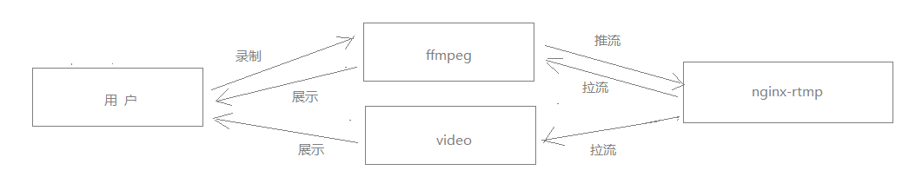
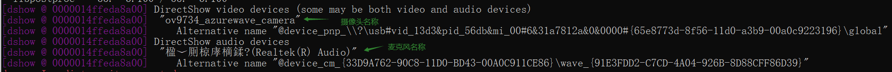
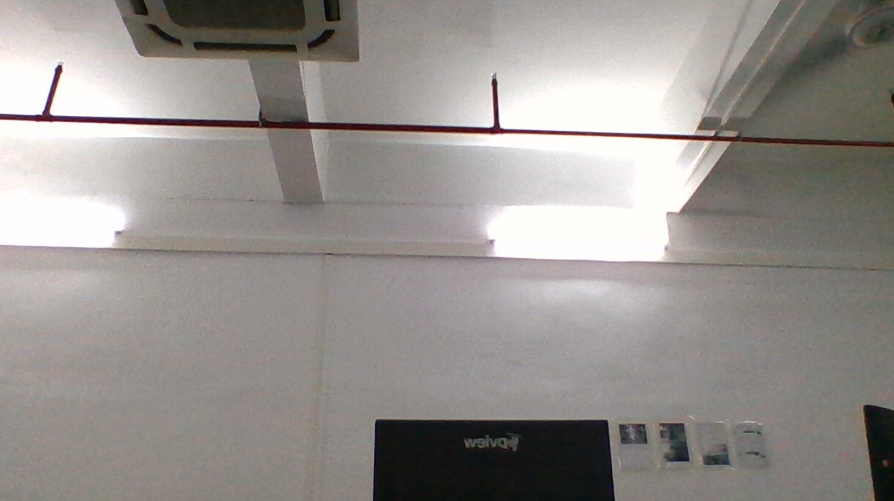
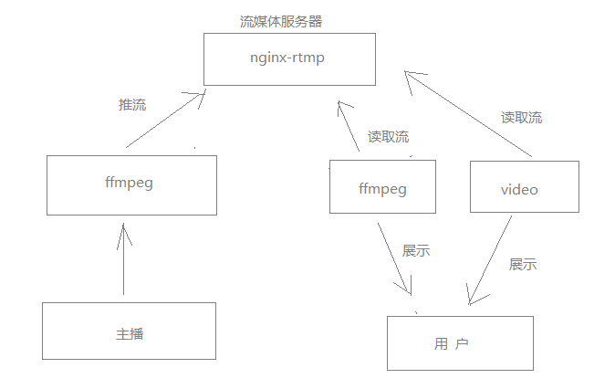
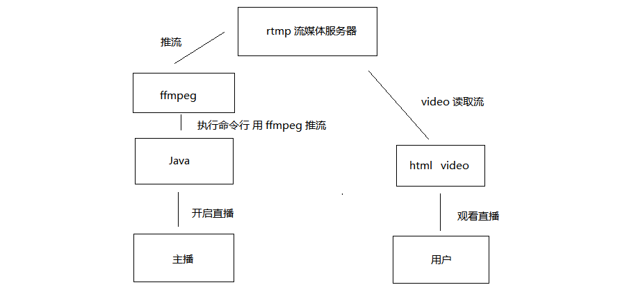

## Nginx-rtmp + ffmpeg 直播搭建

**流程图**



ffmpeg window安装

```tex
https://www.zdfans.com/html/32279.html
```

docker 安装 nginx-rtmp

```shell
#安装 nginx-rtmp 镜像
docker pull alfg/nginx-rtmp
#创建并运行 nginx-rtmp 流媒体服务器
docker run -it --name nginx-rtmp -p 1935:1935 -p 10005:80 --rm alfg/nginx-rtmp
```


**ffmpeg**

当下载完 window 版[当然还有其他版本]的 ffmpeg 进入 bin 下 cmd 输入命令

```shell
#列出计算机设备
ffmpeg -list_devices true -f dshow -i dummy
```

注意这一段



因为在直播中我们需要使用摄像头与麦克风，所以以上显示并标明了俩者的名称，后续我们进行推流的时候会使用到这俩个名称，特意在此标明.

**测试摄像头是否可用**

```shell
# 第一种
ffplay -f dshow -i video="摄像头名称"
# 第二种
ffplay -f vfwcap -i 0
```

如果成功弹出播放窗口，则代表设备可用，否则可能是设备不可用或者设备被占用.

**效果图**




**nginx-rtmp**

​	流默认地址为：rtmp://ip:port/stream/自定义名称 


### 开始搭建直播

**摄像头推流【无音频】**

​	接下来正式把对摄像头进行推流，开始我们已经知道怎么获取摄像头名称了，而且流媒体服务器ip为127.0.0.1:1935，关键字为live，所以cmd中输入以下语句.

> ffmpeg 摄像头推流  【推流】

```shell
ffmpeg -f dshow -i video="摄像头名称" -vcodec libx264 -preset:v ultrafast -tune:v zerolatency -f flv rtmp://127.0.0.1:1935/stream/test
```

> ffplay 播放rtmp流  【拉流】

```shell
ffplay rtmp://127.0.0.1:1935/stream/test
```

这样一个简易的直播已经搭建完毕了



摄像头+麦克风 || 视频直播 参考以下链接 ↓↓ 基本相同

```tex
https://www.jianshu.com/p/c141fc7881e7
```


**Video **

​		以上只介绍了 ffmpeg 怎么读取流，但这种方式仅仅用于给开发人员测试使用，在现实生活中不可能让用户去手动读取流，现实生活中应该是用户进入一个链接地址就可以观看直播，所以这时需要使用 Video 来读取流，并展示给用户.

> 环境一：Vue 【拉流】

```shell
yarn add vue-video-player --save
yarn add videojs-flash --save
yarn add mux.js
```

```html
<template>
    <div>
      <video id="myvideo" class="video-js vjs-default-skin" controls preload="auto"
       width="1280" height="720" poster="http://vjs.zencdn.net/v/oceans.png" data-setup="{}">
    <source src="rtmp://192.168.99.100:1935/lives/test" type="rtmp/flv">//src里面填的是rtmp的地址rtmp://192.168.0.221/live跟密钥1234

    <p class="vjs-no-js">To view this video please enable JavaScript, and consider upgrading to a web browser that
        <a href="http://videojs.com/html5-video-support/" target="_blank">supports HTML5 video</a>
    </p>
</video>
    </div>
</template>

<script>
import 'video.js/dist/video-js.css'
import 'videojs-flash'
export default {
  data () {
    return {
    }
  }
}
</script>
```

> 环境二：HTML 核心代码块 【拉流】

```html
<link href="http://vjs.zencdn.net/5.19/video-js.min.css" rel="stylesheet">
<script src="http://vjs.zencdn.net/5.19/video.min.js"></script>
<script src="https://cdn.jsdelivr.net/npm/videojs-flash@2/dist/videojs-flash.min.js"></script>
<body>
    <video id="myvideo" class="video-js vjs-default-skin" controls
       preload="auto" width="1400" height="900"
       poster="http://vjs.zencdn.net/v/oceans.png" data-setup="{}" style="float:left;width: 980px"  autoplay="autoplay" >
    <source th:src="rtmp://192.168.99.100:1935/lives/test" type="rtmp/flv">
</video>
</body>
```

> Java 【推流】
>

```java
package com.znsd.demo.util;

import org.springframework.util.ClassUtils;
import org.thymeleaf.util.StringUtils;

import java.io.BufferedReader;
import java.io.IOException;
import java.io.InputStreamReader;

public class RtmpUtils {

    // 命令行对象
    private static final Runtime runtime = Runtime.getRuntime();

    // 获取ffmpeg可执行文件路径 【推流操作】 ffmpeg.exe 移入项目中 resources 下即可 【必做】
    private static final String FFMPEG_URI = ClassUtils.getDefaultClassLoader().getResource("ffmpeg.exe").getPath();

    // 摄像头名称
    private static String NAME = "";

    // 进程对象
    private static Process process;

    // 流媒体服务器前缀地址 最后会与自定义名称拼接 【必改】
    private static final String RTMP_SERVER = "rtmp://192.168.99.100:1935/stream/";

    /**
     *  开启直播
     * @param custom 自定义名称 （必须唯一）
     * @return
     */
    public static boolean start(String custom) {

        try {
            NAME = getLog();
            // 推流命令
            String mac = FFMPEG_URI + " -rtbufsize 100M -f dshow -i video=\""+ NAME +" -vcodec libx264  -preset veryfast -crf 22 -tune:v zerolatency -f flv "+ RTMP_SERVER + custom;
            System.out.println(mac);
            // 将摄像头推向流媒体服务器
            process = runtime.exec(mac);
            return true;
        } catch (IOException e) {
            e.printStackTrace();
        }
        return false;
    }

    public static boolean destroy () {
        process.destroy();
        return true;
    }


    /**
     *  获取摄像头名称
     * @return
     * @throws IOException
     */
    private static String getLog() throws IOException {
        System.out.println(FFMPEG_URI);
        String name = FFMPEG_URI + " -list_devices true -f dshow -i dummy";
        Process exec = runtime.exec(name);
        StringBuilder sb = new StringBuilder();

        String line = null;

        int i = 0;

        BufferedReader bufferedReader = new BufferedReader(new InputStreamReader(exec.getErrorStream()));
        while((line = bufferedReader.readLine())!= null){
            sb.append(line + "\n");
            System.out.println(line);
            if(line.contains("[dshow @")){
                i++;
                if(i == 2) { // 一般无其他外设默认第二个是摄像头名称
                    String s = StringUtils.substringAfter(line, "\"");
                    exec.destroy();
                    return s;
                }
            }
        }
        return "";
    }

}
```

**流程图**



nginx.conf 参数配置

```tex
https://blog.csdn.net/defonds/article/details/9274479/
```

