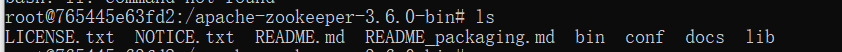

# Zookeeper

简介

```txt
https://baike.baidu.com/item/zookeeper/4836397?fr=aladdin
```

本笔记若图片无法加载建议拉取到本地查看，GitHub可能将图片资源拦截了。

**Zookeeper特点**

```java
1) Zookeeper: 一个领导者(Leader) ，多个跟随者(Follower) 组成的集群。
2)集群中只要有半数以上节点存活，Zookeepex集 群就能正常服务。
3)全局数据一致:每个Server保存一份相同的数据副本，Client无论连接到哪个Server,数据都是一致的。
4)更新请求顺序进行，来自同一个Client的更新请求按其发送顺序依次执行。
5)数据更新原子性，一次数据更新要么成功，要么失败。
6)实时性，在一定时间范围内，Client能读到最新数据。
```

**docker**

```shell
# 安裝 docker
docker pull zookeeper
# 运行 zookeeper
docker run -d --name zk -p 2181:2181 zookeeper
# 查看 zookeeper 配置信息
docker inspect zk
# 进入 zookeeper 容器
docker exec -it zk
```


**初始 zookeeper**

------

**docker** 中 **zookeeper** 的目录结构 



其中 bin 中包含 zookeeper 的客户端脚本，可以通过客户端脚本连接zookeeper。


通过命令 `./zkCli.sh` 连接 **zookeeper 服务端**


可以通过 `ls /` 查看 **zookeeper** 节点信息


可以通过 `quit` 退出 **zookeeper** 客户端

